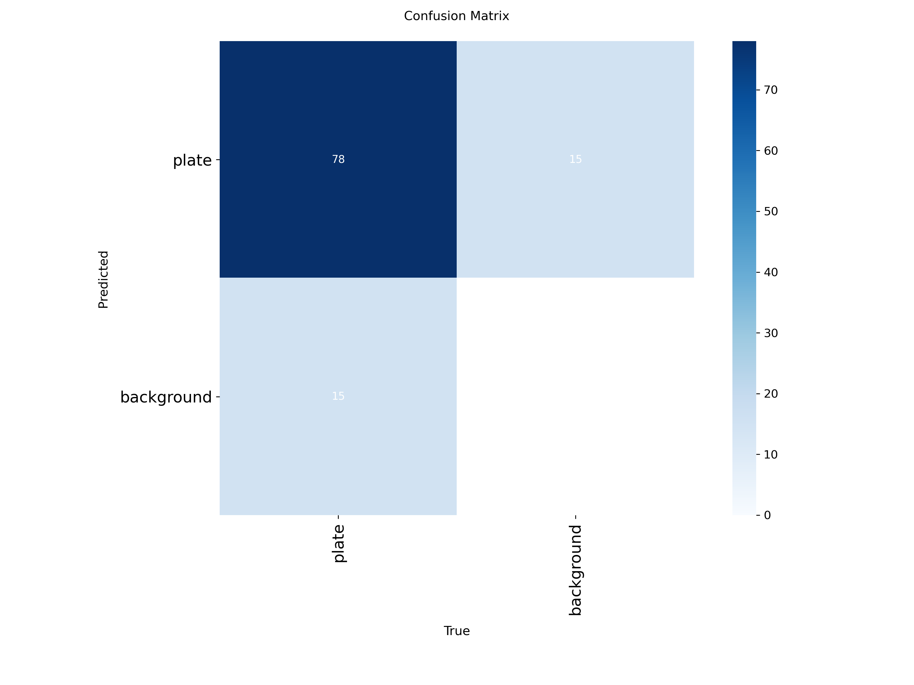
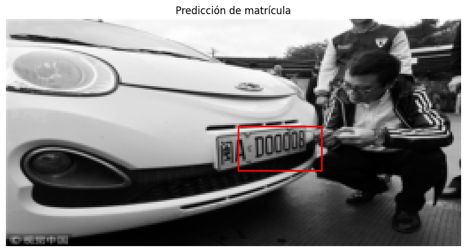
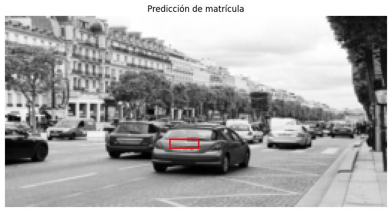
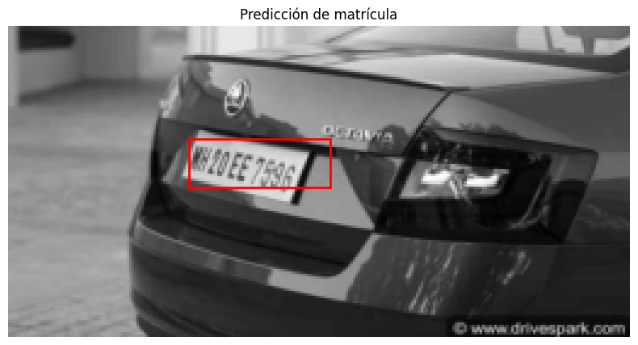
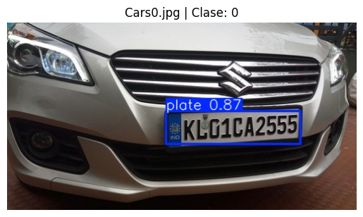
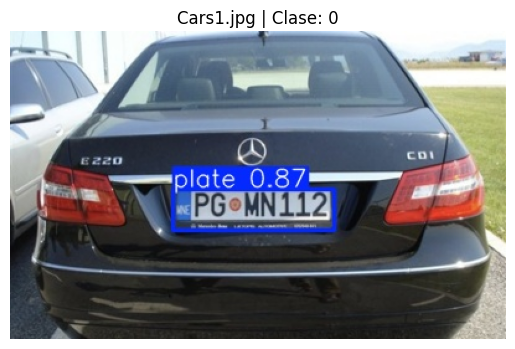

# Comparación de Detectores y Reconocedores de Matrículas Vehiculares 🚗📸
Autor del trabajo: David Valls Lozano

Este proyecto presenta un estudio comparativo de diversos enfoques para la **detección y reconocimiento automático de matrículas vehiculares**, integrando tanto **métodos clásicos de visión por computador** como **modelos modernos de aprendizaje profundo**.  
El objetivo principal es evaluar la eficacia, precisión y eficiencia temporal de cada técnica en distintas condiciones visuales, con el propósito de determinar qué método ofrece un rendimiento más robusto y generalizable.

## ⚙️ Tecnologías Utilizadas

- **Lenguaje:** Python 3.10+
- **Bibliotecas principales:**  
  - OpenCV  
  - EasyOCR  
  - Ultralytics YOLOv8  
  - PyTorch  
  - NumPy, Pandas, Matplotlib 
---

## 🧠 Introducción

La identificación automática de matrículas constituye una aplicación esencial en ámbitos como el control de acceso vehicular, la gestión de tráfico, la seguridad urbana y los sistemas de peaje automatizados.  
A lo largo de los años, las técnicas empleadas han evolucionado desde algoritmos basados en procesamiento morfológico hasta arquitecturas profundas de redes neuronales convolucionales (CNN).

Este trabajo implementa y compara cuatro métodos representativos, con el fin de establecer un marco experimental reproducible y contrastar los resultados bajo métricas objetivas.

 1.**Detección por contornos (OpenCV)**  
   Método tradicional que utiliza operaciones morfológicas, umbralización adaptativa y filtrado por proporciones geométricas para localizar regiones candidatas a matrículas.  
   Es una técnica eficiente, pero sensible a variaciones de iluminación y ángulos de captura.

Utiliza como paquetes principales OpenCV y imutils para la mayoría de las funciones del método, junto a otros paquetes básicos.

    

    

    

    

    

    

    

    

    

    
    

    
    

2. **Detector con EasyOCR**
   Sistema OCR preentrenado capaz de detectar y reconocer texto directamente sobre las imágenes.  
   Permite una implementación sencilla y resultados razonables sin necesidad de entrenamiento adicional.

    coche11 → ['MS66YOB']
    

    

    
 
    

   

# **Visualización de resultados**

    

    

    

    

3. **CNN Personalizada (PyTorch)**  
   Arquitectura desarrollada desde cero para la tarea de detección y reconocimiento, utilizando un conjunto de datos reducido con fines experimentales.  
   Este enfoque permite un mayor control sobre las capas y los hiperparámetros, facilitando el análisis comparativo del desempeño.

    

    

    

    

    

        

    

4. **YOLOv8 preentrenado (Ultralytics)**  
   Detector de objetos de última generación que ofrece un excelente equilibrio entre velocidad y precisión.  
   Se emplea un modelo preentrenado en COCO, ajustado para la detección de matrículas mediante transferencia de aprendizaje.

    

    

    Texto detectado: KLO1CA2555
    
    Procesando imagen: Cars1.jpg
    

    

    

    Texto detectado: PGoHN112
    
    Procesando imagen: Cars101.jpg
    

## 📊 Metodología y Evaluación

El análisis comparativo se realiza bajo tres dimensiones principales:

1. **Precisión y Recuperación (Detección de Matrículas):**  
   Evalúa la capacidad del modelo para identificar correctamente las regiones que contienen matrículas.

2. **Exactitud del OCR (Reconocimiento de Texto):**  
   Compara el texto reconocido con el texto real, considerando errores de carácter y palabras.

3. **Tiempo de Inferencia:**  
   Mide la eficiencia de procesamiento de cada modelo, en segundos por imagen.

El conjunto de pruebas incluye imágenes con diferentes resoluciones, iluminaciones, ángulos y condiciones ambientales, con el propósito de simular escenarios reales.

# **Bibliografia**

*   **Dataset:** https://www.kaggle.com/datasets/andrewmvd/car-plate-detection/data
*   **Repositorio de ejemplo:** https://www.kaggle.com/code/semihberaterdoan/license-plate-recognition-with-yolov11m/notebook

