#***Detector de Matriculas con Visión Artificial***
Autores del trabajo: Pablo López Martínez, David Valls Lozano y Daniel Ventura González


En este proyecto hemos desarrollado una serie de modelos de detección de matrículas basados en diferentes métodos de procesado de imágenes.

# **Detector** **Manual**

Este método se basa en la conversión de la imagen a escala de grises, para posteriormente obtener los contornos de la imagen e intentar localizar polígonos que aproximadente coincidan con la forma de una matrícula.

Utiliza como paquetes principales OpenCV y imutils para la mayoría de las funciones del método, junto a otros paquetes básicos.


```python
import cv2
import imutils
import numpy as np
import matplotlib.pyplot as plt # Se importan los paquetes.


# Función para visualizar las diferentes imágenes.
def mostrar_imagen(titulo, imagen, cmap=None):
    plt.figure(figsize=(10,6))
    plt.title(titulo)
    if cmap:
        plt.imshow(imagen, cmap=cmap)
    else:
        plt.imshow(cv2.cvtColor(imagen, cv2.COLOR_BGR2RGB))
    plt.axis('off')
    plt.show()


# Lista con todas las imágenes.
coches = ['matriculas.png', 'matriculas1.jpg', 'matriculas2.jpg',  'coche1.jpeg', 'coche2.jpeg', 'coche3.jpeg', 'coche4.jpeg']

# Bucle para buscar la matrícula en todas las imágenes.
for i in coches:
    ruta_imagen = i  # Se asigna la ruta a cada imagen.
    imagen = cv2.imread(ruta_imagen)
    gris = cv2.cvtColor(imagen, cv2.COLOR_BGR2GRAY) # Se lee la imagen y se pasa a blanco y negro.
    mostrar_imagen('Imagen original', imagen)
    mostrar_imagen('Imagen en blanco y negro', gris, cmap='gray')

    bordes = cv2.Canny(gris, 100, 200) # Se detctan los bordes con un filtro Canny.
    mostrar_imagen('Bordes de la imagen', bordes, cmap='gray')

    # Se encuentran y extraen los contornos de la imagen (jerarquía de contornos y puntos que los forman).
    contornos = cv2.findContours(bordes.copy(), cv2.RETR_TREE, cv2.CHAIN_APPROX_SIMPLE)
    contornos = imutils.grab_contours(contornos)

    # Se seleccionan los 30 más grandes y se ordenan de mayor a menor.
    contornos = sorted(contornos, key=cv2.contourArea, reverse=True)[:30]

    matricula = None

    # Se buscan los contornos con 4 lados y con proporciones similares a la de una matrícula.
    for cnt in contornos:
        peri = cv2.arcLength(cnt, True) # Se calcula el perímetro cerrado del controno.
        approx = cv2.approxPolyDP(cnt, 0.018 * peri, True) # Se aproxima el contorno a una forma poligonal.

        # Si el contorno tiene 4 puntos se calcula el rectángulo que encierra ese contorno.
        if len(approx) == 4:
            x, y, w, h = cv2.boundingRect(approx)
            aspecto = w / float(h) # Proporción entre ancho y alto.
            area = cv2.contourArea(cnt) # Área del rectángulo.

            # Si la relación de aspecto y el área cumplen los requisitos se guarda la matrícula.
            if 2 < aspecto < 6 and area > 1500:
                matricula = approx
                break

    # Si se detecta la matrícula:
    if matricula is not None:
        imagen_bordeada = imagen.copy() # Se hace una copia de la imagen original.
        cv2.drawContours(imagen_bordeada, [matricula], -1, (0, 255, 0), 3) # Se dibujan todos los contornos del rectángulo de la matrícula.
        mostrar_imagen('Imagen con matrícula detectada', imagen_bordeada)

        x, y, w, h = cv2.boundingRect(matricula) # Coordenadas de la matrícula.
        imagen_matricula = imagen[y:y+h, x:x+w] # Se recorta la matrícula.
        mostrar_imagen('Matrícula recortada', imagen_matricula)
    else:
        print("No se pudo detectar la matrícula.") # Si no se detecta la matrícula se informa.

```


    
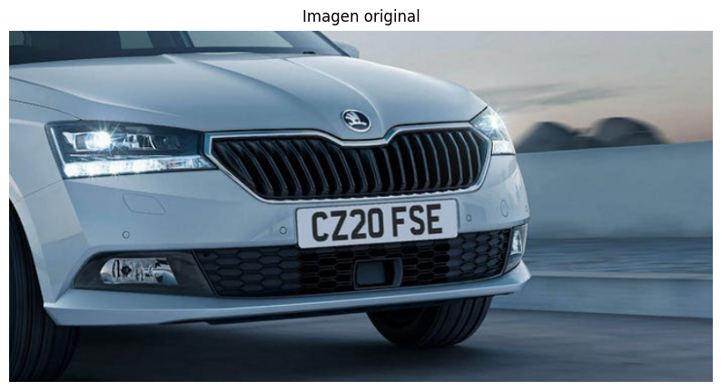
    


    
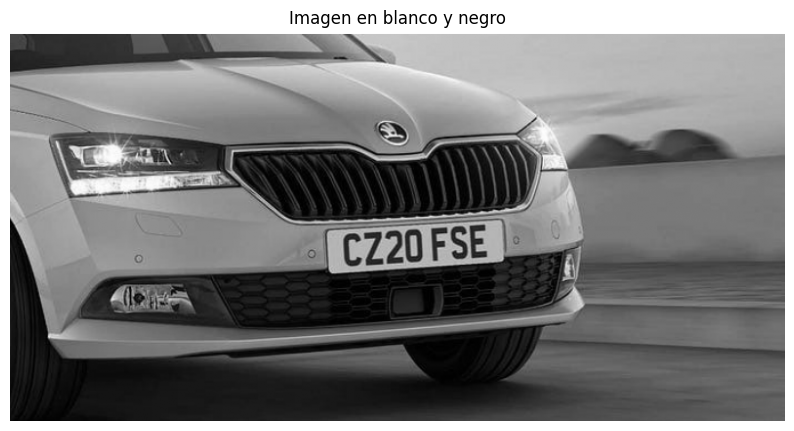
    


    
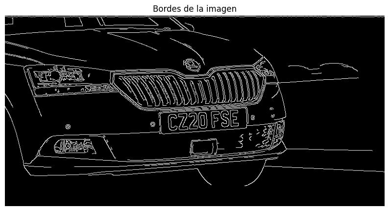
    


    
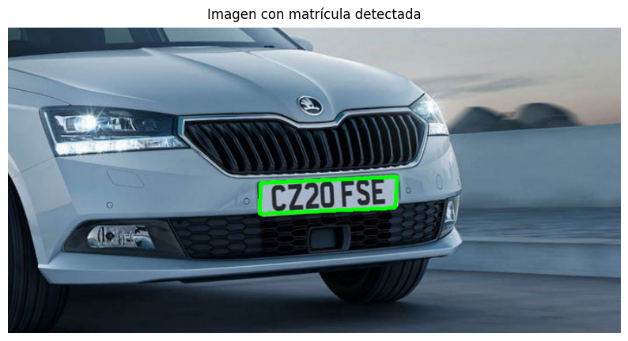
    


    

    


    
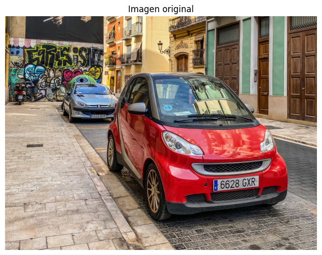
    


    
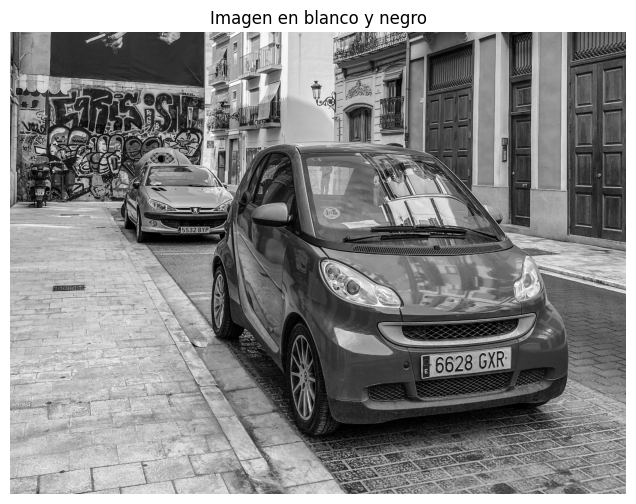
    


    
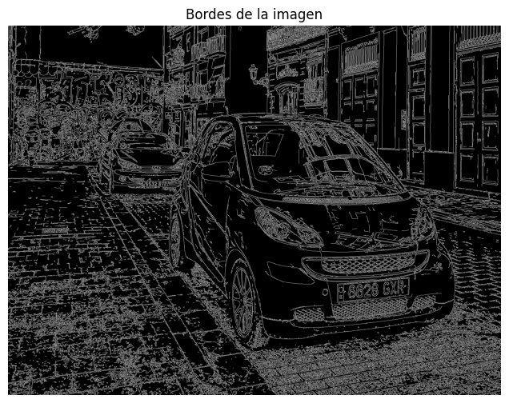
    


    
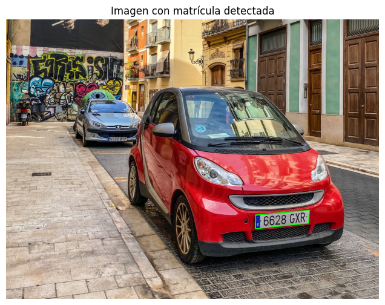
    


    

    


    
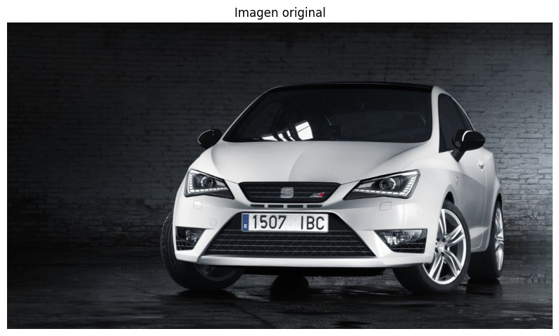
    


    
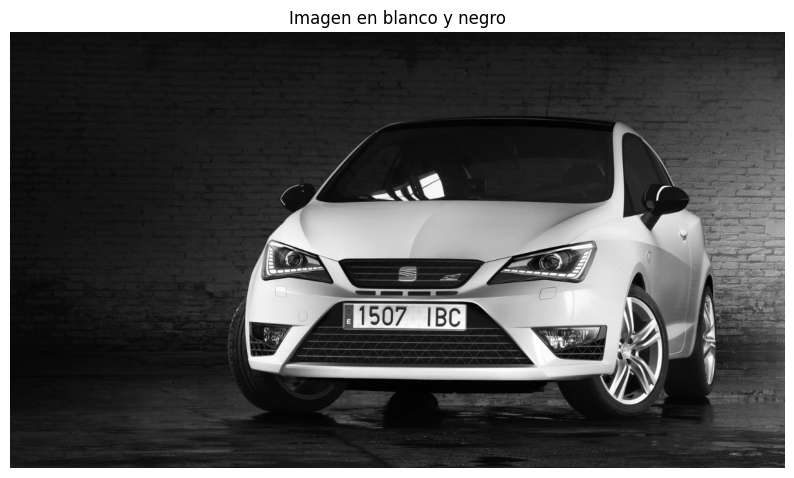
    


    
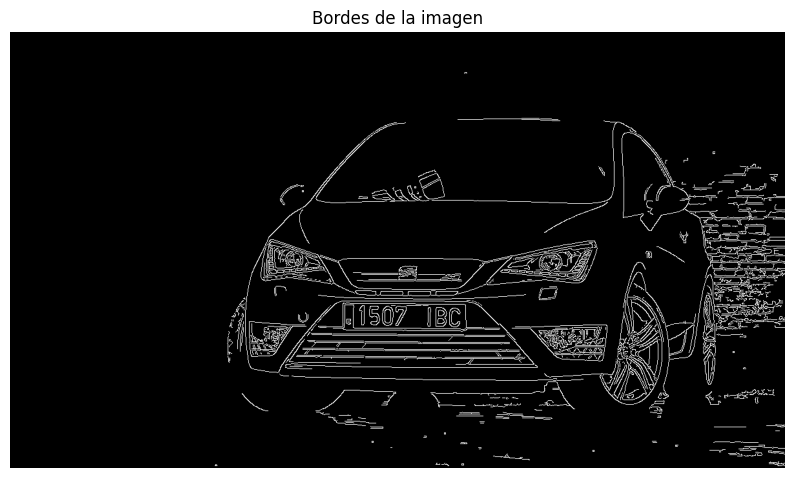
    


    
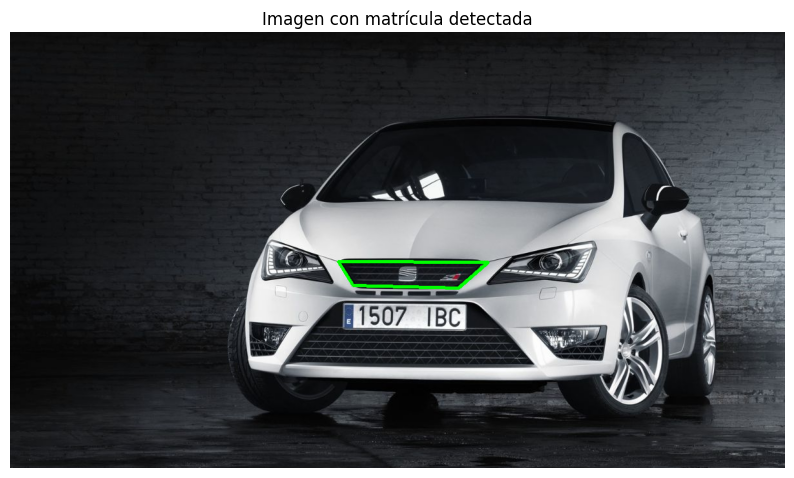
    


    

    


    
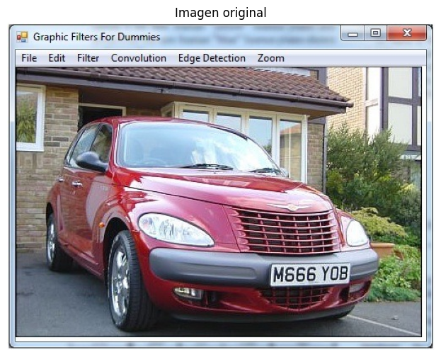
    


    
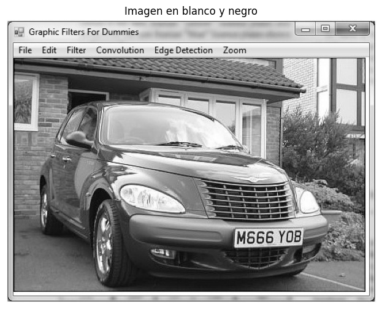
    


    
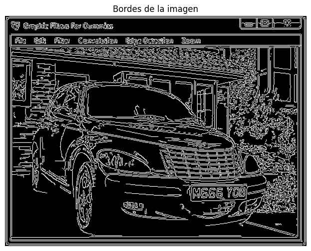
    


    
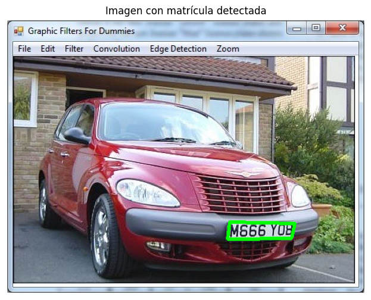
    


    
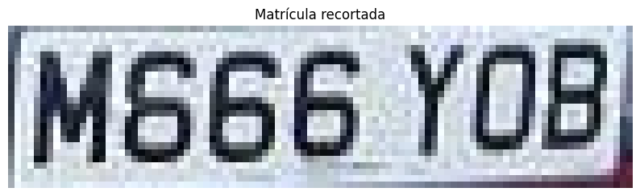
    


    
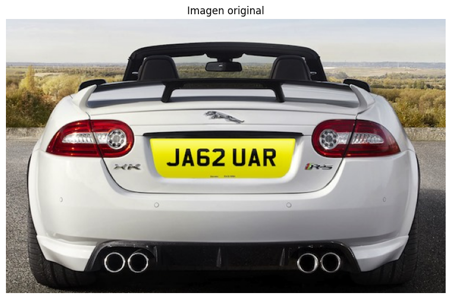
    


    
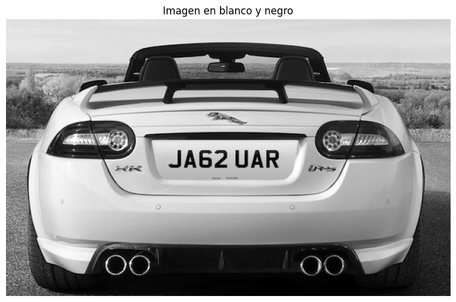
    


    
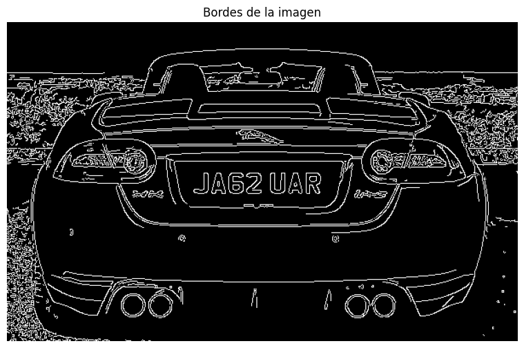
    


    No se pudo detectar la matrícula.
    


    

    


    
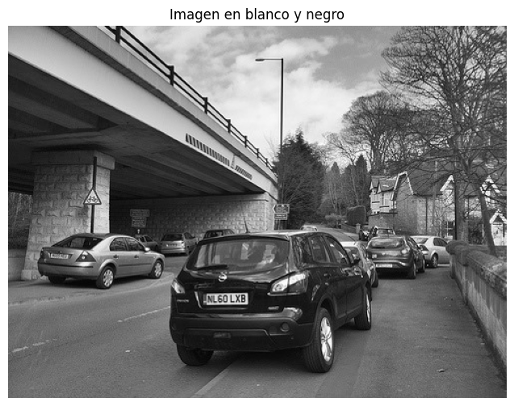
    


    
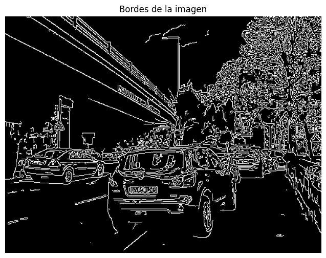
    


    No se pudo detectar la matrícula.
    


    
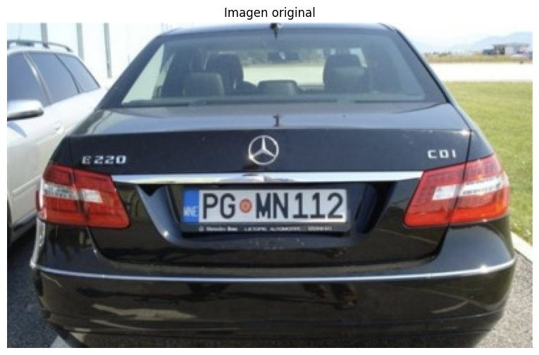
    


    
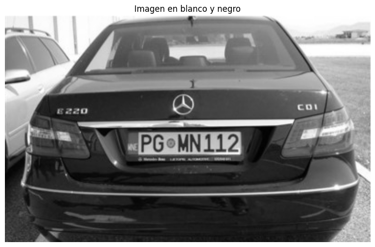
    


    
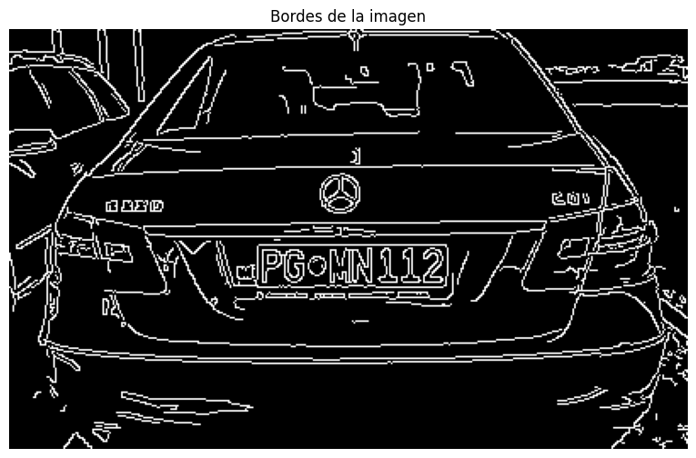
    


    
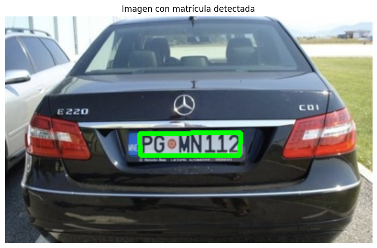
    


    

    


# **Detector con EasyOCR**


```python
# Importamos las librerías necesarias:
import cv2                     # Procesamiento de imágenes
import easyocr                 # OCR para leer textos en imágenes
import matplotlib.pyplot as plt  # Visualización de imágenes
import re                      # Expresiones regulares para limpiar textos
import numpy as np             # Operaciones numéricas y con arrays
from pathlib import Path       # Manejo de rutas y archivos


# Definimos la carpeta que contiene las imágenes a procesar
carpeta_imagenes = '.'
# Definimos la carpeta en la que guardaremos las imágenes procesadas
salida_imagenes = 'matriculas_procesadas_pablo'
# Archivo de salida para guardar las matrículas detectadas
archivo_salida = 'todas_matriculas.txt'

# Crear la carpeta de salida si no existe
Path(salida_imagenes).mkdir(exist_ok=True)

# Creamos el lector de EasyOCR para el idioma español ('es')
lector = easyocr.Reader(['es'])

# FUNCIONES

def parece_matricula(texto):

    # Comprobamos la longitud del texto
    if not (5 <= len(texto) <= 10):
        return False
    # Contamos cuántos caracteres son letras y cuántos son dígitos
    letras = sum(c.isalpha() for c in texto)
    numeros = sum(c.isdigit() for c in texto)
    # Se acepta si tiene al menos 2 letras y 2 dígitos
    if letras >= 2 and numeros >= 2:
        return True
    # También se acepta si el texto está formado solo por letras y su longitud es entre 3 y 7
    if letras == len(texto) and 3 <= letras <= 7:
        return True
    return False

def procesar_imagen(ruta_imagen):

    # Se lee la imagen utilizando OpenCV
    imagen = cv2.imread(str(ruta_imagen))


    # Se convierte la imagen a escala de grises
    gris = cv2.cvtColor(imagen, cv2.COLOR_BGR2GRAY)
    #Se mejora el contraste con ecualización del histograma (aunque en este caso no se utiliza en la detección)
    imagen_preprocesada = cv2.equalizeHist(gris)

    '''
    Las imagenes preprocesadas en escala de grises para mejorar el contraste no se utilizan
    ya que, a pesar de detectar alguna matrícula que de manera normal no detectamos, se deja otras por el camino o tiene otros
    errores de lectura de números y letras.
    '''

    # Se aplica OCR a la imagen (utilizamos la imagen original)
    resultados = lector.readtext(imagen)

    # Listas para almacenar diferentes tipos de detecciones
    matriculas_completas = []  # Detecciones que parecen una matrícula completa
    numeros = []               # Fragmentos detectados que son solo números
    letras = []                # Fragmentos detectados que son solo letras

    # Se recorre cada resultado obtenido del OCR
    for (bbox, texto_original, probabilidad) in resultados:
        # Se limpia el texto removiendo caracteres especiales y se convierte a mayúsculas
        texto_limpio = re.sub(r'[^A-Za-z0-9]', '', texto_original).upper()
        # Se descartan textos con baja probabilidad o sin contenido
        if probabilidad < 0.3 or len(texto_limpio) == 0:
            continue
        # Si el texto parece una matrícula completa, se guarda y se salta el resto del ciclo
        if parece_matricula(texto_limpio):
            matriculas_completas.append({'texto': texto_limpio, 'bbox': bbox})
            continue
        # Si el texto es numérico y tiene una longitud entre 3 y 5, se guarda en la lista de números
        if texto_limpio.isdigit() and 3 <= len(texto_limpio) <= 5:
            numeros.append({'texto': texto_limpio, 'bbox': bbox})
        # Si el texto es alfabético y tiene entre 2 y 4 caracteres, se guarda en la lista de letras
        elif texto_limpio.isalpha() and 2 <= len(texto_limpio) <= 4:
            letras.append({'texto': texto_limpio, 'bbox': bbox})


    # Dibujo de las matrículas completas detectadas (en verde)
    for entrada in matriculas_completas:
        texto = entrada['texto']
        bbox = entrada['bbox']
        # Extraemos las coordenadas de la esquina superior izquierda y la inferior derecha
        (tl, _, br, _) = bbox
        tl = tuple(map(int, tl))
        br = tuple(map(int, br))
        # Dibujamos un rectángulo alrededor del área detectada
        cv2.rectangle(imagen, tl, br, (0, 255, 0), 2)
        # Escribimos el texto de la matrícula sobre la imagen
        cv2.putText(imagen, texto, (tl[0], tl[1] - 10), cv2.FONT_HERSHEY_SIMPLEX, 0.8, (0, 255, 0), 2)


    # Combinamos fragmentos de números y letras para formar posibles matrículas
    fragmentos = numeros + letras
    # Ordenamos los fragmentos de izquierda a derecha según la menor coordenada X de su bbox
    fragmentos.sort(key=lambda x: np.min(np.array(x['bbox'])[:, 0]))

    # Lista para guardar las predicciones de matrículas
    matriculas_predichas = []
    usados = set()  # Se usa para evitar combinaciones duplicadas

    # Probamos combinaciones consecutivas de múltiples fragmentos
    for i in range(len(fragmentos)):
        for j in range(i+1, min(i+4, len(fragmentos)+1)):
            # Se concatenan los textos de los fragmentos en la posición i hasta j
            combinacion = ''.join(f['texto'] for f in fragmentos[i:j])
            # Si esta combinación ya se usó, se salta
            if combinacion in usados:
                continue
            # Se comprueba si la combinación cumple con el formato de matrícula
            if parece_matricula(combinacion):
                usados.add(combinacion)
                # Se recogen las coordenadas de cada fragmento de la combinación
                bboxes = [f['bbox'] for f in fragmentos[i:j]]
                matriculas_predichas.append({'texto': combinacion, 'bboxes': bboxes})

    # Dibujamos las combinaciones detectadas (en púrpura)
    for entrada in matriculas_predichas:
        texto = entrada['texto']
        bboxes = entrada['bboxes']
        # Se une toda las coordenadas de los fragmentos para determinar la caja que contiene la combinación
        coords = np.concatenate(bboxes)
        x_min, y_min = coords.min(axis=0).astype(int)
        x_max, y_max = coords.max(axis=0).astype(int)
        # Dibuja el rectángulo con la combinación detectada
        cv2.rectangle(imagen, (x_min, y_min), (x_max, y_max), (255, 0, 255), 2)
        cv2.putText(imagen, texto, (x_min, y_min - 10), cv2.FONT_HERSHEY_SIMPLEX, 0.8, (255, 0, 255), 2)

    # Guardamos la imagen con las detecciones dibujadas.
    nombre_archivo = Path(ruta_imagen).stem
    cv2.imwrite(f"{salida_imagenes}/{nombre_archivo}_procesada.jpg", imagen)

    # Creamos una lista final de matrículas detectadas quitando duplicados
    todas = list(set(
        [m['texto'] for m in matriculas_completas] +
        [m['texto'] for m in matriculas_predichas]
    ))
    return nombre_archivo, todas


# Extensiones válidas
extensiones_validas = ['.jpg', '.jpeg', '.png', '.bmp']
# Ruta de la carpeta con las imágenes
ruta_carpeta = Path(carpeta_imagenes)
resultados_totales = []


print(ruta_carpeta)
# Se itera sobre cada archivo de imagen en la carpeta
for ruta_imagen in ruta_carpeta.iterdir():
    if ruta_imagen.suffix.lower() in extensiones_validas:
        nombre, placas = procesar_imagen(ruta_imagen)

        for placa in placas:
            resultados_totales.append(f"{nombre}: {placa}")
        print(f"{nombre} → {placas if placas else 'Sin detección'}")

        # Ruta de la imagen procesada
        ruta_procesada = Path(salida_imagenes) / f"{nombre}_procesada.jpg"

        # Leer y mostrar la imagen procesada con matplotlib
        imagen_procesada = cv2.imread(str(ruta_procesada))
        imagen_procesada = cv2.cvtColor(imagen_procesada, cv2.COLOR_BGR2RGB)  # OpenCV usa BGR
        plt.figure(figsize=(10, 6))
        plt.imshow(imagen_procesada)
        plt.title(f"Procesada: {nombre}")
        plt.axis('off')
        plt.show()


# Archivo de texto con todas las matrículas detectadas
with open(archivo_salida, 'w') as f:
    for linea in resultados_totales:
        f.write(linea + "\n")
print("Proceso completo. Resultados guardados en:", archivo_salida)
```

    .
    matricula → ['6628GXR', '5532BYP']
    


    
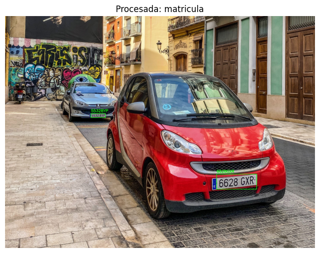
    


    coche9 → ['MK3532']
    


    
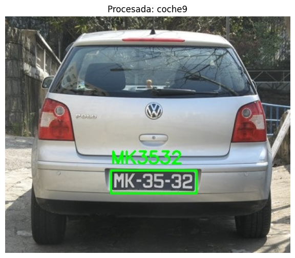
    


    coche4 → Sin detección
    


    
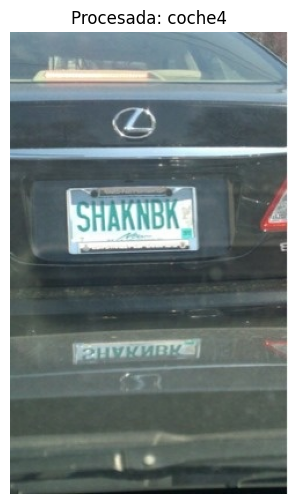
    


    matricula5 → ['8787LBC']
    


    

    


    coche11 → ['MS66YOB']
    


    
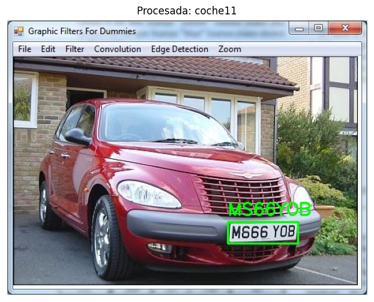
    


    coche2 → ['HR26BC5514']
    


    
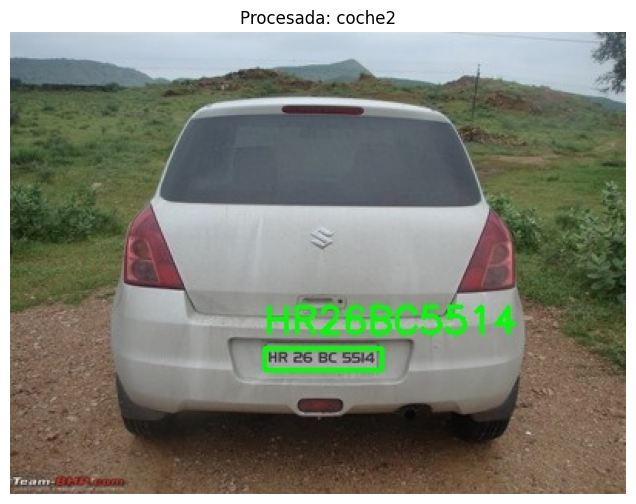
    


    matricula3 → ['4046JBB', '1398HKL', 'SP1514']
    


    
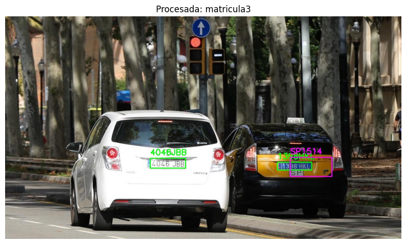
    


    coche1 → Sin detección
    


    
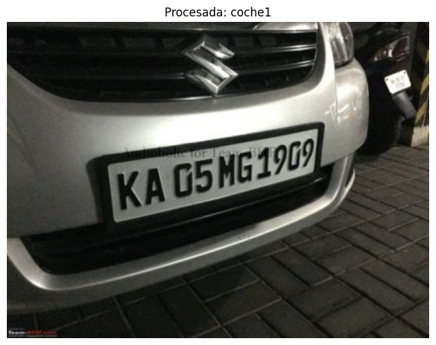
    


    coche5 → Sin detección
    


    

    


    coche6 → Sin detección
    


    
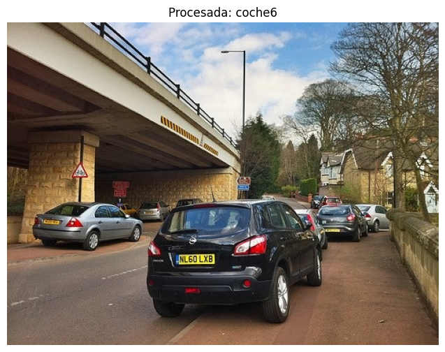
    


    matricula6 → ['1135GSB']
    


    
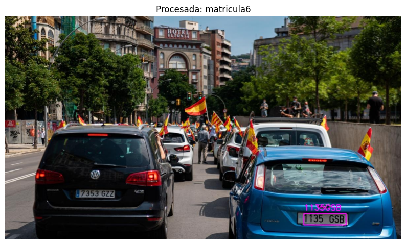
    


    matricula2 → ['3800KCH', '8194JCX']
    


    
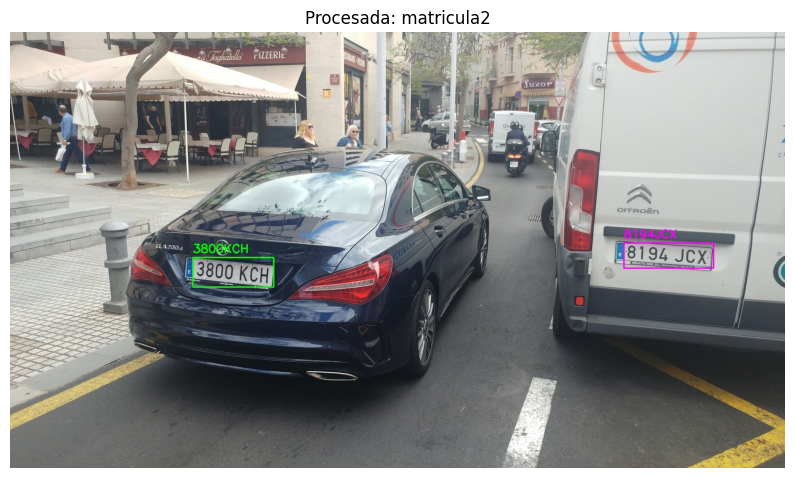
    


    coche3 → ['KLG1CA2555']
    


    
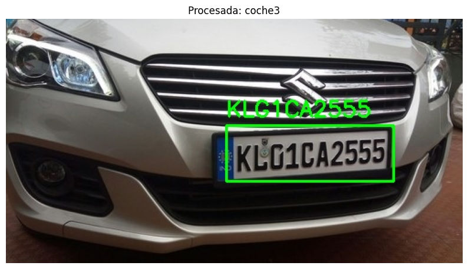
    


    coche7 → ['JA62UAR']
    


    
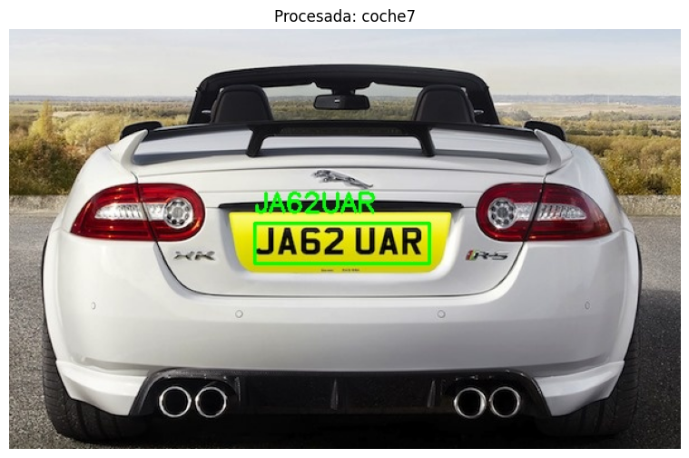
    


    coche8 → ['MH20EE7598']
    


    
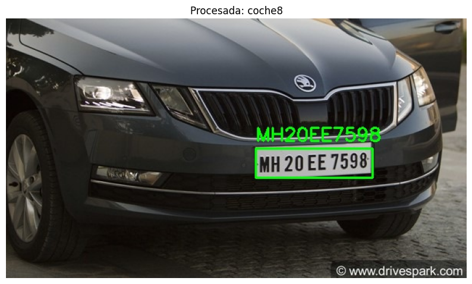
    


    coche12 → ['HH12867237']
    


    
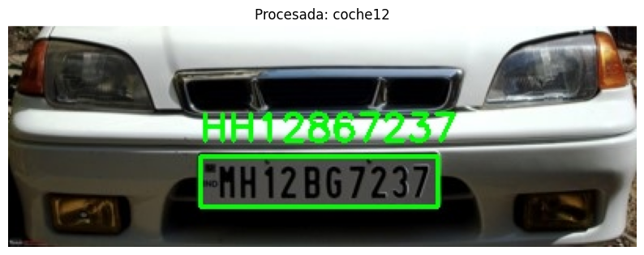
    


    coche10 → Sin detección
    


    


 
    
    


    Proceso completo. Resultados guardados en: todas_matriculas.txt
    

La primera función importante se encarga de comprobar si los fragmentos detectados se parecen a una matrícula siguiendo una serie de condiciones o patrones en base a la variedad de formatos de matrícula que hay en el mundo:

    - Matrículas que combinen letras y números, contando con un mínimo de 2 de cada una y con una longitud máxima combinada de 10 caracteres.
    
    - Matrículas que contienen únicamente letras, con una extensión entre 3 y 7 caracteres.

Después de esta función, está definida la encargada de procesar las imágenes.
Esta extrae los bloques de texto junto con su caja delimitadora y un nivel de probabilidad de confianza respecto a los caracteres obtenidos.
Además, se limpia el texto ante posibles errores en los que se detecten caracteres especiales como paréntesis o guiones que alteran los resultados y baja el porcentaje de acierto. Por otra parte, descartamos los bloques con probabilidad muy baja (inferiores a 0.3 sobre 1) o vacíos de contenido. Por último, se separan matrículas completas de fragmentos.

Para las detecciones de matrículas completas, dibujamos un rectángulo verde y añadimos el texto detectado.
Para aquellos fragmentos que forman parte de una posible predicción, se combinan ordenados de izquierda a derecha si cumplen alguno de los criterios y se dibujan el rectángulo y el texto de color púrpura para diferenciar.

Una vez terminado el proceso, guardamos la imagen resultante en la carpeta de salida y se crea una lista con las matrículas y la almacenamos en un archivo de texto. También imprimimos los resultados de texto detectados por consola para cada imagen.


```python
!pip install easyocr
`
    


```python
from google.colab import drive
drive.mount('/content/drive')
```

    Mounted at /content/drive
    

# **Redes convolucionales**

# **Instalación de librerias**

Se instalan las librerias: `kaggle`, para descargar el dataset; `ultrelytics`, para usar YOLOv8, y `easyocr`, para el reconocimiento de texto.


```python
# Instalamos las librerías necesarias:
# - kagglehub: para descargar datasets de Kaggle de forma sencilla
# - ultralytics: para usar YOLOv8
# - easyocr: para leer texto (OCR) desde las matrículas detectadas
!pip install -q kaggle
!pip install -q ultralytics

```


# **Autenticación en Kaggle**

Para poder acceder a la base de datos de Kaggle es necesario subir el archivo `kaggle.json` con las credenciales necesarias.


```python
# Abre un diálogo para subir tu archivo kaggle.json
# Este archivo permite autenticar tu cuenta de Kaggle y descargar datasets
from google.colab import files
uploaded = files.upload()


```


     <input type="file" id="files-82793a08-dfb4-404e-9b28-18b235e01a33" name="files[]" multiple disabled
        style="border:none" />
     <output id="result-82793a08-dfb4-404e-9b28-18b235e01a33">
      Upload widget is only available when the cell has been executed in the
      current browser session. Please rerun this cell to enable.
      </output>
      <script>// Copyright 2017 Google LLC
//
// Licensed under the Apache License, Version 2.0 (the "License");
// you may not use this file except in compliance with the License.
// You may obtain a copy of the License at
//
//      http://www.apache.org/licenses/LICENSE-2.0
//
// Unless required by applicable law or agreed to in writing, software
// distributed under the License is distributed on an "AS IS" BASIS,
// WITHOUT WARRANTIES OR CONDITIONS OF ANY KIND, either express or implied.
// See the License for the specific language governing permissions and
// limitations under the License.

/**
 * @fileoverview Helpers for google.colab Python module.
 */
(function(scope) {
function span(text, styleAttributes = {}) {
  const element = document.createElement('span');
  element.textContent = text;
  for (const key of Object.keys(styleAttributes)) {
    element.style[key] = styleAttributes[key];
  }
  return element;
}

// Max number of bytes which will be uploaded at a time.
const MAX_PAYLOAD_SIZE = 100 * 1024;

function _uploadFiles(inputId, outputId) {
  const steps = uploadFilesStep(inputId, outputId);
  const outputElement = document.getElementById(outputId);
  // Cache steps on the outputElement to make it available for the next call
  // to uploadFilesContinue from Python.
  outputElement.steps = steps;

  return _uploadFilesContinue(outputId);
}

// This is roughly an async generator (not supported in the browser yet),
// where there are multiple asynchronous steps and the Python side is going
// to poll for completion of each step.
// This uses a Promise to block the python side on completion of each step,
// then passes the result of the previous step as the input to the next step.
function _uploadFilesContinue(outputId) {
  const outputElement = document.getElementById(outputId);
  const steps = outputElement.steps;

  const next = steps.next(outputElement.lastPromiseValue);
  return Promise.resolve(next.value.promise).then((value) => {
    // Cache the last promise value to make it available to the next
    // step of the generator.
    outputElement.lastPromiseValue = value;
    return next.value.response;
  });
}

/**
 * Generator function which is called between each async step of the upload
 * process.
 * @param {string} inputId Element ID of the input file picker element.
 * @param {string} outputId Element ID of the output display.
 * @return {!Iterable<!Object>} Iterable of next steps.
 */
function* uploadFilesStep(inputId, outputId) {
  const inputElement = document.getElementById(inputId);
  inputElement.disabled = false;

  const outputElement = document.getElementById(outputId);
  outputElement.innerHTML = '';

  const pickedPromise = new Promise((resolve) => {
    inputElement.addEventListener('change', (e) => {
      resolve(e.target.files);
    });
  });

  const cancel = document.createElement('button');
  inputElement.parentElement.appendChild(cancel);
  cancel.textContent = 'Cancel upload';
  const cancelPromise = new Promise((resolve) => {
    cancel.onclick = () => {
      resolve(null);
    };
  });

  // Wait for the user to pick the files.
  const files = yield {
    promise: Promise.race([pickedPromise, cancelPromise]),
    response: {
      action: 'starting',
    }
  };

  cancel.remove();

  // Disable the input element since further picks are not allowed.
  inputElement.disabled = true;

  if (!files) {
    return {
      response: {
        action: 'complete',
      }
    };
  }

  for (const file of files) {
    const li = document.createElement('li');
    li.append(span(file.name, {fontWeight: 'bold'}));
    li.append(span(
        `(${file.type || 'n/a'}) - ${file.size} bytes, ` +
        `last modified: ${
            file.lastModifiedDate ? file.lastModifiedDate.toLocaleDateString() :
                                    'n/a'} - `));
    const percent = span('0% done');
    li.appendChild(percent);

    outputElement.appendChild(li);

    const fileDataPromise = new Promise((resolve) => {
      const reader = new FileReader();
      reader.onload = (e) => {
        resolve(e.target.result);
      };
      reader.readAsArrayBuffer(file);
    });
    // Wait for the data to be ready.
    let fileData = yield {
      promise: fileDataPromise,
      response: {
        action: 'continue',
      }
    };

    // Use a chunked sending to avoid message size limits. See b/62115660.
    let position = 0;
    do {
      const length = Math.min(fileData.byteLength - position, MAX_PAYLOAD_SIZE);
      const chunk = new Uint8Array(fileData, position, length);
      position += length;

      const base64 = btoa(String.fromCharCode.apply(null, chunk));
      yield {
        response: {
          action: 'append',
          file: file.name,
          data: base64,
        },
      };

      let percentDone = fileData.byteLength === 0 ?
          100 :
          Math.round((position / fileData.byteLength) * 100);
      percent.textContent = `${percentDone}% done`;

    } while (position < fileData.byteLength);
  }

  // All done.
  yield {
    response: {
      action: 'complete',
    }
  };
}

scope.google = scope.google || {};
scope.google.colab = scope.google.colab || {};
scope.google.colab._files = {
  _uploadFiles,
  _uploadFilesContinue,
};
})(self);
</script> 


    Saving kaggle.json to kaggle (1).json
    

# **Configuración del entorno**

Se genera la estructura de carpetas para que Kaggle funcione correctamente.


```python
import os

# Creamos el directorio oculto donde se guarda la API de Kaggle
os.makedirs("/root/.kaggle", exist_ok=True)

# Movemos el archivo kaggle.json a la ubicación esperada
os.rename("kaggle.json", "/root/.kaggle/kaggle.json")

# Le damos permisos seguros al archivo
os.chmod("/root/.kaggle/kaggle.json", 0o600)

```

# **Descarga de la base de datos**


```python
# Descarga el dataset ZIP desde Kaggle usando el CLI
!kaggle datasets download -d andrewmvd/car-plate-detection
```

    Dataset URL: https://www.kaggle.com/datasets/andrewmvd/car-plate-detection
    License(s): CC0-1.0
    Downloading car-plate-detection.zip to /content
     89% 180M/203M [00:00<00:00, 358MB/s]
    100% 203M/203M [00:00<00:00, 368MB/s]
    

# **Extracción del dataset**


```python
# Extraemos el contenido del ZIP en una carpeta
!unzip -q car-plate-detection.zip -d car-plate-detection
```

# **Conversión de las etiquetas a formato YOLO**

En la base de datos que estamos las etiquetas, donde están delimitadas las bounding boxes de las matriculas, de las imagenes son archivos `.xml`. Así que es necesario generar, a partir de estos los archivos `.txt` que requiere YOLO.


```python
import os
import xml.etree.ElementTree as ET

def convert_coordinates(size, box):
    dw = 1.0 / size[0]
    dh = 1.0 / size[1]
    x = (box[0] + box[1]) / 2.0 * dw
    y = (box[2] + box[3]) / 2.0 * dh
    w = (box[1] - box[0]) * dw
    h = (box[3] - box[2]) * dh
    return (x, y, w, h)

def convert_xml2yolo(xml_folder, output_folder):
    os.makedirs(output_folder, exist_ok=True)
    empty_count = 0
    valid_count = 0

    for xml_file in os.listdir(xml_folder):
        if not xml_file.endswith(".xml"):
            continue

        tree = ET.parse(os.path.join(xml_folder, xml_file))
        root = tree.getroot()

        size = root.find("size")
        if size is None:
            continue

        width = int(size.find("width").text)
        height = int(size.find("height").text)

        image_id = os.path.splitext(xml_file)[0]
        output_path = os.path.join(output_folder, f"{image_id}.txt")

        lines = []
        for obj in root.iter("object"):
            cls = obj.find("name").text
            if cls.lower() != "licence": #Se ignoran los objetos que no son matriculas
                continue

            xmlbox = obj.find("bndbox")
            if xmlbox is None:
                continue

            try:
                b = (
                    int(xmlbox.find("xmin").text),
                    int(xmlbox.find("xmax").text),
                    int(xmlbox.find("ymin").text),
                    int(xmlbox.find("ymax").text),
                )
                bb = convert_coordinates((width, height), b)
                lines.append(f"0 {bb[0]} {bb[1]} {bb[2]} {bb[3]}")
            except:
                continue

        if lines:
            valid_count += 1
            with open(output_path, "w") as f:
                f.write("\n".join(lines))
        else:
            empty_count += 1

    print(f"✅ Conversión completa.")
    print(f"Archivos con etiquetas: {valid_count}")
    print(f"Archivos vacíos: {empty_count}")

# Ejecutar conversión
convert_xml2yolo("/content/car-plate-detection/annotations", "/content/labels")

```

    ✅ Conversión completa.
    Archivos con etiquetas: 433
    Archivos vacíos: 0
    

# **Divisió del dataset en entrenamiento y validación**

---


Se crea la estructura de carpetas ,`/dataset/images/train` y `/dataset/images/val`, que require YOLO.

Se usa un 80% de los datos para en entrenamiento y un 20% para la validación.


```python
import os
import shutil
from sklearn.model_selection import train_test_split

img_dir = "/content/car-plate-detection/images"
label_dir = "/content/labels"
img_ext = ".png"

# Crear estructura YOLO
for split in ["train", "val"]:
    os.makedirs(f"/content/dataset/images/{split}", exist_ok=True)
    os.makedirs(f"/content/dataset/labels/{split}", exist_ok=True)

# Solo archivos válidos (con anotaciones)
valid_files = []
for label_file in os.listdir(label_dir):
    label_path = os.path.join(label_dir, label_file)
    if label_file.endswith(".txt") and os.path.getsize(label_path) > 0:
        name = label_file.replace(".txt", "")
        if os.path.exists(os.path.join(img_dir, f"{name}{img_ext}")):
            valid_files.append(name)

# Dividir train/val
train_files, val_files = train_test_split(valid_files, test_size=0.2, random_state=42)

# Copiar solo imágenes y etiquetas con contenido
def move_files(file_list, split):
    for f in file_list:
        shutil.copy(f"{img_dir}/{f}{img_ext}", f"/content/dataset/images/{split}/{f}{img_ext}")
        shutil.copy(f"{label_dir}/{f}.txt", f"/content/dataset/labels/{split}/{f}.txt")

move_files(train_files, "train")
move_files(val_files, "val")

print(f"Total válidos con cajas: {len(valid_files)}")
print(f"Train: {len(train_files)}")
print(f"Val: {len(val_files)}")

```

    Total válidos con cajas: 433
    Train: 346
    Val: 87
    

# **Entrenamiento de la CNN**

**Funciones para el calculo de métricas**


```python
# === Función para calcular IoU ===
def calcular_iou(box1, box2):
    # Ambos en formato (x1, y1, x2, y2)
    xi1 = max(box1[0], box2[0])
    yi1 = max(box1[1], box2[1])
    xi2 = min(box1[2], box2[2])
    yi2 = min(box1[3], box2[3])

    inter_area = max(0, xi2 - xi1) * max(0, yi2 - yi1)
    box1_area = max(0, box1[2] - box1[0]) * max(0, box1[3] - box1[1])
    box2_area = max(0, box2[2] - box2[0]) * max(0, box2[3] - box2[1])
    union_area = box1_area + box2_area - inter_area

    if union_area == 0:
        return 0
    else:
        return inter_area / union_area

# === Evaluar CNN: Precision, Recall e IoU medio ===
def evaluar_cnn(model, dataloader, iou_threshold=0.5):
    model.eval()
    TP, FP, FN = 0, 0, 0
    ious = []

    with torch.no_grad():
        for x, y_true in dataloader:
            x, y_true = x.to(device), y_true.to(device)
            y_pred = model(x)

            for pred, true in zip(y_pred, y_true):
                # Normalizados a píxeles
                xc_p, yc_p, w_p, h_p = pred.cpu().numpy()
                xc_t, yc_t, w_t, h_t = true.cpu().numpy()

                def to_xyxy(xc, yc, w, h, img_w=256, img_h=128):
                    x1 = (xc - w/2) * img_w
                    y1 = (yc - h/2) * img_h
                    x2 = (xc + w/2) * img_w
                    y2 = (yc + h/2) * img_h
                    return [x1, y1, x2, y2]

                box_p = to_xyxy(xc_p, yc_p, w_p, h_p)
                box_t = to_xyxy(xc_t, yc_t, w_t, h_t)

                iou = calcular_iou(box_p, box_t)
                ious.append(iou)

                if iou >= iou_threshold:
                    TP += 1
                else:
                    FP += 1
                    FN += 1

    precision = TP / (TP + FP + 1e-6)
    recall = TP / (TP + FN + 1e-6)
    iou_mean = sum(ious) / len(ious)

    print(f"→ Precisión: {precision:.4f}")
    print(f"→ Recall:    {recall:.4f}")
    print(f"→ IoU medio: {iou_mean:.4f}")

```

**Definicin y entrenamiento de la CNN**


```python
# Importación de bibliotecas necesarias
import os  # Para manipular rutas de archivos
from PIL import Image  # Para abrir imágenes
import torch  # PyTorch para deep learning
import torch.nn as nn  # Módulos de redes neuronales
import torch.nn.functional as F  # Funciones como ReLU
from torch.utils.data import Dataset, DataLoader, random_split  # Utilidades para datasets
from torchvision import transforms  # Transformaciones de imágenes
import matplotlib.pyplot as plt  # Para graficar imágenes y resultados

# Clase personalizada del dataset para detección de la caja de matrícula
class CarPlateBoundingBoxDataset(Dataset):
    def __init__(self, root_dir, transform=None):
        # Directorios donde se encuentran las imágenes y las etiquetas
        self.image_dir = os.path.join(root_dir, "images", "train")
        self.label_dir = os.path.join(root_dir, "labels", "train")
        self.transform = transform
        self.samples = []  # Lista para almacenar (imagen, bbox)

        # Itera sobre todos los archivos de imagen en el directorio
        for img_file in os.listdir(self.image_dir):
            if img_file.endswith(".png"):  # Solo archivos PNG
                img_path = os.path.join(self.image_dir, img_file)
                label_path = os.path.join(self.label_dir, img_file.replace(".png", ".txt"))

                if os.path.exists(label_path):  # Verifica que exista el archivo de etiqueta
                    with open(label_path, "r") as f:
                        line = f.readline()
                        parts = line.strip().split()
                        if len(parts) == 5:  # Formato YOLO: clase xc yc w h
                            bbox = list(map(float, parts[1:]))  # Solo toma coordenadas
                            if len(bbox) == 4:
                                self.samples.append((img_path, bbox))  # Añade muestra válida

    def __len__(self):
        return len(self.samples)  # Cantidad de muestras

    def __getitem__(self, idx):
        img_path, bbox = self.samples[idx]
        image = Image.open(img_path).convert("L")  # Abre imagen en escala de grises
        if self.transform:
            image = self.transform(image)  # Aplica transformaciones si existen
        bbox = torch.tensor(bbox, dtype=torch.float32)  # Convierte el bbox a tensor
        return image, bbox
# Transformaciones para las imágenes (redimensionar + tensor)
transform = transforms.Compose([
    transforms.Resize((128, 256)),  # Aumenta resolución
    transforms.ToTensor(),  # Convierte imagen a tensor
])

# Definición de la red neuronal convolucional para predecir bounding boxes
class PlateBBoxCNN(nn.Module):
    def __init__(self):
        super().__init__()
        self.conv1 = nn.Conv2d(1, 16, 3, padding=1)  # 1 canal de entrada, 16 filtros
        self.conv2 = nn.Conv2d(16, 32, 3, padding=1)  # 32 filtros
        self.pool = nn.MaxPool2d(2, 2)  # Reduce tamaño a la mitad
        self.fc1 = nn.Linear(32 * 32 * 64, 128)  # Capa totalmente conectada
        self.fc2 = nn.Linear(128, 4)  # Salida: xc, yc, w, h (4 valores)

    def forward(self, x):
        x = self.pool(F.relu(self.conv1(x)))  # Conv1 + ReLU + MaxPooling
        x = self.pool(F.relu(self.conv2(x)))  # Conv2 + ReLU + MaxPooling
        x = x.view(x.size(0), -1)  # Flatten para pasar a capa densa
        x = F.relu(self.fc1(x))  # Activación en capa densa
        return torch.sigmoid(self.fc2(x))  # Salida normalizada entre 0 y 1

# Carga del dataset
root_dir = "/content/dataset"
dataset = CarPlateBoundingBoxDataset(root_dir, transform=transform)

# División en entrenamiento y test (80/20)
train_size = int(0.8 * len(dataset))
test_size = len(dataset) - train_size
train_ds, test_ds = random_split(dataset, [train_size, test_size])

# Dataloaders para entrenamiento y prueba
train_loader = DataLoader(train_ds, batch_size=16, shuffle=True)
test_loader = DataLoader(test_ds, batch_size=16)

# Configuración del modelo y entrenamiento
device = torch.device("cuda" if torch.cuda.is_available() else "cpu")  # Usa GPU si hay
model = PlateBBoxCNN().to(device)  # Pasa el modelo al dispositivo
optimizer = torch.optim.Adam(model.parameters(), lr=0.001)  # Optimizador Adam
criterion = nn.MSELoss()  # Error cuadrático medio (MSE) para regresión


```


```python
# Ciclo de entrenamiento
for epoch in range(200):
    model.train()  # Modo entrenamiento
    total_loss = 0
    for x, y in train_loader:
        x, y = x.to(device), y.to(device)  # Enviar datos al dispositivo
        assert y.shape[1] == 4, f"Shape inesperada de y: {y.shape}"  # Verifica formato bbox
        optimizer.zero_grad()  # Reset gradientes
        output = model(x)  # Predicción
        loss = criterion(output, y)  # Cálculo del error
        loss.backward()  # Retropropagación
        optimizer.step()  # Actualización de pesos
        total_loss += loss.item()  # Acumula pérdida

    print(f"Epoch {epoch+1}, Loss: {total_loss / len(train_loader):.4f} \n")  # Log
    evaluar_cnn(model, test_loader)


# ✅ GUARDAR el modelo entrenado (state_dict)
torch.save({
    'epoch': epoch,
    'model_state_dict': model.state_dict(),
    'optimizer_state_dict': optimizer.state_dict(),
}, 'modelo_cnn_200.pth')
print("Modelo guardado como 'modelo_cnn_200.pth'")
```

# **Creació del archivo de configuración para YOLO**

En este archivo se definen la ruta de las imagenes, el número de clases que hay que detectar y el nombre de la clase.


```python
yaml = """
path: /content/dataset
train: images/train
val: images/val
nc: 1
names: ['plate']
"""

with open("placa.yaml", "w") as f:
    f.write(yaml.strip())

```

# **Entrenamiento del modelo YOLO**


```python
!yolo detect train data=placa.yaml model=yolov8n.pt epochs=200 imgsz=640 plots=True

```

    Creating new Ultralytics Settings v0.0.6 file ✅ 
    View Ultralytics Settings with 'yolo settings' or at '/root/.config/Ultralytics/settings.json'
    Update Settings with 'yolo settings key=value', i.e. 'yolo settings runs_dir=path/to/dir'. For help see https://docs.ultralytics.com/quickstart/#ultralytics-settings.
    Downloading https://github.com/ultralytics/assets/releases/download/v8.3.0/yolov8n.pt to 'yolov8n.pt'...
    100% 6.25M/6.25M [00:00<00:00, 111MB/s]
    Ultralytics 8.3.149 🚀 Python-3.11.12 torch-2.6.0+cu124 CUDA:0 (Tesla T4, 15095MiB)
    engine/trainer: agnostic_nms=False, amp=True, augment=False, auto_augment=randaugment, batch=16, bgr=0.0, box=7.5, cache=False, cfg=None, classes=None, close_mosaic=10, cls=0.5, conf=None, copy_paste=0.0, copy_paste_mode=flip, cos_lr=False, cutmix=0.0, data=placa.yaml, degrees=0.0, deterministic=True, device=None, dfl=1.5, dnn=False, dropout=0.0, dynamic=False, embed=None, epochs=200, erasing=0.4, exist_ok=False, fliplr=0.5, flipud=0.0, format=torchscript, fraction=1.0, freeze=None, half=False, hsv_h=0.015, hsv_s=0.7, hsv_v=0.4, imgsz=640, int8=False, iou=0.7, keras=False, kobj=1.0, line_width=None, lr0=0.01, lrf=0.01, mask_ratio=4, max_det=300, mixup=0.0, mode=train, model=yolov8n.pt, momentum=0.937, mosaic=1.0, multi_scale=False, name=train, nbs=64, nms=False, opset=None, optimize=False, optimizer=auto, overlap_mask=True, patience=100, perspective=0.0, plots=True, pose=12.0, pretrained=True, profile=False, project=None, rect=False, resume=False, retina_masks=False, save=True, save_conf=False, save_crop=False, save_dir=runs/detect/train, save_frames=False, save_json=False, save_period=-1, save_txt=False, scale=0.5, seed=0, shear=0.0, show=False, show_boxes=True, show_conf=True, show_labels=True, simplify=True, single_cls=False, source=None, split=val, stream_buffer=False, task=detect, time=None, tracker=botsort.yaml, translate=0.1, val=True, verbose=True, vid_stride=1, visualize=False, warmup_bias_lr=0.1, warmup_epochs=3.0, warmup_momentum=0.8, weight_decay=0.0005, workers=8, workspace=None
    Downloading https://ultralytics.com/assets/Arial.ttf to '/root/.config/Ultralytics/Arial.ttf'...
    100% 755k/755k [00:00<00:00, 24.0MB/s]
    Overriding model.yaml nc=80 with nc=1
    
                       from  n    params  module                                       arguments                     
      0                  -1  1       464  ultralytics.nn.modules.conv.Conv             [3, 16, 3, 2]                 
      1                  -1  1      4672  ultralytics.nn.modules.conv.Conv             [16, 32, 3, 2]                
      2                  -1  1      7360  ultralytics.nn.modules.block.C2f             [32, 32, 1, True]             
      3                  -1  1     18560  ultralytics.nn.modules.conv.Conv             [32, 64, 3, 2]                
      4                  -1  2     49664  ultralytics.nn.modules.block.C2f             [64, 64, 2, True]             
      5                  -1  1     73984  ultralytics.nn.modules.conv.Conv             [64, 128, 3, 2]               
      6                  -1  2    197632  ultralytics.nn.modules.block.C2f             [128, 128, 2, True]           
      7                  -1  1    295424  ultralytics.nn.modules.conv.Conv             [128, 256, 3, 2]              
      8                  -1  1    460288  ultralytics.nn.modules.block.C2f             [256, 256, 1, True]           
      9                  -1  1    164608  ultralytics.nn.modules.block.SPPF            [256, 256, 5]                 
     10                  -1  1         0  torch.nn.modules.upsampling.Upsample         [None, 2, 'nearest']          
     11             [-1, 6]  1         0  ultralytics.nn.modules.conv.Concat           [1]                           
     12                  -1  1    148224  ultralytics.nn.modules.block.C2f             [384, 128, 1]                 
     13                  -1  1         0  torch.nn.modules.upsampling.Upsample         [None, 2, 'nearest']          
     14             [-1, 4]  1         0  ultralytics.nn.modules.conv.Concat           [1]                           
     15                  -1  1     37248  ultralytics.nn.modules.block.C2f             [192, 64, 1]                  
     16                  -1  1     36992  ultralytics.nn.modules.conv.Conv             [64, 64, 3, 2]                
     17            [-1, 12]  1         0  ultralytics.nn.modules.conv.Concat           [1]                           
     18                  -1  1    123648  ultralytics.nn.modules.block.C2f             [192, 128, 1]                 
     19                  -1  1    147712  ultralytics.nn.modules.conv.Conv             [128, 128, 3, 2]              
     20             [-1, 9]  1         0  ultralytics.nn.modules.conv.Concat           [1]                           
     21                  -1  1    493056  ultralytics.nn.modules.block.C2f             [384, 256, 1]                 
     22        [15, 18, 21]  1    751507  ultralytics.nn.modules.head.Detect           [1, [64, 128, 256]]           
    Model summary: 129 layers, 3,011,043 parameters, 3,011,027 gradients, 8.2 GFLOPs
    
    Transferred 319/355 items from pretrained weights
    Freezing layer 'model.22.dfl.conv.weight'
    AMP: running Automatic Mixed Precision (AMP) checks...
    Downloading https://github.com/ultralytics/assets/releases/download/v8.3.0/yolo11n.pt to 'yolo11n.pt'...
    100% 5.35M/5.35M [00:00<00:00, 109MB/s]
    AMP: checks passed ✅
    train: Fast image access ✅ (ping: 0.0±0.0 ms, read: 4040.2±1001.4 MB/s, size: 534.0 KB)
    train: Scanning /content/dataset/labels/train... 346 images, 0 backgrounds, 0 corrupt: 100% 346/346 [00:00<00:00, 932.19it/s]
    train: New cache created: /content/dataset/labels/train.cache
    albumentations: Blur(p=0.01, blur_limit=(3, 7)), MedianBlur(p=0.01, blur_limit=(3, 7)), ToGray(p=0.01, method='weighted_average', num_output_channels=3), CLAHE(p=0.01, clip_limit=(1.0, 4.0), tile_grid_size=(8, 8))
    val: Fast image access ✅ (ping: 0.0±0.0 ms, read: 652.6±215.0 MB/s, size: 515.5 KB)
    val: Scanning /content/dataset/labels/val... 87 images, 0 backgrounds, 0 corrupt: 100% 87/87 [00:00<00:00, 713.55it/s]
    val: New cache created: /content/dataset/labels/val.cache
    Plotting labels to runs/detect/train/labels.jpg... 
    optimizer: 'optimizer=auto' found, ignoring 'lr0=0.01' and 'momentum=0.937' and determining best 'optimizer', 'lr0' and 'momentum' automatically... 
    optimizer: AdamW(lr=0.002, momentum=0.9) with parameter groups 57 weight(decay=0.0), 64 weight(decay=0.0005), 63 bias(decay=0.0)
    Image sizes 640 train, 640 val
    Using 2 dataloader workers
    Logging results to runs/detect/train
    Starting training for 200 epochs...
    
          Epoch    GPU_mem   box_loss   cls_loss   dfl_loss  Instances       Size
          1/200      2.08G      1.552      3.243       1.29         30        640: 100% 22/22 [00:10<00:00,  2.12it/s]
                     Class     Images  Instances      Box(P          R      mAP50  mAP50-95): 100% 3/3 [00:02<00:00,  1.25it/s]
                       all         87         91    0.00337      0.967      0.242      0.137
    
          Epoch    GPU_mem   box_loss   cls_loss   dfl_loss  Instances       Size
          2/200      2.34G      1.499       2.02      1.245         19        640: 100% 22/22 [00:08<00:00,  2.51it/s]
                     Class     Images  Instances      Box(P          R      mAP50  mAP50-95): 100% 3/3 [00:01<00:00,  2.43it/s]
                       all         87         91     0.0033      0.945      0.245      0.106
    
          Epoch    GPU_mem   box_loss   cls_loss   dfl_loss  Instances       Size
          3/200      2.36G      1.469      1.873      1.296         22        640: 100% 22/22 [00:07<00:00,  3.00it/s]
                     Class     Images  Instances      Box(P          R      mAP50  mAP50-95): 100% 3/3 [00:01<00:00,  1.54it/s]
                       all         87         91        0.9      0.396      0.691      0.349
    
          Epoch    GPU_mem   box_loss   cls_loss   dfl_loss  Instances       Size
          4/200      2.38G      1.476      1.712      1.284         21        640: 100% 22/22 [00:06<00:00,  3.22it/s]
                     Class     Images  Instances      Box(P          R      mAP50  mAP50-95): 100% 3/3 [00:01<00:00,  2.35it/s]
                       all         87         91     0.0787      0.374     0.0974     0.0368
    
          Epoch    GPU_mem   box_loss   cls_loss   dfl_loss  Instances       Size
          5/200       2.4G      1.587      1.718      1.311         27        640: 100% 22/22 [00:08<00:00,  2.67it/s]
                     Class     Images  Instances      Box(P          R      mAP50  mAP50-95): 100% 3/3 [00:01<00:00,  2.47it/s]
                       all         87         91      0.585      0.451      0.382      0.182
    
          Epoch    GPU_mem   box_loss   cls_loss   dfl_loss  Instances       Size
          6/200      2.41G      1.544      1.558      1.286         23        640: 100% 22/22 [00:07<00:00,  2.97it/s]
                     Class     Images  Instances      Box(P          R      mAP50  mAP50-95): 100% 3/3 [00:01<00:00,  1.63it/s]
                       all         87         91      0.417      0.384      0.292      0.148
    
          Epoch    GPU_mem   box_loss   cls_loss   dfl_loss  Instances       Size
          7/200      2.43G      1.541      1.463      1.284         16        640: 100% 22/22 [00:07<00:00,  3.14it/s]
                     Class     Images  Instances      Box(P          R      mAP50  mAP50-95): 100% 3/3 [00:01<00:00,  2.64it/s]
                       all         87         91      0.793      0.673      0.747      0.368
    
          Epoch    GPU_mem   box_loss   cls_loss   dfl_loss  Instances       Size
          8/200      2.45G      1.439      1.349      1.223         24        640: 100% 22/22 [00:08<00:00,  2.63it/s]
                     Class     Images  Instances      Box(P          R      mAP50  mAP50-95): 100% 3/3 [00:01<00:00,  2.59it/s]
                       all         87         91      0.822      0.681      0.717       0.38
    
          Epoch    GPU_mem   box_loss   cls_loss   dfl_loss  Instances       Size
          9/200      2.46G      1.459      1.264      1.258         24        640: 100% 22/22 [00:08<00:00,  2.59it/s]
                     Class     Images  Instances      Box(P          R      mAP50  mAP50-95): 100% 3/3 [00:01<00:00,  2.22it/s]
                       all         87         91      0.773      0.725      0.808      0.411
    
          Epoch    GPU_mem   box_loss   cls_loss   dfl_loss  Instances       Size
         10/200      2.48G      1.511      1.247      1.276         16        640: 100% 22/22 [00:06<00:00,  3.22it/s]
                     Class     Images  Instances      Box(P          R      mAP50  mAP50-95): 100% 3/3 [00:01<00:00,  2.36it/s]
                       all         87         91      0.767      0.626      0.724      0.394
    
          Epoch    GPU_mem   box_loss   cls_loss   dfl_loss  Instances       Size
         11/200       2.5G      1.438      1.166      1.254         25        640: 100% 22/22 [00:08<00:00,  2.61it/s]
                     Class     Images  Instances      Box(P          R      mAP50  mAP50-95): 100% 3/3 [00:01<00:00,  2.56it/s]
                       all         87         91      0.797      0.769      0.815      0.461
    
          Epoch    GPU_mem   box_loss   cls_loss   dfl_loss  Instances       Size
         12/200      2.52G      1.484      1.173      1.294         18        640: 100% 22/22 [00:08<00:00,  2.67it/s]
                     Class     Images  Instances      Box(P          R      mAP50  mAP50-95): 100% 3/3 [00:01<00:00,  2.62it/s]
                       all         87         91      0.738      0.791      0.742       0.39
    
          Epoch    GPU_mem   box_loss   cls_loss   dfl_loss  Instances       Size
         13/200      2.53G      1.466      1.141      1.223         16        640: 100% 22/22 [00:06<00:00,  3.31it/s]
                     Class     Images  Instances      Box(P          R      mAP50  mAP50-95): 100% 3/3 [00:01<00:00,  2.09it/s]
                       all         87         91      0.815      0.776      0.859      0.451
    
          Epoch    GPU_mem   box_loss   cls_loss   dfl_loss  Instances       Size
         14/200      2.55G      1.395      1.033      1.231         20        640: 100% 22/22 [00:07<00:00,  2.77it/s]
                     Class     Images  Instances      Box(P          R      mAP50  mAP50-95): 100% 3/3 [00:00<00:00,  3.08it/s]
                       all         87         91      0.938      0.769      0.866      0.491
    
          Epoch    GPU_mem   box_loss   cls_loss   dfl_loss  Instances       Size
         15/200      2.57G      1.442      1.059      1.218         22        640: 100% 22/22 [00:08<00:00,  2.66it/s]
                     Class     Images  Instances      Box(P          R      mAP50  mAP50-95): 100% 3/3 [00:01<00:00,  2.52it/s]
                       all         87         91      0.828      0.802      0.866      0.486
    
          Epoch    GPU_mem   box_loss   cls_loss   dfl_loss  Instances       Size
         16/200      2.59G      1.382      1.053       1.25         19        640: 100% 22/22 [00:06<00:00,  3.28it/s]
                     Class     Images  Instances      Box(P          R      mAP50  mAP50-95): 100% 3/3 [00:01<00:00,  2.09it/s]
                       all         87         91       0.87      0.769      0.855      0.473
    
          Epoch    GPU_mem   box_loss   cls_loss   dfl_loss  Instances       Size
         17/200       2.6G      1.402      1.026      1.242         19        640: 100% 22/22 [00:07<00:00,  2.82it/s]
                     Class     Images  Instances      Box(P          R      mAP50  mAP50-95): 100% 3/3 [00:01<00:00,  2.54it/s]
                       all         87         91      0.751      0.863       0.84      0.469
    
          Epoch    GPU_mem   box_loss   cls_loss   dfl_loss  Instances       Size
         18/200      2.62G      1.419      1.007      1.217         21        640: 100% 22/22 [00:08<00:00,  2.52it/s]
                     Class     Images  Instances      Box(P          R      mAP50  mAP50-95): 100% 3/3 [00:01<00:00,  2.41it/s]
                       all         87         91      0.855      0.802      0.849      0.491
    
          Epoch    GPU_mem   box_loss   cls_loss   dfl_loss  Instances       Size
         19/200      2.64G       1.34     0.9808      1.192         16        640: 100% 22/22 [00:06<00:00,  3.15it/s]
                     Class     Images  Instances      Box(P          R      mAP50  mAP50-95): 100% 3/3 [00:01<00:00,  1.62it/s]
                       all         87         91      0.864      0.835      0.853      0.502
    
          Epoch    GPU_mem   box_loss   cls_loss   dfl_loss  Instances       Size
         20/200      2.65G      1.348     0.9306      1.186         28        640: 100% 22/22 [00:07<00:00,  2.97it/s]
                     Class     Images  Instances      Box(P          R      mAP50  mAP50-95): 100% 3/3 [00:01<00:00,  2.93it/s]
                       all         87         91      0.967      0.824      0.907      0.497
    
          Epoch    GPU_mem   box_loss   cls_loss   dfl_loss  Instances       Size
         21/200      2.67G      1.339      0.962       1.21         23        640: 100% 22/22 [00:10<00:00,  2.12it/s]
                     Class     Images  Instances      Box(P          R      mAP50  mAP50-95): 100% 3/3 [00:01<00:00,  2.72it/s]
                       all         87         91      0.805      0.736      0.773      0.411
    
          Epoch    GPU_mem   box_loss   cls_loss   dfl_loss  Instances       Size
         22/200      2.69G      1.328     0.8936      1.188         20        640: 100% 22/22 [00:08<00:00,  2.59it/s]
                     Class     Images  Instances      Box(P          R      mAP50  mAP50-95): 100% 3/3 [00:01<00:00,  2.56it/s]
                       all         87         91      0.867      0.859      0.916      0.509
    
          Epoch    GPU_mem   box_loss   cls_loss   dfl_loss  Instances       Size
         23/200       2.7G       1.31     0.8675      1.195         23        640: 100% 22/22 [00:07<00:00,  3.13it/s]
                     Class     Images  Instances      Box(P          R      mAP50  mAP50-95): 100% 3/3 [00:01<00:00,  2.85it/s]
                       all         87         91      0.872      0.822      0.883       0.54
    
          Epoch    GPU_mem   box_loss   cls_loss   dfl_loss  Instances       Size
         24/200      2.72G      1.311     0.8877      1.163         15        640: 100% 22/22 [00:08<00:00,  2.66it/s]
                     Class     Images  Instances      Box(P          R      mAP50  mAP50-95): 100% 3/3 [00:01<00:00,  2.34it/s]
                       all         87         91      0.877      0.862      0.886      0.513
    
          Epoch    GPU_mem   box_loss   cls_loss   dfl_loss  Instances       Size
         25/200      2.74G      1.312     0.8489      1.198         27        640: 100% 22/22 [00:08<00:00,  2.66it/s]
                     Class     Images  Instances      Box(P          R      mAP50  mAP50-95): 100% 3/3 [00:01<00:00,  2.47it/s]
                       all         87         91      0.912      0.907      0.926      0.517
    
          Epoch    GPU_mem   box_loss   cls_loss   dfl_loss  Instances       Size
         26/200      2.75G      1.353     0.8892      1.227         30        640: 100% 22/22 [00:06<00:00,  3.25it/s]
                     Class     Images  Instances      Box(P          R      mAP50  mAP50-95): 100% 3/3 [00:01<00:00,  1.61it/s]
                       all         87         91       0.92       0.88      0.927      0.549
    
          Epoch    GPU_mem   box_loss   cls_loss   dfl_loss  Instances       Size
         27/200      2.77G      1.288     0.8643      1.185         24        640: 100% 22/22 [00:07<00:00,  2.96it/s]
                     Class     Images  Instances      Box(P          R      mAP50  mAP50-95): 100% 3/3 [00:01<00:00,  2.51it/s]
                       all         87         91      0.932      0.846      0.934      0.557
    
          Epoch    GPU_mem   box_loss   cls_loss   dfl_loss  Instances       Size
         28/200      2.79G       1.31     0.8719      1.172         23        640: 100% 22/22 [00:08<00:00,  2.62it/s]
                     Class     Images  Instances      Box(P          R      mAP50  mAP50-95): 100% 3/3 [00:01<00:00,  2.39it/s]
                       all         87         91      0.964      0.802      0.891      0.516
    
          Epoch    GPU_mem   box_loss   cls_loss   dfl_loss  Instances       Size
         29/200       2.8G      1.328     0.8429        1.2         20        640: 100% 22/22 [00:06<00:00,  3.18it/s]
                     Class     Images  Instances      Box(P          R      mAP50  mAP50-95): 100% 3/3 [00:01<00:00,  1.62it/s]
                       all         87         91      0.939      0.802      0.888      0.485
    
          Epoch    GPU_mem   box_loss   cls_loss   dfl_loss  Instances       Size
         30/200      2.82G      1.314     0.8412      1.181         18        640: 100% 22/22 [00:07<00:00,  2.93it/s]
                     Class     Images  Instances      Box(P          R      mAP50  mAP50-95): 100% 3/3 [00:01<00:00,  2.70it/s]
                       all         87         91      0.876      0.857      0.899      0.506
    
          Epoch    GPU_mem   box_loss   cls_loss   dfl_loss  Instances       Size
         31/200      2.84G      1.269     0.8391      1.195         10        640: 100% 22/22 [00:08<00:00,  2.64it/s]
                     Class     Images  Instances      Box(P          R      mAP50  mAP50-95): 100% 3/3 [00:01<00:00,  2.61it/s]
                       all         87         91      0.856       0.85      0.903      0.533
    
          Epoch    GPU_mem   box_loss   cls_loss   dfl_loss  Instances       Size
         32/200      2.86G       1.25     0.8171      1.143         19        640: 100% 22/22 [00:06<00:00,  3.17it/s]
                     Class     Images  Instances      Box(P          R      mAP50  mAP50-95): 100% 3/3 [00:01<00:00,  1.69it/s]
                       all         87         91      0.851      0.882      0.904      0.497
    
          Epoch    GPU_mem   box_loss   cls_loss   dfl_loss  Instances       Size
         33/200      2.87G      1.233     0.7801      1.149         23        640: 100% 22/22 [00:07<00:00,  3.06it/s]
                     Class     Images  Instances      Box(P          R      mAP50  mAP50-95): 100% 3/3 [00:01<00:00,  2.65it/s]
                       all         87         91       0.93      0.835      0.913      0.558
    
          Epoch    GPU_mem   box_loss   cls_loss   dfl_loss  Instances       Size
         34/200      2.89G      1.272     0.8037      1.165         24        640: 100% 22/22 [00:08<00:00,  2.54it/s]
                     Class     Images  Instances      Box(P          R      mAP50  mAP50-95): 100% 3/3 [00:01<00:00,  2.80it/s]
                       all         87         91      0.823      0.846      0.865      0.527
    
          Epoch    GPU_mem   box_loss   cls_loss   dfl_loss  Instances       Size
         35/200      2.91G      1.305      0.799       1.17         21        640: 100% 22/22 [00:07<00:00,  3.02it/s]
                     Class     Images  Instances      Box(P          R      mAP50  mAP50-95): 100% 3/3 [00:01<00:00,  1.62it/s]
                       all         87         91      0.861      0.814      0.888      0.502
    
          Epoch    GPU_mem   box_loss   cls_loss   dfl_loss  Instances       Size
         36/200      2.92G      1.322     0.8266      1.197         29        640: 100% 22/22 [00:06<00:00,  3.20it/s]
                     Class     Images  Instances      Box(P          R      mAP50  mAP50-95): 100% 3/3 [00:01<00:00,  2.93it/s]
                       all         87         91      0.837      0.905      0.898      0.513
    
          Epoch    GPU_mem   box_loss   cls_loss   dfl_loss  Instances       Size
         37/200      2.95G      1.284     0.8441      1.186         15        640: 100% 22/22 [00:08<00:00,  2.54it/s]
                     Class     Images  Instances      Box(P          R      mAP50  mAP50-95): 100% 3/3 [00:01<00:00,  2.43it/s]
                       all         87         91      0.862       0.89      0.907      0.501
    
          Epoch    GPU_mem   box_loss   cls_loss   dfl_loss  Instances       Size
         38/200      2.96G      1.253     0.8118      1.136         24        640: 100% 22/22 [00:07<00:00,  2.78it/s]
                     Class     Images  Instances      Box(P          R      mAP50  mAP50-95): 100% 3/3 [00:01<00:00,  1.78it/s]
                       all         87         91      0.892      0.912      0.927      0.532
    
          Epoch    GPU_mem   box_loss   cls_loss   dfl_loss  Instances       Size
         39/200      2.98G      1.286     0.8102      1.155         20        640: 100% 22/22 [00:06<00:00,  3.15it/s]
                     Class     Images  Instances      Box(P          R      mAP50  mAP50-95): 100% 3/3 [00:01<00:00,  2.65it/s]
                       all         87         91      0.912      0.868      0.927      0.547
    
          Epoch    GPU_mem   box_loss   cls_loss   dfl_loss  Instances       Size
         40/200      2.99G      1.239      0.752      1.146         20        640: 100% 22/22 [00:08<00:00,  2.57it/s]
                     Class     Images  Instances      Box(P          R      mAP50  mAP50-95): 100% 3/3 [00:01<00:00,  2.55it/s]
                       all         87         91      0.953       0.89      0.941      0.527
    
          Epoch    GPU_mem   box_loss   cls_loss   dfl_loss  Instances       Size
         41/200      3.01G      1.195     0.7671      1.135         26        640: 100% 22/22 [00:08<00:00,  2.66it/s]
                     Class     Images  Instances      Box(P          R      mAP50  mAP50-95): 100% 3/3 [00:01<00:00,  2.47it/s]
                       all         87         91      0.938      0.829      0.924      0.523
    
          Epoch    GPU_mem   box_loss   cls_loss   dfl_loss  Instances       Size
         42/200      3.03G       1.26     0.7481      1.165         19        640: 100% 22/22 [00:06<00:00,  3.21it/s]
                     Class     Images  Instances      Box(P          R      mAP50  mAP50-95): 100% 3/3 [00:01<00:00,  2.61it/s]
                       all         87         91      0.951      0.857      0.942       0.53
    
          Epoch    GPU_mem   box_loss   cls_loss   dfl_loss  Instances       Size
         43/200      3.04G      1.222      0.724      1.122         23        640: 100% 22/22 [00:08<00:00,  2.71it/s]
                     Class     Images  Instances      Box(P          R      mAP50  mAP50-95): 100% 3/3 [00:01<00:00,  2.46it/s]
                       all         87         91      0.939       0.85      0.937      0.558
    
          Epoch    GPU_mem   box_loss   cls_loss   dfl_loss  Instances       Size
         44/200      3.06G       1.21      0.729      1.135         15        640: 100% 22/22 [00:08<00:00,  2.59it/s]
                     Class     Images  Instances      Box(P          R      mAP50  mAP50-95): 100% 3/3 [00:01<00:00,  2.51it/s]
                       all         87         91       0.92      0.879      0.931      0.563
    
          Epoch    GPU_mem   box_loss   cls_loss   dfl_loss  Instances       Size
         45/200      3.08G      1.236     0.7205      1.143         24        640: 100% 22/22 [00:06<00:00,  3.21it/s]
                     Class     Images  Instances      Box(P          R      mAP50  mAP50-95): 100% 3/3 [00:01<00:00,  2.77it/s]
                       all         87         91       0.95      0.857      0.919      0.553
    
          Epoch    GPU_mem   box_loss   cls_loss   dfl_loss  Instances       Size
         46/200       3.1G      1.196     0.7257      1.123         22        640: 100% 22/22 [00:08<00:00,  2.60it/s]
                     Class     Images  Instances      Box(P          R      mAP50  mAP50-95): 100% 3/3 [00:01<00:00,  2.80it/s]
                       all         87         91       0.96       0.89      0.932      0.595
    
          Epoch    GPU_mem   box_loss   cls_loss   dfl_loss  Instances       Size
         47/200      3.11G      1.207     0.7271      1.112         24        640: 100% 22/22 [00:08<00:00,  2.59it/s]
                     Class     Images  Instances      Box(P          R      mAP50  mAP50-95): 100% 3/3 [00:01<00:00,  2.69it/s]
                       all         87         91      0.942      0.894      0.929      0.535
    
          Epoch    GPU_mem   box_loss   cls_loss   dfl_loss  Instances       Size
         48/200      3.13G      1.178     0.7187      1.127         23        640: 100% 22/22 [00:06<00:00,  3.17it/s]
                     Class     Images  Instances      Box(P          R      mAP50  mAP50-95): 100% 3/3 [00:01<00:00,  1.77it/s]
                       all         87         91      0.936      0.901      0.914      0.533
    
          Epoch    GPU_mem   box_loss   cls_loss   dfl_loss  Instances       Size
         49/200      3.15G      1.186     0.7028      1.124         21        640: 100% 22/22 [00:07<00:00,  2.98it/s]
                     Class     Images  Instances      Box(P          R      mAP50  mAP50-95): 100% 3/3 [00:01<00:00,  2.52it/s]
                       all         87         91      0.917      0.901      0.904      0.531
    
          Epoch    GPU_mem   box_loss   cls_loss   dfl_loss  Instances       Size
         50/200      3.16G      1.193     0.7194      1.111         19        640: 100% 22/22 [00:09<00:00,  2.43it/s]
                     Class     Images  Instances      Box(P          R      mAP50  mAP50-95): 100% 3/3 [00:01<00:00,  2.56it/s]
                       all         87         91      0.834       0.89      0.909      0.544
    
          Epoch    GPU_mem   box_loss   cls_loss   dfl_loss  Instances       Size
         51/200      3.18G      1.258     0.7504      1.143         24        640: 100% 22/22 [00:06<00:00,  3.25it/s]
                     Class     Images  Instances      Box(P          R      mAP50  mAP50-95): 100% 3/3 [00:01<00:00,  1.58it/s]
                       all         87         91      0.906      0.879      0.925      0.559
    
          Epoch    GPU_mem   box_loss   cls_loss   dfl_loss  Instances       Size
         52/200       3.2G      1.206     0.7185      1.142         19        640: 100% 22/22 [00:07<00:00,  2.79it/s]
                     Class     Images  Instances      Box(P          R      mAP50  mAP50-95): 100% 3/3 [00:01<00:00,  2.90it/s]
                       all         87         91      0.921      0.879      0.934      0.574
    
          Epoch    GPU_mem   box_loss   cls_loss   dfl_loss  Instances       Size
         53/200      3.21G      1.204     0.7027      1.099         17        640: 100% 22/22 [00:08<00:00,  2.60it/s]
                     Class     Images  Instances      Box(P          R      mAP50  mAP50-95): 100% 3/3 [00:01<00:00,  2.44it/s]
                       all         87         91      0.926      0.835      0.917      0.543
    
          Epoch    GPU_mem   box_loss   cls_loss   dfl_loss  Instances       Size
         54/200      3.23G      1.172     0.7006      1.115         15        640: 100% 22/22 [00:07<00:00,  2.79it/s]
                     Class     Images  Instances      Box(P          R      mAP50  mAP50-95): 100% 3/3 [00:01<00:00,  1.74it/s]
                       all         87         91      0.929      0.791      0.891      0.567
    
          Epoch    GPU_mem   box_loss   cls_loss   dfl_loss  Instances       Size
         55/200      3.25G        1.2     0.6929      1.111         16        640: 100% 22/22 [00:06<00:00,  3.37it/s]
                     Class     Images  Instances      Box(P          R      mAP50  mAP50-95): 100% 3/3 [00:01<00:00,  2.50it/s]
                       all         87         91      0.896      0.868      0.906      0.537
    
          Epoch    GPU_mem   box_loss   cls_loss   dfl_loss  Instances       Size
         56/200      3.27G      1.171     0.7052      1.084         25        640: 100% 22/22 [00:08<00:00,  2.61it/s]
                     Class     Images  Instances      Box(P          R      mAP50  mAP50-95): 100% 3/3 [00:01<00:00,  2.81it/s]
                       all         87         91      0.912      0.846      0.899      0.509
    
          Epoch    GPU_mem   box_loss   cls_loss   dfl_loss  Instances       Size
         57/200      3.28G      1.152     0.6885      1.102         17        640: 100% 22/22 [00:08<00:00,  2.60it/s]
                     Class     Images  Instances      Box(P          R      mAP50  mAP50-95): 100% 3/3 [00:01<00:00,  2.10it/s]
                       all         87         91      0.928      0.857      0.905       0.54
    
          Epoch    GPU_mem   box_loss   cls_loss   dfl_loss  Instances       Size
         58/200       3.3G      1.203     0.6893      1.122         22        640: 100% 22/22 [00:06<00:00,  3.18it/s]
                     Class     Images  Instances      Box(P          R      mAP50  mAP50-95): 100% 3/3 [00:01<00:00,  2.62it/s]
                       all         87         91      0.949      0.868      0.903      0.534
    
          Epoch    GPU_mem   box_loss   cls_loss   dfl_loss  Instances       Size
         59/200      3.32G      1.142       0.66      1.096         17        640: 100% 22/22 [00:08<00:00,  2.57it/s]
                     Class     Images  Instances      Box(P          R      mAP50  mAP50-95): 100% 3/3 [00:01<00:00,  2.92it/s]
                       all         87         91      0.928      0.879      0.913      0.557
    
          Epoch    GPU_mem   box_loss   cls_loss   dfl_loss  Instances       Size
         60/200      3.33G      1.104      0.649      1.083         16        640: 100% 22/22 [00:08<00:00,  2.56it/s]
                     Class     Images  Instances      Box(P          R      mAP50  mAP50-95): 100% 3/3 [00:01<00:00,  2.64it/s]
                       all         87         91      0.931      0.868      0.922      0.563
    
          Epoch    GPU_mem   box_loss   cls_loss   dfl_loss  Instances       Size
         61/200      3.35G      1.179     0.6835      1.101         25        640: 100% 22/22 [00:06<00:00,  3.27it/s]
                     Class     Images  Instances      Box(P          R      mAP50  mAP50-95): 100% 3/3 [00:00<00:00,  3.43it/s]
                       all         87         91      0.913       0.92      0.942       0.56
    
          Epoch    GPU_mem   box_loss   cls_loss   dfl_loss  Instances       Size
         62/200      3.37G      1.123     0.6461      1.094         19        640: 100% 22/22 [00:07<00:00,  2.75it/s]
                     Class     Images  Instances      Box(P          R      mAP50  mAP50-95): 100% 3/3 [00:01<00:00,  2.71it/s]
                       all         87         91      0.964      0.876      0.941      0.551
    
          Epoch    GPU_mem   box_loss   cls_loss   dfl_loss  Instances       Size
         63/200      3.39G       1.14     0.6458      1.096         23        640: 100% 22/22 [00:08<00:00,  2.55it/s]
                     Class     Images  Instances      Box(P          R      mAP50  mAP50-95): 100% 3/3 [00:01<00:00,  2.52it/s]
                       all         87         91      0.882      0.901       0.92      0.549
    
          Epoch    GPU_mem   box_loss   cls_loss   dfl_loss  Instances       Size
         64/200       3.4G      1.161     0.6418      1.095         18        640: 100% 22/22 [00:06<00:00,  3.27it/s]
                     Class     Images  Instances      Box(P          R      mAP50  mAP50-95): 100% 3/3 [00:01<00:00,  2.07it/s]
                       all         87         91      0.919      0.912      0.927      0.528
    
          Epoch    GPU_mem   box_loss   cls_loss   dfl_loss  Instances       Size
         65/200      3.42G       1.12      0.657      1.096         21        640: 100% 22/22 [00:07<00:00,  2.83it/s]
                     Class     Images  Instances      Box(P          R      mAP50  mAP50-95): 100% 3/3 [00:01<00:00,  2.66it/s]
                       all         87         91      0.906      0.879      0.889      0.541
    
          Epoch    GPU_mem   box_loss   cls_loss   dfl_loss  Instances       Size
         66/200      3.44G      1.149       0.69      1.102         19        640: 100% 22/22 [00:08<00:00,  2.54it/s]
                     Class     Images  Instances      Box(P          R      mAP50  mAP50-95): 100% 3/3 [00:01<00:00,  2.53it/s]
                       all         87         91      0.896      0.879        0.9      0.554
    
          Epoch    GPU_mem   box_loss   cls_loss   dfl_loss  Instances       Size
         67/200      3.45G      1.117     0.6583      1.085         19        640: 100% 22/22 [00:07<00:00,  3.11it/s]
                     Class     Images  Instances      Box(P          R      mAP50  mAP50-95): 100% 3/3 [00:01<00:00,  1.82it/s]
                       all         87         91      0.937      0.879      0.911      0.527
    
          Epoch    GPU_mem   box_loss   cls_loss   dfl_loss  Instances       Size
         68/200      3.47G      1.125     0.6355      1.073         28        640: 100% 22/22 [00:07<00:00,  3.03it/s]
                     Class     Images  Instances      Box(P          R      mAP50  mAP50-95): 100% 3/3 [00:01<00:00,  2.50it/s]
                       all         87         91      0.939      0.868      0.917      0.537
    
          Epoch    GPU_mem   box_loss   cls_loss   dfl_loss  Instances       Size
         69/200      3.49G      1.182     0.6598      1.107         22        640: 100% 22/22 [00:08<00:00,  2.60it/s]
                     Class     Images  Instances      Box(P          R      mAP50  mAP50-95): 100% 3/3 [00:01<00:00,  2.56it/s]
                       all         87         91      0.939      0.852      0.934      0.564
    
          Epoch    GPU_mem   box_loss   cls_loss   dfl_loss  Instances       Size
         70/200      3.51G      1.095     0.6318        1.1         12        640: 100% 22/22 [00:07<00:00,  3.01it/s]
                     Class     Images  Instances      Box(P          R      mAP50  mAP50-95): 100% 3/3 [00:01<00:00,  1.71it/s]
                       all         87         91      0.953      0.824      0.934      0.551
    
          Epoch    GPU_mem   box_loss   cls_loss   dfl_loss  Instances       Size
         71/200      3.52G      1.112     0.6507      1.087         24        640: 100% 22/22 [00:06<00:00,  3.21it/s]
                     Class     Images  Instances      Box(P          R      mAP50  mAP50-95): 100% 3/3 [00:01<00:00,  2.45it/s]
                       all         87         91      0.894      0.924      0.935      0.562
    
          Epoch    GPU_mem   box_loss   cls_loss   dfl_loss  Instances       Size
         72/200      3.54G      1.103     0.6474      1.103         12        640: 100% 22/22 [00:08<00:00,  2.54it/s]
                     Class     Images  Instances      Box(P          R      mAP50  mAP50-95): 100% 3/3 [00:01<00:00,  2.69it/s]
                       all         87         91      0.935      0.901      0.925      0.566
    
          Epoch    GPU_mem   box_loss   cls_loss   dfl_loss  Instances       Size
         73/200      3.56G       1.05     0.6225      1.086         19        640: 100% 22/22 [00:06<00:00,  3.21it/s]
                     Class     Images  Instances      Box(P          R      mAP50  mAP50-95): 100% 3/3 [00:01<00:00,  1.56it/s]
                       all         87         91      0.871       0.89      0.906      0.569
    
          Epoch    GPU_mem   box_loss   cls_loss   dfl_loss  Instances       Size
         74/200      3.57G      1.088     0.6074      1.074         23        640: 100% 22/22 [00:06<00:00,  3.26it/s]
                     Class     Images  Instances      Box(P          R      mAP50  mAP50-95): 100% 3/3 [00:01<00:00,  2.89it/s]
                       all         87         91      0.947      0.868      0.939      0.573
    
          Epoch    GPU_mem   box_loss   cls_loss   dfl_loss  Instances       Size
         75/200      3.59G      1.127     0.6507      1.108         15        640: 100% 22/22 [00:08<00:00,  2.67it/s]
                     Class     Images  Instances      Box(P          R      mAP50  mAP50-95): 100% 3/3 [00:01<00:00,  2.93it/s]
                       all         87         91      0.964      0.857      0.933      0.539
    
          Epoch    GPU_mem   box_loss   cls_loss   dfl_loss  Instances       Size
         76/200      3.61G      1.067     0.6185      1.069         20        640: 100% 22/22 [00:07<00:00,  2.95it/s]
                     Class     Images  Instances      Box(P          R      mAP50  mAP50-95): 100% 3/3 [00:01<00:00,  1.58it/s]
                       all         87         91       0.94      0.857      0.917       0.56
    
          Epoch    GPU_mem   box_loss   cls_loss   dfl_loss  Instances       Size
         77/200      3.62G      1.121     0.6265      1.087         22        640: 100% 22/22 [00:06<00:00,  3.22it/s]
                     Class     Images  Instances      Box(P          R      mAP50  mAP50-95): 100% 3/3 [00:01<00:00,  2.63it/s]
                       all         87         91      0.862      0.892      0.934      0.542
    
          Epoch    GPU_mem   box_loss   cls_loss   dfl_loss  Instances       Size
         78/200      3.64G      1.047     0.6136      1.068         24        640: 100% 22/22 [00:08<00:00,  2.47it/s]
                     Class     Images  Instances      Box(P          R      mAP50  mAP50-95): 100% 3/3 [00:01<00:00,  2.51it/s]
                       all         87         91      0.902      0.923      0.951      0.563
    
          Epoch    GPU_mem   box_loss   cls_loss   dfl_loss  Instances       Size
         79/200      3.66G      1.056     0.5986       1.07         22        640: 100% 22/22 [00:08<00:00,  2.71it/s]
                     Class     Images  Instances      Box(P          R      mAP50  mAP50-95): 100% 3/3 [00:01<00:00,  1.99it/s]
                       all         87         91      0.917      0.912      0.955      0.557
    
          Epoch    GPU_mem   box_loss   cls_loss   dfl_loss  Instances       Size
         80/200      3.68G      1.034     0.5953      1.058         18        640: 100% 22/22 [00:06<00:00,  3.21it/s]
                     Class     Images  Instances      Box(P          R      mAP50  mAP50-95): 100% 3/3 [00:01<00:00,  2.40it/s]
                       all         87         91      0.948      0.879      0.926      0.529
    
          Epoch    GPU_mem   box_loss   cls_loss   dfl_loss  Instances       Size
         81/200      3.69G      1.016     0.5876      1.042         22        640: 100% 22/22 [00:08<00:00,  2.63it/s]
                     Class     Images  Instances      Box(P          R      mAP50  mAP50-95): 100% 3/3 [00:01<00:00,  2.56it/s]
                       all         87         91      0.899      0.879      0.933      0.564
    
          Epoch    GPU_mem   box_loss   cls_loss   dfl_loss  Instances       Size
         82/200      3.71G      1.062     0.6009      1.077         22        640: 100% 22/22 [00:08<00:00,  2.51it/s]
                     Class     Images  Instances      Box(P          R      mAP50  mAP50-95): 100% 3/3 [00:01<00:00,  2.67it/s]
                       all         87         91      0.939      0.851       0.92      0.518
    
          Epoch    GPU_mem   box_loss   cls_loss   dfl_loss  Instances       Size
         83/200      3.73G      1.075     0.6018      1.057         28        640: 100% 22/22 [00:06<00:00,  3.18it/s]
                     Class     Images  Instances      Box(P          R      mAP50  mAP50-95): 100% 3/3 [00:01<00:00,  2.46it/s]
                       all         87         91      0.958      0.846      0.934      0.496
    
          Epoch    GPU_mem   box_loss   cls_loss   dfl_loss  Instances       Size
         84/200      3.74G      1.048     0.5814      1.077         23        640: 100% 22/22 [00:08<00:00,  2.71it/s]
                     Class     Images  Instances      Box(P          R      mAP50  mAP50-95): 100% 3/3 [00:01<00:00,  2.44it/s]
                       all         87         91      0.925      0.824      0.928      0.532
    
          Epoch    GPU_mem   box_loss   cls_loss   dfl_loss  Instances       Size
         85/200      3.76G      1.031     0.5828      1.037         12        640: 100% 22/22 [00:08<00:00,  2.63it/s]
                     Class     Images  Instances      Box(P          R      mAP50  mAP50-95): 100% 3/3 [00:01<00:00,  2.58it/s]
                       all         87         91      0.916      0.857      0.911      0.571
    
          Epoch    GPU_mem   box_loss   cls_loss   dfl_loss  Instances       Size
         86/200      3.78G      1.067     0.6002      1.079         20        640: 100% 22/22 [00:06<00:00,  3.25it/s]
                     Class     Images  Instances      Box(P          R      mAP50  mAP50-95): 100% 3/3 [00:01<00:00,  1.77it/s]
                       all         87         91       0.93      0.873      0.935      0.556
    
          Epoch    GPU_mem   box_loss   cls_loss   dfl_loss  Instances       Size
         87/200      3.79G      1.076     0.6122      1.068         20        640: 100% 22/22 [00:07<00:00,  2.83it/s]
                     Class     Images  Instances      Box(P          R      mAP50  mAP50-95): 100% 3/3 [00:01<00:00,  2.82it/s]
                       all         87         91      0.959      0.868      0.939      0.541
    
          Epoch    GPU_mem   box_loss   cls_loss   dfl_loss  Instances       Size
         88/200      3.81G      1.061     0.5764       1.07         19        640: 100% 22/22 [00:08<00:00,  2.57it/s]
                     Class     Images  Instances      Box(P          R      mAP50  mAP50-95): 100% 3/3 [00:01<00:00,  2.55it/s]
                       all         87         91      0.937       0.89      0.933       0.54
    
          Epoch    GPU_mem   box_loss   cls_loss   dfl_loss  Instances       Size
         89/200      3.83G      1.044     0.5586      1.059         21        640: 100% 22/22 [00:06<00:00,  3.17it/s]
                     Class     Images  Instances      Box(P          R      mAP50  mAP50-95): 100% 3/3 [00:01<00:00,  1.64it/s]
                       all         87         91      0.951      0.848      0.922      0.536
    
          Epoch    GPU_mem   box_loss   cls_loss   dfl_loss  Instances       Size
         90/200      3.85G      1.057     0.6089      1.055         24        640: 100% 22/22 [00:07<00:00,  3.03it/s]
                     Class     Images  Instances      Box(P          R      mAP50  mAP50-95): 100% 3/3 [00:01<00:00,  2.87it/s]
                       all         87         91      0.915      0.912      0.942      0.556
    
          Epoch    GPU_mem   box_loss   cls_loss   dfl_loss  Instances       Size
         91/200      3.86G      1.055     0.5927      1.056         17        640: 100% 22/22 [00:08<00:00,  2.50it/s]
                     Class     Images  Instances      Box(P          R      mAP50  mAP50-95): 100% 3/3 [00:01<00:00,  2.86it/s]
                       all         87         91      0.895      0.879      0.915      0.542
    
          Epoch    GPU_mem   box_loss   cls_loss   dfl_loss  Instances       Size
         92/200      3.88G       1.02     0.5751      1.055         20        640: 100% 22/22 [00:07<00:00,  2.92it/s]
                     Class     Images  Instances      Box(P          R      mAP50  mAP50-95): 100% 3/3 [00:01<00:00,  1.70it/s]
                       all         87         91      0.941      0.868      0.947      0.547
    
          Epoch    GPU_mem   box_loss   cls_loss   dfl_loss  Instances       Size
         93/200       3.9G      1.057      0.557      1.063         20        640: 100% 22/22 [00:06<00:00,  3.17it/s]
                     Class     Images  Instances      Box(P          R      mAP50  mAP50-95): 100% 3/3 [00:01<00:00,  2.45it/s]
                       all         87         91      0.901        0.9      0.933      0.583
    
          Epoch    GPU_mem   box_loss   cls_loss   dfl_loss  Instances       Size
         94/200      3.91G     0.9576     0.5738      1.016         19        640: 100% 22/22 [00:08<00:00,  2.57it/s]
                     Class     Images  Instances      Box(P          R      mAP50  mAP50-95): 100% 3/3 [00:01<00:00,  2.83it/s]
                       all         87         91       0.96      0.868      0.928      0.576
    
          Epoch    GPU_mem   box_loss   cls_loss   dfl_loss  Instances       Size
         95/200      3.93G     0.9917     0.5472      1.038         25        640: 100% 22/22 [00:07<00:00,  3.03it/s]
                     Class     Images  Instances      Box(P          R      mAP50  mAP50-95): 100% 3/3 [00:01<00:00,  1.59it/s]
                       all         87         91      0.969      0.868      0.925       0.57
    
          Epoch    GPU_mem   box_loss   cls_loss   dfl_loss  Instances       Size
         96/200      3.95G     0.9644     0.5409      1.014         20        640: 100% 22/22 [00:06<00:00,  3.17it/s]
                     Class     Images  Instances      Box(P          R      mAP50  mAP50-95): 100% 3/3 [00:00<00:00,  3.00it/s]
                       all         87         91      0.964      0.879      0.945      0.581
    
          Epoch    GPU_mem   box_loss   cls_loss   dfl_loss  Instances       Size
         97/200      3.97G      1.041     0.5981      1.053         23        640: 100% 22/22 [00:08<00:00,  2.53it/s]
                     Class     Images  Instances      Box(P          R      mAP50  mAP50-95): 100% 3/3 [00:01<00:00,  2.87it/s]
                       all         87         91      0.976      0.876       0.93      0.572
    
          Epoch    GPU_mem   box_loss   cls_loss   dfl_loss  Instances       Size
         98/200      3.98G      1.035     0.5744      1.051         21        640: 100% 22/22 [00:07<00:00,  2.75it/s]
                     Class     Images  Instances      Box(P          R      mAP50  mAP50-95): 100% 3/3 [00:01<00:00,  2.02it/s]
                       all         87         91      0.917      0.879      0.924      0.562
    
          Epoch    GPU_mem   box_loss   cls_loss   dfl_loss  Instances       Size
         99/200         4G     0.9781     0.5503      1.024         19        640: 100% 22/22 [00:06<00:00,  3.21it/s]
                     Class     Images  Instances      Box(P          R      mAP50  mAP50-95): 100% 3/3 [00:01<00:00,  2.50it/s]
                       all         87         91      0.922      0.907      0.907       0.57
    
          Epoch    GPU_mem   box_loss   cls_loss   dfl_loss  Instances       Size
        100/200      4.02G     0.9811     0.5521      1.053         17        640: 100% 22/22 [00:08<00:00,  2.57it/s]
                     Class     Images  Instances      Box(P          R      mAP50  mAP50-95): 100% 3/3 [00:01<00:00,  2.60it/s]
                       all         87         91       0.91      0.868       0.91       0.57
    
          Epoch    GPU_mem   box_loss   cls_loss   dfl_loss  Instances       Size
        101/200      4.04G     0.9496     0.5348      1.024         21        640: 100% 22/22 [00:08<00:00,  2.63it/s]
                     Class     Images  Instances      Box(P          R      mAP50  mAP50-95): 100% 3/3 [00:01<00:00,  2.11it/s]
                       all         87         91      0.923      0.879      0.904      0.556
    
          Epoch    GPU_mem   box_loss   cls_loss   dfl_loss  Instances       Size
        102/200      4.05G     0.9903     0.5403      1.048         23        640: 100% 22/22 [00:07<00:00,  3.13it/s]
                     Class     Images  Instances      Box(P          R      mAP50  mAP50-95): 100% 3/3 [00:01<00:00,  2.62it/s]
                       all         87         91      0.941       0.89      0.936      0.559
    
          Epoch    GPU_mem   box_loss   cls_loss   dfl_loss  Instances       Size
        103/200      4.07G     0.9527     0.5268      1.034         16        640: 100% 22/22 [00:08<00:00,  2.64it/s]
                     Class     Images  Instances      Box(P          R      mAP50  mAP50-95): 100% 3/3 [00:01<00:00,  2.65it/s]
                       all         87         91      0.964      0.888      0.922      0.577
    
          Epoch    GPU_mem   box_loss   cls_loss   dfl_loss  Instances       Size
        104/200      4.09G     0.9433     0.5425       1.02         16        640: 100% 22/22 [00:08<00:00,  2.60it/s]
                     Class     Images  Instances      Box(P          R      mAP50  mAP50-95): 100% 3/3 [00:01<00:00,  2.90it/s]
                       all         87         91      0.926      0.857      0.887      0.558
    
          Epoch    GPU_mem   box_loss   cls_loss   dfl_loss  Instances       Size
        105/200       4.1G     0.9672      0.555       1.03         21        640: 100% 22/22 [00:07<00:00,  3.12it/s]
                     Class     Images  Instances      Box(P          R      mAP50  mAP50-95): 100% 3/3 [00:01<00:00,  1.84it/s]
                       all         87         91      0.926      0.823        0.9      0.559
    
          Epoch    GPU_mem   box_loss   cls_loss   dfl_loss  Instances       Size
        106/200      4.12G     0.9582     0.5397       1.05         15        640: 100% 22/22 [00:07<00:00,  2.79it/s]
                     Class     Images  Instances      Box(P          R      mAP50  mAP50-95): 100% 3/3 [00:01<00:00,  2.90it/s]
                       all         87         91      0.932      0.824      0.922      0.531
    
          Epoch    GPU_mem   box_loss   cls_loss   dfl_loss  Instances       Size
        107/200      4.14G      1.036     0.5702      1.064         23        640: 100% 22/22 [00:08<00:00,  2.55it/s]
                     Class     Images  Instances      Box(P          R      mAP50  mAP50-95): 100% 3/3 [00:01<00:00,  2.92it/s]
                       all         87         91      0.921      0.901      0.928      0.522
    
          Epoch    GPU_mem   box_loss   cls_loss   dfl_loss  Instances       Size
        108/200      4.16G      0.939     0.5353      1.018         14        640: 100% 22/22 [00:07<00:00,  3.02it/s]
                     Class     Images  Instances      Box(P          R      mAP50  mAP50-95): 100% 3/3 [00:01<00:00,  1.72it/s]
                       all         87         91      0.941      0.877      0.935      0.557
    
          Epoch    GPU_mem   box_loss   cls_loss   dfl_loss  Instances       Size
        109/200      4.17G     0.9733     0.5283      1.047         21        640: 100% 22/22 [00:07<00:00,  3.08it/s]
                     Class     Images  Instances      Box(P          R      mAP50  mAP50-95): 100% 3/3 [00:01<00:00,  2.74it/s]
                       all         87         91      0.919      0.868      0.925      0.574
    
          Epoch    GPU_mem   box_loss   cls_loss   dfl_loss  Instances       Size
        110/200      4.19G     0.9317     0.5231      1.009         15        640: 100% 22/22 [00:08<00:00,  2.49it/s]
                     Class     Images  Instances      Box(P          R      mAP50  mAP50-95): 100% 3/3 [00:00<00:00,  3.06it/s]
                       all         87         91       0.93      0.868      0.917       0.58
    
          Epoch    GPU_mem   box_loss   cls_loss   dfl_loss  Instances       Size
        111/200      4.21G     0.9486     0.5256      1.027         27        640: 100% 22/22 [00:07<00:00,  2.86it/s]
                     Class     Images  Instances      Box(P          R      mAP50  mAP50-95): 100% 3/3 [00:01<00:00,  1.66it/s]
                       all         87         91      0.933      0.857      0.923       0.55
    
          Epoch    GPU_mem   box_loss   cls_loss   dfl_loss  Instances       Size
        112/200      4.22G     0.9417     0.5491     0.9954         20        640: 100% 22/22 [00:07<00:00,  3.12it/s]
                     Class     Images  Instances      Box(P          R      mAP50  mAP50-95): 100% 3/3 [00:01<00:00,  2.62it/s]
                       all         87         91      0.945      0.868      0.941      0.564
    
          Epoch    GPU_mem   box_loss   cls_loss   dfl_loss  Instances       Size
        113/200      4.24G     0.9227     0.5292      1.007         26        640: 100% 22/22 [00:08<00:00,  2.64it/s]
                     Class     Images  Instances      Box(P          R      mAP50  mAP50-95): 100% 3/3 [00:01<00:00,  2.74it/s]
                       all         87         91      0.988      0.872      0.952      0.594
    
          Epoch    GPU_mem   box_loss   cls_loss   dfl_loss  Instances       Size
        114/200      4.26G     0.9614     0.5124      1.042         20        640: 100% 22/22 [00:07<00:00,  2.76it/s]
                     Class     Images  Instances      Box(P          R      mAP50  mAP50-95): 100% 3/3 [00:01<00:00,  1.81it/s]
                       all         87         91        0.9      0.888      0.934      0.556
    
          Epoch    GPU_mem   box_loss   cls_loss   dfl_loss  Instances       Size
        115/200      4.27G     0.9247     0.5125       1.01         25        640: 100% 22/22 [00:06<00:00,  3.16it/s]
                     Class     Images  Instances      Box(P          R      mAP50  mAP50-95): 100% 3/3 [00:01<00:00,  2.43it/s]
                       all         87         91      0.898      0.867      0.923      0.542
    
          Epoch    GPU_mem   box_loss   cls_loss   dfl_loss  Instances       Size
        116/200      4.29G       0.91     0.5082      1.015         26        640: 100% 22/22 [00:08<00:00,  2.56it/s]
                     Class     Images  Instances      Box(P          R      mAP50  mAP50-95): 100% 3/3 [00:01<00:00,  2.39it/s]
                       all         87         91      0.961       0.89      0.937      0.567
    
          Epoch    GPU_mem   box_loss   cls_loss   dfl_loss  Instances       Size
        117/200      4.31G     0.9438     0.5247      1.026         22        640: 100% 22/22 [00:08<00:00,  2.65it/s]
                     Class     Images  Instances      Box(P          R      mAP50  mAP50-95): 100% 3/3 [00:01<00:00,  2.40it/s]
                       all         87         91      0.948      0.879      0.918      0.529
    
          Epoch    GPU_mem   box_loss   cls_loss   dfl_loss  Instances       Size
        118/200      4.33G     0.9367     0.5344       1.02         14        640: 100% 22/22 [00:07<00:00,  3.08it/s]
                     Class     Images  Instances      Box(P          R      mAP50  mAP50-95): 100% 3/3 [00:01<00:00,  2.46it/s]
                       all         87         91      0.951      0.855      0.911      0.553
    
          Epoch    GPU_mem   box_loss   cls_loss   dfl_loss  Instances       Size
        119/200      4.34G     0.9434     0.5313      1.034         26        640: 100% 22/22 [00:07<00:00,  2.79it/s]
                     Class     Images  Instances      Box(P          R      mAP50  mAP50-95): 100% 3/3 [00:01<00:00,  2.53it/s]
                       all         87         91      0.953      0.889       0.93      0.568
    
          Epoch    GPU_mem   box_loss   cls_loss   dfl_loss  Instances       Size
        120/200      4.36G     0.9445     0.5336      1.029         24        640: 100% 22/22 [00:08<00:00,  2.58it/s]
                     Class     Images  Instances      Box(P          R      mAP50  mAP50-95): 100% 3/3 [00:01<00:00,  2.69it/s]
                       all         87         91      0.916      0.879      0.921      0.567
    
          Epoch    GPU_mem   box_loss   cls_loss   dfl_loss  Instances       Size
        121/200      4.38G     0.9169     0.5053      1.013         21        640: 100% 22/22 [00:07<00:00,  3.10it/s]
                     Class     Images  Instances      Box(P          R      mAP50  mAP50-95): 100% 3/3 [00:01<00:00,  1.61it/s]
                       all         87         91      0.925      0.879      0.922      0.554
    
          Epoch    GPU_mem   box_loss   cls_loss   dfl_loss  Instances       Size
        122/200       4.4G     0.9232     0.5101      1.004         14        640: 100% 22/22 [00:07<00:00,  2.94it/s]
                     Class     Images  Instances      Box(P          R      mAP50  mAP50-95): 100% 3/3 [00:00<00:00,  3.06it/s]
                       all         87         91       0.92      0.912      0.932      0.549
    
          Epoch    GPU_mem   box_loss   cls_loss   dfl_loss  Instances       Size
        123/200      4.41G     0.8872     0.4979      1.002         24        640: 100% 22/22 [00:08<00:00,  2.55it/s]
                     Class     Images  Instances      Box(P          R      mAP50  mAP50-95): 100% 3/3 [00:01<00:00,  2.70it/s]
                       all         87         91      0.962      0.879      0.947      0.562
    
          Epoch    GPU_mem   box_loss   cls_loss   dfl_loss  Instances       Size
        124/200      4.43G     0.9014     0.5067      1.002         26        640: 100% 22/22 [00:07<00:00,  3.01it/s]
                     Class     Images  Instances      Box(P          R      mAP50  mAP50-95): 100% 3/3 [00:01<00:00,  1.79it/s]
                       all         87         91      0.959      0.868      0.923      0.555
    
          Epoch    GPU_mem   box_loss   cls_loss   dfl_loss  Instances       Size
        125/200      4.45G       0.93     0.5254      1.035         16        640: 100% 22/22 [00:07<00:00,  3.04it/s]
                     Class     Images  Instances      Box(P          R      mAP50  mAP50-95): 100% 3/3 [00:01<00:00,  2.51it/s]
                       all         87         91      0.966      0.868      0.923      0.551
    
          Epoch    GPU_mem   box_loss   cls_loss   dfl_loss  Instances       Size
        126/200      4.47G     0.9031     0.5132      1.003         15        640: 100% 22/22 [00:08<00:00,  2.56it/s]
                     Class     Images  Instances      Box(P          R      mAP50  mAP50-95): 100% 3/3 [00:01<00:00,  2.50it/s]
                       all         87         91      0.949      0.868      0.926      0.553
    
          Epoch    GPU_mem   box_loss   cls_loss   dfl_loss  Instances       Size
        127/200      4.48G     0.9241      0.493      1.019         16        640: 100% 22/22 [00:07<00:00,  2.89it/s]
                     Class     Images  Instances      Box(P          R      mAP50  mAP50-95): 100% 3/3 [00:01<00:00,  1.73it/s]
                       all         87         91      0.964      0.889      0.934      0.557
    
          Epoch    GPU_mem   box_loss   cls_loss   dfl_loss  Instances       Size
        128/200       4.5G      0.902     0.4966     0.9939         25        640: 100% 22/22 [00:06<00:00,  3.19it/s]
                     Class     Images  Instances      Box(P          R      mAP50  mAP50-95): 100% 3/3 [00:01<00:00,  2.58it/s]
                       all         87         91       0.93       0.87      0.931      0.544
    
          Epoch    GPU_mem   box_loss   cls_loss   dfl_loss  Instances       Size
        129/200      4.51G     0.9022     0.4968       1.01         18        640: 100% 22/22 [00:08<00:00,  2.55it/s]
                     Class     Images  Instances      Box(P          R      mAP50  mAP50-95): 100% 3/3 [00:01<00:00,  2.56it/s]
                       all         87         91      0.955      0.868      0.928      0.552
    
          Epoch    GPU_mem   box_loss   cls_loss   dfl_loss  Instances       Size
        130/200      4.53G     0.8881     0.5166      1.007         17        640: 100% 22/22 [00:08<00:00,  2.59it/s]
                     Class     Images  Instances      Box(P          R      mAP50  mAP50-95): 100% 3/3 [00:01<00:00,  2.74it/s]
                       all         87         91      0.952       0.89      0.935      0.552
    
          Epoch    GPU_mem   box_loss   cls_loss   dfl_loss  Instances       Size
        131/200      4.55G     0.9074     0.5045      1.021         23        640: 100% 22/22 [00:07<00:00,  3.04it/s]
                     Class     Images  Instances      Box(P          R      mAP50  mAP50-95): 100% 3/3 [00:01<00:00,  2.65it/s]
                       all         87         91      0.938      0.868      0.908      0.556
    
          Epoch    GPU_mem   box_loss   cls_loss   dfl_loss  Instances       Size
        132/200      4.56G     0.8859     0.4771      1.003         19        640: 100% 22/22 [00:08<00:00,  2.65it/s]
                     Class     Images  Instances      Box(P          R      mAP50  mAP50-95): 100% 3/3 [00:01<00:00,  2.76it/s]
                       all         87         91       0.94      0.879      0.931      0.549
    
          Epoch    GPU_mem   box_loss   cls_loss   dfl_loss  Instances       Size
        133/200      4.58G     0.8853     0.5153      1.011         21        640: 100% 22/22 [00:08<00:00,  2.56it/s]
                     Class     Images  Instances      Box(P          R      mAP50  mAP50-95): 100% 3/3 [00:01<00:00,  2.51it/s]
                       all         87         91      0.943      0.912      0.952      0.551
    
          Epoch    GPU_mem   box_loss   cls_loss   dfl_loss  Instances       Size
        134/200       4.6G     0.8717     0.4864     0.9998         29        640: 100% 22/22 [00:06<00:00,  3.19it/s]
                     Class     Images  Instances      Box(P          R      mAP50  mAP50-95): 100% 3/3 [00:01<00:00,  1.93it/s]
                       all         87         91       0.95       0.89       0.95      0.559
    
          Epoch    GPU_mem   box_loss   cls_loss   dfl_loss  Instances       Size
        135/200      4.62G     0.9036      0.485      1.001         16        640: 100% 22/22 [00:07<00:00,  2.86it/s]
                     Class     Images  Instances      Box(P          R      mAP50  mAP50-95): 100% 3/3 [00:01<00:00,  2.48it/s]
                       all         87         91      0.942      0.886      0.959      0.557
    
          Epoch    GPU_mem   box_loss   cls_loss   dfl_loss  Instances       Size
        136/200      4.63G     0.9048     0.4974      1.008         25        640: 100% 22/22 [00:08<00:00,  2.56it/s]
                     Class     Images  Instances      Box(P          R      mAP50  mAP50-95): 100% 3/3 [00:01<00:00,  2.45it/s]
                       all         87         91      0.944      0.879      0.935      0.561
    
          Epoch    GPU_mem   box_loss   cls_loss   dfl_loss  Instances       Size
        137/200      4.65G     0.8523     0.4828     0.9939         22        640: 100% 22/22 [00:06<00:00,  3.25it/s]
                     Class     Images  Instances      Box(P          R      mAP50  mAP50-95): 100% 3/3 [00:01<00:00,  1.70it/s]
                       all         87         91      0.921      0.898      0.932      0.571
    
          Epoch    GPU_mem   box_loss   cls_loss   dfl_loss  Instances       Size
        138/200      4.67G     0.8643     0.4951      1.003         18        640: 100% 22/22 [00:07<00:00,  2.89it/s]
                     Class     Images  Instances      Box(P          R      mAP50  mAP50-95): 100% 3/3 [00:01<00:00,  2.65it/s]
                       all         87         91      0.957       0.89      0.942      0.552
    
          Epoch    GPU_mem   box_loss   cls_loss   dfl_loss  Instances       Size
        139/200      4.68G     0.8484     0.4828     0.9918         22        640: 100% 22/22 [00:08<00:00,  2.54it/s]
                     Class     Images  Instances      Box(P          R      mAP50  mAP50-95): 100% 3/3 [00:01<00:00,  2.53it/s]
                       all         87         91      0.959      0.879      0.933      0.539
    
          Epoch    GPU_mem   box_loss   cls_loss   dfl_loss  Instances       Size
        140/200       4.7G     0.8436     0.4675     0.9777         19        640: 100% 22/22 [00:06<00:00,  3.20it/s]
                     Class     Images  Instances      Box(P          R      mAP50  mAP50-95): 100% 3/3 [00:01<00:00,  1.63it/s]
                       all         87         91      0.953      0.884      0.921      0.528
    
          Epoch    GPU_mem   box_loss   cls_loss   dfl_loss  Instances       Size
        141/200      4.72G     0.8504     0.4636     0.9887         21        640: 100% 22/22 [00:07<00:00,  3.06it/s]
                     Class     Images  Instances      Box(P          R      mAP50  mAP50-95): 100% 3/3 [00:01<00:00,  2.71it/s]
                       all         87         91       0.95       0.89      0.922      0.552
    
          Epoch    GPU_mem   box_loss   cls_loss   dfl_loss  Instances       Size
        142/200      4.73G     0.8448     0.4665      1.001         20        640: 100% 22/22 [00:08<00:00,  2.54it/s]
                     Class     Images  Instances      Box(P          R      mAP50  mAP50-95): 100% 3/3 [00:01<00:00,  2.62it/s]
                       all         87         91       0.93       0.88      0.932      0.559
    
          Epoch    GPU_mem   box_loss   cls_loss   dfl_loss  Instances       Size
        143/200      4.75G     0.8404     0.4661     0.9651         23        640: 100% 22/22 [00:07<00:00,  2.97it/s]
                     Class     Images  Instances      Box(P          R      mAP50  mAP50-95): 100% 3/3 [00:01<00:00,  1.63it/s]
                       all         87         91       0.94      0.868      0.924      0.554
    
          Epoch    GPU_mem   box_loss   cls_loss   dfl_loss  Instances       Size
        144/200      4.77G     0.8698     0.4769      1.011         17        640: 100% 22/22 [00:07<00:00,  3.03it/s]
                     Class     Images  Instances      Box(P          R      mAP50  mAP50-95): 100% 3/3 [00:01<00:00,  2.71it/s]
                       all         87         91      0.891      0.912      0.947      0.569
    
          Epoch    GPU_mem   box_loss   cls_loss   dfl_loss  Instances       Size
        145/200      4.79G      0.834     0.4633     0.9736         20        640: 100% 22/22 [00:08<00:00,  2.53it/s]
                     Class     Images  Instances      Box(P          R      mAP50  mAP50-95): 100% 3/3 [00:00<00:00,  3.01it/s]
                       all         87         91       0.95      0.868      0.942      0.566
    
          Epoch    GPU_mem   box_loss   cls_loss   dfl_loss  Instances       Size
        146/200       4.8G     0.8493     0.4753     0.9801         22        640: 100% 22/22 [00:08<00:00,  2.74it/s]
                     Class     Images  Instances      Box(P          R      mAP50  mAP50-95): 100% 3/3 [00:01<00:00,  1.69it/s]
                       all         87         91      0.957      0.846      0.938      0.559
    
          Epoch    GPU_mem   box_loss   cls_loss   dfl_loss  Instances       Size
        147/200      4.82G     0.8328     0.4841     0.9893         22        640: 100% 22/22 [00:07<00:00,  2.97it/s]
                     Class     Images  Instances      Box(P          R      mAP50  mAP50-95): 100% 3/3 [00:01<00:00,  2.68it/s]
                       all         87         91      0.976      0.876      0.954      0.559
    
          Epoch    GPU_mem   box_loss   cls_loss   dfl_loss  Instances       Size
        148/200      4.84G     0.8537     0.4634     0.9975         19        640: 100% 22/22 [00:08<00:00,  2.46it/s]
                     Class     Images  Instances      Box(P          R      mAP50  mAP50-95): 100% 3/3 [00:01<00:00,  2.11it/s]
                       all         87         91      0.906      0.879      0.937      0.559
    
          Epoch    GPU_mem   box_loss   cls_loss   dfl_loss  Instances       Size
        149/200      4.85G     0.8887     0.4686       1.01         19        640: 100% 22/22 [00:08<00:00,  2.61it/s]
                     Class     Images  Instances      Box(P          R      mAP50  mAP50-95): 100% 3/3 [00:01<00:00,  2.21it/s]
                       all         87         91      0.939      0.879      0.949      0.574
    
          Epoch    GPU_mem   box_loss   cls_loss   dfl_loss  Instances       Size
        150/200      4.87G     0.8381     0.4707     0.9812         23        640: 100% 22/22 [00:07<00:00,  3.06it/s]
                     Class     Images  Instances      Box(P          R      mAP50  mAP50-95): 100% 3/3 [00:01<00:00,  2.85it/s]
                       all         87         91       0.95       0.89      0.955      0.568
    
          Epoch    GPU_mem   box_loss   cls_loss   dfl_loss  Instances       Size
        151/200      4.89G     0.8281     0.4689     0.9881         23        640: 100% 22/22 [00:08<00:00,  2.61it/s]
                     Class     Images  Instances      Box(P          R      mAP50  mAP50-95): 100% 3/3 [00:01<00:00,  2.68it/s]
                       all         87         91       0.93      0.872      0.937      0.566
    
          Epoch    GPU_mem   box_loss   cls_loss   dfl_loss  Instances       Size
        152/200      4.91G     0.8312     0.4605     0.9847         23        640: 100% 22/22 [00:08<00:00,  2.64it/s]
                     Class     Images  Instances      Box(P          R      mAP50  mAP50-95): 100% 3/3 [00:00<00:00,  3.64it/s]
                       all         87         91      0.899       0.89       0.93      0.577
    
          Epoch    GPU_mem   box_loss   cls_loss   dfl_loss  Instances       Size
        153/200      4.93G      0.838     0.4503     0.9873         21        640: 100% 22/22 [00:07<00:00,  3.14it/s]
                     Class     Images  Instances      Box(P          R      mAP50  mAP50-95): 100% 3/3 [00:01<00:00,  2.91it/s]
                       all         87         91      0.908       0.89      0.928      0.571
    
          Epoch    GPU_mem   box_loss   cls_loss   dfl_loss  Instances       Size
        154/200      4.94G     0.7928     0.4451     0.9663         26        640: 100% 22/22 [00:08<00:00,  2.73it/s]
                     Class     Images  Instances      Box(P          R      mAP50  mAP50-95): 100% 3/3 [00:01<00:00,  2.81it/s]
                       all         87         91      0.928       0.89      0.934      0.567
    
          Epoch    GPU_mem   box_loss   cls_loss   dfl_loss  Instances       Size
        155/200      4.96G     0.8258     0.4447     0.9913         22        640: 100% 22/22 [00:08<00:00,  2.62it/s]
                     Class     Images  Instances      Box(P          R      mAP50  mAP50-95): 100% 3/3 [00:01<00:00,  2.50it/s]
                       all         87         91        0.9       0.89      0.916      0.556
    
          Epoch    GPU_mem   box_loss   cls_loss   dfl_loss  Instances       Size
        156/200      4.97G     0.8346     0.4605      0.985         30        640: 100% 22/22 [00:07<00:00,  3.14it/s]
                     Class     Images  Instances      Box(P          R      mAP50  mAP50-95): 100% 3/3 [00:01<00:00,  1.95it/s]
                       all         87         91      0.965      0.905      0.941      0.566
    
          Epoch    GPU_mem   box_loss   cls_loss   dfl_loss  Instances       Size
        157/200      4.99G     0.8452     0.4815     0.9801         26        640: 100% 22/22 [00:07<00:00,  2.89it/s]
                     Class     Images  Instances      Box(P          R      mAP50  mAP50-95): 100% 3/3 [00:01<00:00,  2.62it/s]
                       all         87         91      0.969      0.901      0.944      0.571
    
          Epoch    GPU_mem   box_loss   cls_loss   dfl_loss  Instances       Size
        158/200      5.01G     0.8087     0.4718     0.9712         29        640: 100% 22/22 [00:08<00:00,  2.50it/s]
                     Class     Images  Instances      Box(P          R      mAP50  mAP50-95): 100% 3/3 [00:01<00:00,  2.96it/s]
                       all         87         91      0.966      0.901      0.949       0.57
    
          Epoch    GPU_mem   box_loss   cls_loss   dfl_loss  Instances       Size
        159/200      5.03G     0.8132     0.4401      0.977         18        640: 100% 22/22 [00:06<00:00,  3.37it/s]
                     Class     Images  Instances      Box(P          R      mAP50  mAP50-95): 100% 3/3 [00:01<00:00,  2.15it/s]
                       all         87         91      0.964      0.889      0.931      0.551
    
          Epoch    GPU_mem   box_loss   cls_loss   dfl_loss  Instances       Size
        160/200      5.04G     0.8143     0.4467     0.9653         23        640: 100% 22/22 [00:07<00:00,  2.81it/s]
                     Class     Images  Instances      Box(P          R      mAP50  mAP50-95): 100% 3/3 [00:01<00:00,  2.84it/s]
                       all         87         91      0.955      0.901      0.946      0.556
    
          Epoch    GPU_mem   box_loss   cls_loss   dfl_loss  Instances       Size
        161/200      5.06G     0.8097     0.4416     0.9698         21        640: 100% 22/22 [00:08<00:00,  2.65it/s]
                     Class     Images  Instances      Box(P          R      mAP50  mAP50-95): 100% 3/3 [00:01<00:00,  2.33it/s]
                       all         87         91      0.948      0.912      0.947      0.559
    
          Epoch    GPU_mem   box_loss   cls_loss   dfl_loss  Instances       Size
        162/200      5.08G     0.8362     0.4414     0.9745         21        640: 100% 22/22 [00:06<00:00,  3.16it/s]
                     Class     Images  Instances      Box(P          R      mAP50  mAP50-95): 100% 3/3 [00:01<00:00,  2.12it/s]
                       all         87         91      0.953      0.892      0.937      0.553
    
          Epoch    GPU_mem   box_loss   cls_loss   dfl_loss  Instances       Size
        163/200      5.09G     0.7475     0.4257     0.9502         18        640: 100% 22/22 [00:07<00:00,  2.98it/s]
                     Class     Images  Instances      Box(P          R      mAP50  mAP50-95): 100% 3/3 [00:01<00:00,  2.30it/s]
                       all         87         91      0.963      0.901      0.938      0.542
    
          Epoch    GPU_mem   box_loss   cls_loss   dfl_loss  Instances       Size
        164/200      5.11G     0.8146     0.4518     0.9724         17        640: 100% 22/22 [00:09<00:00,  2.39it/s]
                     Class     Images  Instances      Box(P          R      mAP50  mAP50-95): 100% 3/3 [00:01<00:00,  2.68it/s]
                       all         87         91      0.952      0.878      0.925      0.551
    
          Epoch    GPU_mem   box_loss   cls_loss   dfl_loss  Instances       Size
        165/200      5.13G     0.8285     0.4494     0.9685         29        640: 100% 22/22 [00:08<00:00,  2.69it/s]
                     Class     Images  Instances      Box(P          R      mAP50  mAP50-95): 100% 3/3 [00:01<00:00,  1.59it/s]
                       all         87         91       0.94      0.879      0.922      0.562
    
          Epoch    GPU_mem   box_loss   cls_loss   dfl_loss  Instances       Size
        166/200      5.14G     0.7761     0.4463     0.9643         21        640: 100% 22/22 [00:06<00:00,  3.20it/s]
                     Class     Images  Instances      Box(P          R      mAP50  mAP50-95): 100% 3/3 [00:01<00:00,  2.86it/s]
                       all         87         91      0.923       0.89      0.934      0.574
    
          Epoch    GPU_mem   box_loss   cls_loss   dfl_loss  Instances       Size
        167/200      5.16G     0.7877     0.4419     0.9538         26        640: 100% 22/22 [00:08<00:00,  2.53it/s]
                     Class     Images  Instances      Box(P          R      mAP50  mAP50-95): 100% 3/3 [00:01<00:00,  2.42it/s]
                       all         87         91      0.938      0.901      0.947       0.57
    
          Epoch    GPU_mem   box_loss   cls_loss   dfl_loss  Instances       Size
        168/200      5.18G      0.777     0.4366     0.9644         23        640: 100% 22/22 [00:07<00:00,  2.81it/s]
                     Class     Images  Instances      Box(P          R      mAP50  mAP50-95): 100% 3/3 [00:01<00:00,  1.59it/s]
                       all         87         91      0.953       0.89      0.945      0.571
    
          Epoch    GPU_mem   box_loss   cls_loss   dfl_loss  Instances       Size
        169/200       5.2G     0.7813      0.436     0.9682         13        640: 100% 22/22 [00:07<00:00,  3.07it/s]
                     Class     Images  Instances      Box(P          R      mAP50  mAP50-95): 100% 3/3 [00:01<00:00,  2.71it/s]
                       all         87         91      0.952      0.879      0.925       0.56
    
          Epoch    GPU_mem   box_loss   cls_loss   dfl_loss  Instances       Size
        170/200      5.21G     0.8288     0.4469     0.9772         18        640: 100% 22/22 [00:08<00:00,  2.53it/s]
                     Class     Images  Instances      Box(P          R      mAP50  mAP50-95): 100% 3/3 [00:01<00:00,  2.55it/s]
                       all         87         91      0.926      0.901      0.939       0.56
    
          Epoch    GPU_mem   box_loss   cls_loss   dfl_loss  Instances       Size
        171/200      5.23G     0.7667     0.4313     0.9497         19        640: 100% 22/22 [00:08<00:00,  2.60it/s]
                     Class     Images  Instances      Box(P          R      mAP50  mAP50-95): 100% 3/3 [00:01<00:00,  2.46it/s]
                       all         87         91       0.94      0.901      0.936      0.558
    
          Epoch    GPU_mem   box_loss   cls_loss   dfl_loss  Instances       Size
        172/200      5.25G     0.7959     0.4406     0.9641         23        640: 100% 22/22 [00:07<00:00,  3.08it/s]
                     Class     Images  Instances      Box(P          R      mAP50  mAP50-95): 100% 3/3 [00:01<00:00,  2.82it/s]
                       all         87         91      0.941      0.901      0.933       0.55
    
          Epoch    GPU_mem   box_loss   cls_loss   dfl_loss  Instances       Size
        173/200      5.26G      0.802     0.4362     0.9766         15        640: 100% 22/22 [00:08<00:00,  2.63it/s]
                     Class     Images  Instances      Box(P          R      mAP50  mAP50-95): 100% 3/3 [00:01<00:00,  2.57it/s]
                       all         87         91       0.94      0.901      0.939      0.542
    
          Epoch    GPU_mem   box_loss   cls_loss   dfl_loss  Instances       Size
        174/200      5.28G     0.7564     0.4207     0.9638         21        640: 100% 22/22 [00:08<00:00,  2.57it/s]
                     Class     Images  Instances      Box(P          R      mAP50  mAP50-95): 100% 3/3 [00:01<00:00,  2.38it/s]
                       all         87         91      0.921      0.923      0.939      0.534
    
          Epoch    GPU_mem   box_loss   cls_loss   dfl_loss  Instances       Size
        175/200       5.3G      0.739     0.4147      0.942         20        640: 100% 22/22 [00:06<00:00,  3.25it/s]
                     Class     Images  Instances      Box(P          R      mAP50  mAP50-95): 100% 3/3 [00:01<00:00,  2.09it/s]
                       all         87         91      0.923      0.919      0.942      0.548
    
          Epoch    GPU_mem   box_loss   cls_loss   dfl_loss  Instances       Size
        176/200      5.32G     0.7492     0.4276     0.9506         28        640: 100% 22/22 [00:07<00:00,  2.78it/s]
                     Class     Images  Instances      Box(P          R      mAP50  mAP50-95): 100% 3/3 [00:01<00:00,  2.46it/s]
                       all         87         91      0.933      0.879      0.951      0.564
    
          Epoch    GPU_mem   box_loss   cls_loss   dfl_loss  Instances       Size
        177/200      5.33G     0.7722      0.422      0.954         29        640: 100% 22/22 [00:08<00:00,  2.60it/s]
                     Class     Images  Instances      Box(P          R      mAP50  mAP50-95): 100% 3/3 [00:01<00:00,  2.48it/s]
                       all         87         91       0.93       0.89      0.944      0.566
    
          Epoch    GPU_mem   box_loss   cls_loss   dfl_loss  Instances       Size
        178/200      5.35G     0.7439     0.4227     0.9551         19        640: 100% 22/22 [00:07<00:00,  3.09it/s]
                     Class     Images  Instances      Box(P          R      mAP50  mAP50-95): 100% 3/3 [00:01<00:00,  1.67it/s]
                       all         87         91      0.924      0.912      0.947      0.571
    
          Epoch    GPU_mem   box_loss   cls_loss   dfl_loss  Instances       Size
        179/200      5.37G     0.7379     0.4205     0.9655         32        640: 100% 22/22 [00:07<00:00,  3.03it/s]
                     Class     Images  Instances      Box(P          R      mAP50  mAP50-95): 100% 3/3 [00:01<00:00,  2.58it/s]
                       all         87         91      0.949      0.901      0.952      0.567
    
          Epoch    GPU_mem   box_loss   cls_loss   dfl_loss  Instances       Size
        180/200      5.38G     0.7994     0.4353     0.9726         17        640: 100% 22/22 [00:08<00:00,  2.57it/s]
                     Class     Images  Instances      Box(P          R      mAP50  mAP50-95): 100% 3/3 [00:01<00:00,  2.41it/s]
                       all         87         91      0.943      0.911      0.951      0.574
    
          Epoch    GPU_mem   box_loss   cls_loss   dfl_loss  Instances       Size
        181/200       5.4G     0.7532     0.4329     0.9579         21        640: 100% 22/22 [00:07<00:00,  3.01it/s]
                     Class     Images  Instances      Box(P          R      mAP50  mAP50-95): 100% 3/3 [00:01<00:00,  1.63it/s]
                       all         87         91       0.93      0.912      0.958      0.573
    
          Epoch    GPU_mem   box_loss   cls_loss   dfl_loss  Instances       Size
        182/200      5.42G     0.7649     0.4121      0.958         24        640: 100% 22/22 [00:06<00:00,  3.20it/s]
                     Class     Images  Instances      Box(P          R      mAP50  mAP50-95): 100% 3/3 [00:01<00:00,  2.78it/s]
                       all         87         91      0.932      0.909       0.96      0.569
    
          Epoch    GPU_mem   box_loss   cls_loss   dfl_loss  Instances       Size
        183/200      5.44G     0.7399     0.4244     0.9579         21        640: 100% 22/22 [00:08<00:00,  2.57it/s]
                     Class     Images  Instances      Box(P          R      mAP50  mAP50-95): 100% 3/3 [00:01<00:00,  2.49it/s]
                       all         87         91       0.93      0.901      0.958      0.568
    
          Epoch    GPU_mem   box_loss   cls_loss   dfl_loss  Instances       Size
        184/200      5.45G     0.7491     0.4227     0.9401         13        640: 100% 22/22 [00:07<00:00,  2.79it/s]
                     Class     Images  Instances      Box(P          R      mAP50  mAP50-95): 100% 3/3 [00:01<00:00,  1.62it/s]
                       all         87         91      0.964       0.87      0.953      0.571
    
          Epoch    GPU_mem   box_loss   cls_loss   dfl_loss  Instances       Size
        185/200      5.47G     0.7625      0.434     0.9636         24        640: 100% 22/22 [00:06<00:00,  3.28it/s]
                     Class     Images  Instances      Box(P          R      mAP50  mAP50-95): 100% 3/3 [00:01<00:00,  2.68it/s]
                       all         87         91      0.964      0.868      0.947      0.568
    
          Epoch    GPU_mem   box_loss   cls_loss   dfl_loss  Instances       Size
        186/200      5.49G     0.7221     0.4205     0.9524         23        640: 100% 22/22 [00:08<00:00,  2.53it/s]
                     Class     Images  Instances      Box(P          R      mAP50  mAP50-95): 100% 3/3 [00:01<00:00,  2.55it/s]
                       all         87         91      0.932      0.899      0.941      0.565
    
          Epoch    GPU_mem   box_loss   cls_loss   dfl_loss  Instances       Size
        187/200       5.5G     0.7507     0.4107     0.9561         24        640: 100% 22/22 [00:08<00:00,  2.59it/s]
                     Class     Images  Instances      Box(P          R      mAP50  mAP50-95): 100% 3/3 [00:01<00:00,  2.22it/s]
                       all         87         91      0.927      0.912      0.945       0.57
    
          Epoch    GPU_mem   box_loss   cls_loss   dfl_loss  Instances       Size
        188/200      5.53G     0.7555     0.4203      0.967         14        640: 100% 22/22 [00:07<00:00,  3.07it/s]
                     Class     Images  Instances      Box(P          R      mAP50  mAP50-95): 100% 3/3 [00:01<00:00,  2.85it/s]
                       all         87         91      0.933      0.912       0.94      0.566
    
          Epoch    GPU_mem   box_loss   cls_loss   dfl_loss  Instances       Size
        189/200      5.54G     0.7346      0.407     0.9296         25        640: 100% 22/22 [00:08<00:00,  2.67it/s]
                     Class     Images  Instances      Box(P          R      mAP50  mAP50-95): 100% 3/3 [00:00<00:00,  3.15it/s]
                       all         87         91      0.919      0.912      0.941      0.565
    
          Epoch    GPU_mem   box_loss   cls_loss   dfl_loss  Instances       Size
        190/200      5.55G     0.7297     0.4174     0.9404         21        640: 100% 22/22 [00:08<00:00,  2.53it/s]
                     Class     Images  Instances      Box(P          R      mAP50  mAP50-95): 100% 3/3 [00:00<00:00,  3.37it/s]
                       all         87         91       0.93      0.901      0.949      0.564
    Closing dataloader mosaic
    albumentations: Blur(p=0.01, blur_limit=(3, 7)), MedianBlur(p=0.01, blur_limit=(3, 7)), ToGray(p=0.01, method='weighted_average', num_output_channels=3), CLAHE(p=0.01, clip_limit=(1.0, 4.0), tile_grid_size=(8, 8))
    
          Epoch    GPU_mem   box_loss   cls_loss   dfl_loss  Instances       Size
        191/200      5.57G     0.7343     0.4145     0.9499         11        640: 100% 22/22 [00:10<00:00,  2.20it/s]
                     Class     Images  Instances      Box(P          R      mAP50  mAP50-95): 100% 3/3 [00:01<00:00,  1.73it/s]
                       all         87         91        0.9      0.923      0.939       0.56
    
          Epoch    GPU_mem   box_loss   cls_loss   dfl_loss  Instances       Size
        192/200      5.59G     0.7314     0.3877      0.942          9        640: 100% 22/22 [00:06<00:00,  3.32it/s]
                     Class     Images  Instances      Box(P          R      mAP50  mAP50-95): 100% 3/3 [00:01<00:00,  2.99it/s]
                       all         87         91       0.92      0.901      0.936      0.558
    
          Epoch    GPU_mem   box_loss   cls_loss   dfl_loss  Instances       Size
        193/200      5.61G     0.7164     0.3837     0.9431         10        640: 100% 22/22 [00:08<00:00,  2.59it/s]
                     Class     Images  Instances      Box(P          R      mAP50  mAP50-95): 100% 3/3 [00:01<00:00,  2.71it/s]
                       all         87         91      0.932      0.898      0.928      0.552
    
          Epoch    GPU_mem   box_loss   cls_loss   dfl_loss  Instances       Size
        194/200      5.62G     0.6843     0.3896      0.933         11        640: 100% 22/22 [00:08<00:00,  2.75it/s]
                     Class     Images  Instances      Box(P          R      mAP50  mAP50-95): 100% 3/3 [00:01<00:00,  2.06it/s]
                       all         87         91      0.932      0.898      0.935      0.563
    
          Epoch    GPU_mem   box_loss   cls_loss   dfl_loss  Instances       Size
        195/200      5.64G     0.7052     0.3724     0.9262         13        640: 100% 22/22 [00:06<00:00,  3.27it/s]
                     Class     Images  Instances      Box(P          R      mAP50  mAP50-95): 100% 3/3 [00:01<00:00,  2.41it/s]
                       all         87         91      0.932      0.901      0.935      0.564
    
          Epoch    GPU_mem   box_loss   cls_loss   dfl_loss  Instances       Size
        196/200      5.66G     0.6966       0.38     0.9325         17        640: 100% 22/22 [00:08<00:00,  2.56it/s]
                     Class     Images  Instances      Box(P          R      mAP50  mAP50-95): 100% 3/3 [00:01<00:00,  2.57it/s]
                       all         87         91      0.931      0.901      0.936      0.562
    
          Epoch    GPU_mem   box_loss   cls_loss   dfl_loss  Instances       Size
        197/200      5.68G      0.673      0.361     0.9393         11        640: 100% 22/22 [00:07<00:00,  2.86it/s]
                     Class     Images  Instances      Box(P          R      mAP50  mAP50-95): 100% 3/3 [00:01<00:00,  1.73it/s]
                       all         87         91      0.929      0.901      0.939      0.563
    
          Epoch    GPU_mem   box_loss   cls_loss   dfl_loss  Instances       Size
        198/200      5.69G     0.6837     0.3724     0.9174         11        640: 100% 22/22 [00:06<00:00,  3.35it/s]
                     Class     Images  Instances      Box(P          R      mAP50  mAP50-95): 100% 3/3 [00:01<00:00,  2.74it/s]
                       all         87         91      0.937       0.89      0.933      0.558
    
          Epoch    GPU_mem   box_loss   cls_loss   dfl_loss  Instances       Size
        199/200      5.71G     0.6757     0.3654     0.9274         11        640: 100% 22/22 [00:08<00:00,  2.60it/s]
                     Class     Images  Instances      Box(P          R      mAP50  mAP50-95): 100% 3/3 [00:01<00:00,  2.63it/s]
                       all         87         91      0.942       0.89      0.936      0.555
    
          Epoch    GPU_mem   box_loss   cls_loss   dfl_loss  Instances       Size
        200/200      5.73G     0.6914     0.3641     0.9341         10        640: 100% 22/22 [00:07<00:00,  2.91it/s]
                     Class     Images  Instances      Box(P          R      mAP50  mAP50-95): 100% 3/3 [00:01<00:00,  1.68it/s]
                       all         87         91      0.942      0.898      0.943      0.559
    
    200 epochs completed in 0.551 hours.
    Optimizer stripped from runs/detect/train/weights/last.pt, 6.3MB
    Optimizer stripped from runs/detect/train/weights/best.pt, 6.3MB
    
    Validating runs/detect/train/weights/best.pt...
    Ultralytics 8.3.149 🚀 Python-3.11.12 torch-2.6.0+cu124 CUDA:0 (Tesla T4, 15095MiB)
    Model summary (fused): 72 layers, 3,005,843 parameters, 0 gradients, 8.1 GFLOPs
                     Class     Images  Instances      Box(P          R      mAP50  mAP50-95): 100% 3/3 [00:01<00:00,  2.09it/s]
                       all         87         91      0.988      0.873      0.952      0.594
    Speed: 0.2ms preprocess, 2.2ms inference, 0.0ms loss, 5.2ms postprocess per image
    Results saved to runs/detect/train
    💡 Learn more at https://docs.ultralytics.com/modes/train
    

# **Visualización de resultados**


```python
from IPython.display import Image as IPyImage
IPyImage(filename='/content/runs/detect/train/results.png', width=800)

```


    
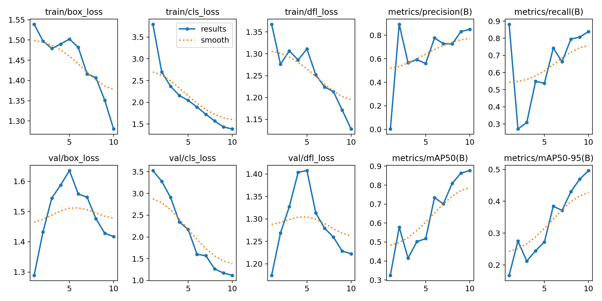
    


```python
IPyImage(filename='/content/runs/detect/train/confusion_matrix.png', width=600)
```


    

    


# **Inferencia con los modelos entrenados**


```python
'''from google.colab import drive
drive.mount('/content/drive')'''
```


```python
# Crear el modelo y optimizador igual que antes
model = PlateBBoxCNN().to(device)
optimizer = torch.optim.Adam(model.parameters(), lr=0.001)

# Cargar el checkpoint
checkpoint = torch.load('Modelo_cnn_200.pth', map_location=device)
model.load_state_dict(checkpoint['model_state_dict'])
optimizer.load_state_dict(checkpoint['optimizer_state_dict'])
start_epoch = checkpoint['epoch'] + 1

#model.eval()  # Si solo vas a usarlo para inferencia
print(f"Modelo cargado desde la epoch {start_epoch}")

# Función para visualizar predicciones
def visualizar_bbox_pred(model, dataloader):
    model.eval()  # Modo evaluación
    with torch.no_grad():  # No se calculan gradientes
        for x, y in dataloader:
            x = x.to(device)
            preds = model(x).cpu().numpy()  # Predicciones
            images = x.cpu().numpy()  # Imágenes en numpy

            for i in range(len(images)):
                img = images[i][0]  # Imagen en escala de grises
                pred_box = preds[i]  # Bounding box predicho
                h, w = img.shape  # Alto y ancho original

                # Convertir coordenadas normalizadas a píxeles
                xc, yc, bw, bh = pred_box
                x1 = int((xc - bw / 2) * w)
                y1 = int((yc - bh / 2) * h)
                x2 = int((xc + bw / 2) * w)
                y2 = int((yc + bh / 2) * h)

                # Mostrar imagen con bbox predicha
                plt.figure(figsize=(10, 5))
                plt.imshow(img, cmap='gray', interpolation='nearest')
                plt.gca().add_patch(plt.Rectangle((x1, y1), x2 - x1, y2 - y1,
                                                  edgecolor='red', facecolor='none', linewidth=2))
                plt.title("Predicción de matrícula")
                plt.axis('off')
                plt.show()
            break  # Solo muestra una tanda

# Mostrar visualización de predicciones en el set de prueba
visualizar_bbox_pred(model, test_loader)

```

    Modelo cargado desde la epoch 200
    


    

    


    

    


    

    


    

    


    

    


    

    


    

    


    

    


    

    


    

    


    

    


    

    


    

    


    

    


    

    


    

    


```python
!yolo detect predict model=/content/best_200.pt source=/content/dataset/images/val

```

    Creating new Ultralytics Settings v0.0.6 file ✅ 
    View Ultralytics Settings with 'yolo settings' or at '/root/.config/Ultralytics/settings.json'
    Update Settings with 'yolo settings key=value', i.e. 'yolo settings runs_dir=path/to/dir'. For help see https://docs.ultralytics.com/quickstart/#ultralytics-settings.
    Ultralytics 8.3.151 🚀 Python-3.11.13 torch-2.6.0+cu124 CUDA:0 (Tesla T4, 15095MiB)
    Model summary (fused): 72 layers, 3,005,843 parameters, 0 gradients, 8.1 GFLOPs
    
    image 1/87 /content/dataset/images/val/Cars0.png: 352x640 1 plate, 45.0ms
    image 2/87 /content/dataset/images/val/Cars1.png: 416x640 1 plate, 35.6ms
    image 3/87 /content/dataset/images/val/Cars101.png: 480x640 1 plate, 35.6ms
    image 4/87 /content/dataset/images/val/Cars102.png: 512x640 1 plate, 35.3ms
    image 5/87 /content/dataset/images/val/Cars105.png: 384x640 2 plates, 35.0ms
    image 6/87 /content/dataset/images/val/Cars117.png: 320x640 1 plate, 36.4ms
    image 7/87 /content/dataset/images/val/Cars121.png: 480x640 1 plate, 6.7ms
    image 8/87 /content/dataset/images/val/Cars131.png: 384x640 (no detections), 6.9ms
    image 9/87 /content/dataset/images/val/Cars140.png: 448x640 1 plate, 36.2ms
    image 10/87 /content/dataset/images/val/Cars146.png: 480x640 6 plates, 6.8ms
    image 11/87 /content/dataset/images/val/Cars15.png: 448x640 1 plate, 6.7ms
    image 12/87 /content/dataset/images/val/Cars154.png: 640x480 1 plate, 34.4ms
    image 13/87 /content/dataset/images/val/Cars158.png: 480x640 1 plate, 7.9ms
    image 14/87 /content/dataset/images/val/Cars159.png: 544x640 1 plate, 35.2ms
    image 15/87 /content/dataset/images/val/Cars16.png: 384x640 1 plate, 9.3ms
    image 16/87 /content/dataset/images/val/Cars161.png: 512x640 1 plate, 7.3ms
    image 17/87 /content/dataset/images/val/Cars162.png: 384x640 1 plate, 6.9ms
    image 18/87 /content/dataset/images/val/Cars163.png: 384x640 1 plate, 6.4ms
    image 19/87 /content/dataset/images/val/Cars164.png: 448x640 1 plate, 6.8ms
    image 20/87 /content/dataset/images/val/Cars179.png: 448x640 1 plate, 6.1ms
    image 21/87 /content/dataset/images/val/Cars192.png: 480x640 1 plate, 7.2ms
    image 22/87 /content/dataset/images/val/Cars196.png: 416x640 (no detections), 6.8ms
    image 23/87 /content/dataset/images/val/Cars197.png: 384x640 1 plate, 6.7ms
    image 24/87 /content/dataset/images/val/Cars203.png: 448x640 1 plate, 8.9ms
    image 25/87 /content/dataset/images/val/Cars204.png: 480x640 1 plate, 7.3ms
    image 26/87 /content/dataset/images/val/Cars210.png: 448x640 1 plate, 7.3ms
    image 27/87 /content/dataset/images/val/Cars218.png: 416x640 1 plate, 14.2ms
    image 28/87 /content/dataset/images/val/Cars220.png: 448x640 1 plate, 7.8ms
    image 29/87 /content/dataset/images/val/Cars222.png: 384x640 1 plate, 6.8ms
    image 30/87 /content/dataset/images/val/Cars229.png: 384x640 1 plate, 6.0ms
    image 31/87 /content/dataset/images/val/Cars230.png: 384x640 1 plate, 6.1ms
    image 32/87 /content/dataset/images/val/Cars233.png: 256x640 1 plate, 49.3ms
    image 33/87 /content/dataset/images/val/Cars242.png: 640x640 1 plate, 8.0ms
    image 34/87 /content/dataset/images/val/Cars245.png: 448x640 1 plate, 10.5ms
    image 35/87 /content/dataset/images/val/Cars247.png: 384x640 1 plate, 7.0ms
    image 36/87 /content/dataset/images/val/Cars254.png: 608x640 1 plate, 35.9ms
    image 37/87 /content/dataset/images/val/Cars255.png: 448x640 2 plates, 6.8ms
    image 38/87 /content/dataset/images/val/Cars259.png: 384x640 1 plate, 6.9ms
    image 39/87 /content/dataset/images/val/Cars260.png: 384x640 1 plate, 6.3ms
    image 40/87 /content/dataset/images/val/Cars266.png: 384x640 6 plates, 6.2ms
    image 41/87 /content/dataset/images/val/Cars276.png: 448x640 1 plate, 9.3ms
    image 42/87 /content/dataset/images/val/Cars280.png: 448x640 1 plate, 6.0ms
    image 43/87 /content/dataset/images/val/Cars282.png: 512x640 1 plate, 6.7ms
    image 44/87 /content/dataset/images/val/Cars285.png: 448x640 1 plate, 6.6ms
    image 45/87 /content/dataset/images/val/Cars288.png: 352x640 1 plate, 6.9ms
    image 46/87 /content/dataset/images/val/Cars292.png: 448x640 1 plate, 6.7ms
    image 47/87 /content/dataset/images/val/Cars299.png: 480x640 1 plate, 7.0ms
    image 48/87 /content/dataset/images/val/Cars3.png: 384x640 1 plate, 6.7ms
    image 49/87 /content/dataset/images/val/Cars302.png: 320x640 1 plate, 7.2ms
    image 50/87 /content/dataset/images/val/Cars305.png: 384x640 1 plate, 7.0ms
    image 51/87 /content/dataset/images/val/Cars316.png: 480x640 2 plates, 6.8ms
    image 52/87 /content/dataset/images/val/Cars317.png: 480x640 1 plate, 7.1ms
    image 53/87 /content/dataset/images/val/Cars322.png: 576x640 1 plate, 38.5ms
    image 54/87 /content/dataset/images/val/Cars331.png: 480x640 1 plate, 7.4ms
    image 55/87 /content/dataset/images/val/Cars336.png: 480x640 1 plate, 6.5ms
    image 56/87 /content/dataset/images/val/Cars341.png: 448x640 1 plate, 7.0ms
    image 57/87 /content/dataset/images/val/Cars343.png: 480x640 1 plate, 7.6ms
    image 58/87 /content/dataset/images/val/Cars349.png: 448x640 2 plates, 7.0ms
    image 59/87 /content/dataset/images/val/Cars35.png: 448x640 1 plate, 6.5ms
    image 60/87 /content/dataset/images/val/Cars351.png: 384x640 1 plate, 7.6ms
    image 61/87 /content/dataset/images/val/Cars354.png: 448x640 1 plate, 7.3ms
    image 62/87 /content/dataset/images/val/Cars356.png: 448x640 1 plate, 6.3ms
    image 63/87 /content/dataset/images/val/Cars359.png: 480x640 1 plate, 6.8ms
    image 64/87 /content/dataset/images/val/Cars366.png: 384x640 1 plate, 12.5ms
    image 65/87 /content/dataset/images/val/Cars367.png: 448x640 1 plate, 9.7ms
    image 66/87 /content/dataset/images/val/Cars37.png: 448x640 1 plate, 6.0ms
    image 67/87 /content/dataset/images/val/Cars370.png: 448x640 1 plate, 6.0ms
    image 68/87 /content/dataset/images/val/Cars372.png: 480x640 1 plate, 6.7ms
    image 69/87 /content/dataset/images/val/Cars391.png: 384x640 1 plate, 6.9ms
    image 70/87 /content/dataset/images/val/Cars399.png: 384x640 1 plate, 6.0ms
    image 71/87 /content/dataset/images/val/Cars40.png: 384x640 1 plate, 6.2ms
    image 72/87 /content/dataset/images/val/Cars401.png: 480x640 1 plate, 6.8ms
    image 73/87 /content/dataset/images/val/Cars403.png: 512x640 2 plates, 7.6ms
    image 74/87 /content/dataset/images/val/Cars406.png: 448x640 1 plate, 6.9ms
    image 75/87 /content/dataset/images/val/Cars410.png: 640x512 1 plate, 34.6ms
    image 76/87 /content/dataset/images/val/Cars420.png: 480x640 1 plate, 7.4ms
    image 77/87 /content/dataset/images/val/Cars424.png: 480x640 1 plate, 6.6ms
    image 78/87 /content/dataset/images/val/Cars428.png: 384x640 1 plate, 6.7ms
    image 79/87 /content/dataset/images/val/Cars429.png: 640x512 1 plate, 6.7ms
    image 80/87 /content/dataset/images/val/Cars430.png: 384x640 1 plate, 7.0ms
    image 81/87 /content/dataset/images/val/Cars432.png: 416x640 1 plate, 6.8ms
    image 82/87 /content/dataset/images/val/Cars49.png: 416x640 1 plate, 6.4ms
    image 83/87 /content/dataset/images/val/Cars55.png: 480x640 1 plate, 7.2ms
    image 84/87 /content/dataset/images/val/Cars56.png: 320x640 1 plate, 6.9ms
    image 85/87 /content/dataset/images/val/Cars62.png: 480x640 1 plate, 6.8ms
    image 86/87 /content/dataset/images/val/Cars74.png: 448x640 1 plate, 7.4ms
    image 87/87 /content/dataset/images/val/Cars99.png: 640x480 1 plate, 6.6ms
    Speed: 2.1ms preprocess, 11.7ms inference, 5.3ms postprocess per image at shape (1, 3, 640, 480)
    Results saved to runs/detect/predict
    💡 Learn more at https://docs.ultralytics.com/modes/predict
    

# **Lectura y visualización de las matriculas con EasyOCR**


```python
import cv2
import matplotlib.pyplot as plt
import easyocr
import os

# Rutas a las carpetas de imágenes y etiquetas
img_dir = '/content/runs/detect/predict'
label_dir = '/content/dataset/labels/val'

# Listar los archivos de imagen y ordenarlo
image_files = []

for f in os.listdir(img_dir):
    if f.endswith('.png') or f.endswith('.jpg'):
        image_files.append(f)

image_files = sorted(image_files)[:15]

# Inicializar el lector OCR una sola vez
reader = easyocr.Reader(['en'])

# Procesar las primeras 15 imágenes
for img_file in image_files:
    print(f"\nProcesando imagen: {img_file}")
    img_path = os.path.join(img_dir, img_file)
    label_file = os.path.splitext(img_file)[0] + '.txt'
    label_path = os.path.join(label_dir, label_file)

    # Cargar imagen
    img = cv2.imread(img_path)
    img_rgb = cv2.cvtColor(img, cv2.COLOR_BGR2RGB)
    h, w, _ = img.shape

    # Leer las etiquetas
    if not os.path.exists(label_path):
        print("No se encontró el archivo de etiqueta:", label_path)
        continue

    with open(label_path, 'r') as f:
        lines = f.readlines()

    for line in lines:
        class_id, x_center, y_center, box_width, box_height = map(float, line.strip().split())

        # Convertir a coordenadas absolutas
        x1 = int(round((x_center - box_width / 2) * w))
        y1 = int(round((y_center - box_height / 2) * h))
        x2 = int(round((x_center + box_width / 2) * w))
        y2 = int(round((y_center + box_height / 2) * h))

        # Asegurarse de que las coordenadas estén dentro de los límites
        x1, y1 = max(0, x1), max(0, y1)
        x2, y2 = min(w, x2), min(h, y2)

        # Recortar ROI
        roi = img_rgb[y1:y2, x1:x2]

        # Mostrar el ROI
        plt.imshow(img_rgb)
        plt.axis('off')
        plt.title(f'{img_file} | Clase: {int(class_id)}')
        plt.show()

        # Aplicar OCR
        results = reader.readtext(roi)

        for detection in results:
            text = detection[1]
            print("Texto detectado:", text)

```

    WARNING:easyocr.easyocr:Downloading detection model, please wait. This may take several minutes depending upon your network connection.
    

    Progress: |██████████████████████████████████████████████████| 100.0% Complete

    WARNING:easyocr.easyocr:Downloading recognition model, please wait. This may take several minutes depending upon your network connection.
    

    
Progress: |--------------------------------------------------| 0.0% Complete
Progress: |--------------------------------------------------| 0.1% Complete
Progress: |--------------------------------------------------| 0.1% Complete
Progress: |--------------------------------------------------| 0.2% Complete
Progress: |--------------------------------------------------| 0.2% Complete
Progress: |--------------------------------------------------| 0.3% Complete
Progress: |--------------------------------------------------| 0.4% Complete
Progress: |--------------------------------------------------| 0.4% Complete
Progress: |--------------------------------------------------| 0.5% Complete
Progress: |--------------------------------------------------| 0.5% Complete
Progress: |--------------------------------------------------| 0.6% Complete
Progress: |--------------------------------------------------| 0.6% Complete
Progress: |--------------------------------------------------| 0.7% Complete
Progress: |--------------------------------------------------| 0.8% Complete
Progress: |--------------------------------------------------| 0.8% Complete
Progress: |--------------------------------------------------| 0.9% Complete
Progress: |--------------------------------------------------| 0.9% Complete
Progress: |--------------------------------------------------| 1.0% Complete
Progress: |--------------------------------------------------| 1.1% Complete
Progress: |--------------------------------------------------| 1.1% Complete
Progress: |--------------------------------------------------| 1.2% Complete
Progress: |--------------------------------------------------| 1.2% Complete
Progress: |--------------------------------------------------| 1.3% Complete
Progress: |--------------------------------------------------| 1.3% Complete
Progress: |--------------------------------------------------| 1.4% Complete
Progress: |--------------------------------------------------| 1.5% Complete
Progress: |--------------------------------------------------| 1.5% Complete
Progress: |--------------------------------------------------| 1.6% Complete
Progress: |--------------------------------------------------| 1.6% Complete
Progress: |--------------------------------------------------| 1.7% Complete
Progress: |--------------------------------------------------| 1.8% Complete
Progress: |--------------------------------------------------| 1.8% Complete
Progress: |--------------------------------------------------| 1.9% Complete
Progress: |--------------------------------------------------| 1.9% Complete
Progress: |--------------------------------------------------| 2.0% Complete
Progress: |█-------------------------------------------------| 2.0% Complete
Progress: |█-------------------------------------------------| 2.1% Complete
Progress: |█-------------------------------------------------| 2.2% Complete
Progress: |█-------------------------------------------------| 2.2% Complete
Progress: |█-------------------------------------------------| 2.3% Complete
Progress: |█-------------------------------------------------| 2.3% Complete
Progress: |█-------------------------------------------------| 2.4% Complete
Progress: |█-------------------------------------------------| 2.5% Complete
Progress: |█-------------------------------------------------| 2.5% Complete
Progress: |█-------------------------------------------------| 2.6% Complete
Progress: |█-------------------------------------------------| 2.6% Complete
Progress: |█-------------------------------------------------| 2.7% Complete
Progress: |█-------------------------------------------------| 2.7% Complete
Progress: |█-------------------------------------------------| 2.8% Complete
Progress: |█-------------------------------------------------| 2.9% Complete
Progress: |█-------------------------------------------------| 2.9% Complete
Progress: |█-------------------------------------------------| 3.0% Complete
Progress: |█-------------------------------------------------| 3.0% Complete
Progress: |█-------------------------------------------------| 3.1% Complete
Progress: |█-------------------------------------------------| 3.2% Complete
Progress: |█-------------------------------------------------| 3.2% Complete
Progress: |█-------------------------------------------------| 3.3% Complete
Progress: |█-------------------------------------------------| 3.3% Complete
Progress: |█-------------------------------------------------| 3.4% Complete
Progress: |█-------------------------------------------------| 3.4% Complete
Progress: |█-------------------------------------------------| 3.5% Complete
Progress: |█-------------------------------------------------| 3.6% Complete
Progress: |█-------------------------------------------------| 3.6% Complete
Progress: |█-------------------------------------------------| 3.7% Complete
Progress: |█-------------------------------------------------| 3.7% Complete
Progress: |█-------------------------------------------------| 3.8% Complete
Progress: |█-------------------------------------------------| 3.9% Complete
Progress: |█-------------------------------------------------| 3.9% Complete
Progress: |█-------------------------------------------------| 4.0% Complete
Progress: |██------------------------------------------------| 4.0% Complete
Progress: |██------------------------------------------------| 4.1% Complete
Progress: |██------------------------------------------------| 4.1% Complete
Progress: |██------------------------------------------------| 4.2% Complete
Progress: |██------------------------------------------------| 4.3% Complete
Progress: |██------------------------------------------------| 4.3% Complete
Progress: |██------------------------------------------------| 4.4% Complete
Progress: |██------------------------------------------------| 4.4% Complete
Progress: |██------------------------------------------------| 4.5% Complete
Progress: |██------------------------------------------------| 4.6% Complete
Progress: |██------------------------------------------------| 4.6% Complete
Progress: |██------------------------------------------------| 4.7% Complete
Progress: |██------------------------------------------------| 4.7% Complete
Progress: |██------------------------------------------------| 4.8% Complete
Progress: |██------------------------------------------------| 4.8% Complete
Progress: |██------------------------------------------------| 4.9% Complete
Progress: |██------------------------------------------------| 5.0% Complete
Progress: |██------------------------------------------------| 5.0% Complete
Progress: |██------------------------------------------------| 5.1% Complete
Progress: |██------------------------------------------------| 5.1% Complete
Progress: |██------------------------------------------------| 5.2% Complete
Progress: |██------------------------------------------------| 5.3% Complete
Progress: |██------------------------------------------------| 5.3% Complete
Progress: |██------------------------------------------------| 5.4% Complete
Progress: |██------------------------------------------------| 5.4% Complete
Progress: |██------------------------------------------------| 5.5% Complete
Progress: |██------------------------------------------------| 5.5% Complete
Progress: |██------------------------------------------------| 5.6% Complete
Progress: |██------------------------------------------------| 5.7% Complete
Progress: |██------------------------------------------------| 5.7% Complete
Progress: |██------------------------------------------------| 5.8% Complete
Progress: |██------------------------------------------------| 5.8% Complete
Progress: |██------------------------------------------------| 5.9% Complete
Progress: |██------------------------------------------------| 6.0% Complete
Progress: |███-----------------------------------------------| 6.0% Complete
Progress: |███-----------------------------------------------| 6.1% Complete
Progress: |███-----------------------------------------------| 6.1% Complete
Progress: |███-----------------------------------------------| 6.2% Complete
Progress: |███-----------------------------------------------| 6.2% Complete
Progress: |███-----------------------------------------------| 6.3% Complete
Progress: |███-----------------------------------------------| 6.4% Complete
Progress: |███-----------------------------------------------| 6.4% Complete
Progress: |███-----------------------------------------------| 6.5% Complete
Progress: |███-----------------------------------------------| 6.5% Complete
Progress: |███-----------------------------------------------| 6.6% Complete
Progress: |███-----------------------------------------------| 6.7% Complete
Progress: |███-----------------------------------------------| 6.7% Complete
Progress: |███-----------------------------------------------| 6.8% Complete
Progress: |███-----------------------------------------------| 6.8% Complete
Progress: |███-----------------------------------------------| 6.9% Complete
Progress: |███-----------------------------------------------| 6.9% Complete
Progress: |███-----------------------------------------------| 7.0% Complete
Progress: |███-----------------------------------------------| 7.1% Complete
Progress: |███-----------------------------------------------| 7.1% Complete
Progress: |███-----------------------------------------------| 7.2% Complete
Progress: |███-----------------------------------------------| 7.2% Complete
Progress: |███-----------------------------------------------| 7.3% Complete
Progress: |███-----------------------------------------------| 7.4% Complete
Progress: |███-----------------------------------------------| 7.4% Complete
Progress: |███-----------------------------------------------| 7.5% Complete
Progress: |███-----------------------------------------------| 7.5% Complete
Progress: |███-----------------------------------------------| 7.6% Complete
Progress: |███-----------------------------------------------| 7.6% Complete
Progress: |███-----------------------------------------------| 7.7% Complete
Progress: |███-----------------------------------------------| 7.8% Complete
Progress: |███-----------------------------------------------| 7.8% Complete
Progress: |███-----------------------------------------------| 7.9% Complete
Progress: |███-----------------------------------------------| 7.9% Complete
Progress: |███-----------------------------------------------| 8.0% Complete
Progress: |████----------------------------------------------| 8.1% Complete
Progress: |████----------------------------------------------| 8.1% Complete
Progress: |████----------------------------------------------| 8.2% Complete
Progress: |████----------------------------------------------| 8.2% Complete
Progress: |████----------------------------------------------| 8.3% Complete
Progress: |████----------------------------------------------| 8.3% Complete
Progress: |████----------------------------------------------| 8.4% Complete
Progress: |████----------------------------------------------| 8.5% Complete
Progress: |████----------------------------------------------| 8.5% Complete
Progress: |████----------------------------------------------| 8.6% Complete
Progress: |████----------------------------------------------| 8.6% Complete
Progress: |████----------------------------------------------| 8.7% Complete
Progress: |████----------------------------------------------| 8.8% Complete
Progress: |████----------------------------------------------| 8.8% Complete
Progress: |████----------------------------------------------| 8.9% Complete
Progress: |████----------------------------------------------| 8.9% Complete
Progress: |████----------------------------------------------| 9.0% Complete
Progress: |████----------------------------------------------| 9.0% Complete
Progress: |████----------------------------------------------| 9.1% Complete
Progress: |████----------------------------------------------| 9.2% Complete
Progress: |████----------------------------------------------| 9.2% Complete
Progress: |████----------------------------------------------| 9.3% Complete
Progress: |████----------------------------------------------| 9.3% Complete
Progress: |████----------------------------------------------| 9.4% Complete
Progress: |████----------------------------------------------| 9.5% Complete
Progress: |████----------------------------------------------| 9.5% Complete
Progress: |████----------------------------------------------| 9.6% Complete
Progress: |████----------------------------------------------| 9.6% Complete
Progress: |████----------------------------------------------| 9.7% Complete
Progress: |████----------------------------------------------| 9.7% Complete
Progress: |████----------------------------------------------| 9.8% Complete
Progress: |████----------------------------------------------| 9.9% Complete
Progress: |████----------------------------------------------| 9.9% Complete
Progress: |████----------------------------------------------| 10.0% Complete
Progress: |█████---------------------------------------------| 10.0% Complete
Progress: |█████---------------------------------------------| 10.1% Complete
Progress: |█████---------------------------------------------| 10.2% Complete
Progress: |█████---------------------------------------------| 10.2% Complete
Progress: |█████---------------------------------------------| 10.3% Complete
Progress: |█████---------------------------------------------| 10.3% Complete
Progress: |█████---------------------------------------------| 10.4% Complete
Progress: |█████---------------------------------------------| 10.4% Complete
Progress: |█████---------------------------------------------| 10.5% Complete
Progress: |█████---------------------------------------------| 10.6% Complete
Progress: |█████---------------------------------------------| 10.6% Complete
Progress: |█████---------------------------------------------| 10.7% Complete
Progress: |█████---------------------------------------------| 10.7% Complete
Progress: |█████---------------------------------------------| 10.8% Complete
Progress: |█████---------------------------------------------| 10.9% Complete
Progress: |█████---------------------------------------------| 10.9% Complete
Progress: |█████---------------------------------------------| 11.0% Complete
Progress: |█████---------------------------------------------| 11.0% Complete
Progress: |█████---------------------------------------------| 11.1% Complete
Progress: |█████---------------------------------------------| 11.1% Complete
Progress: |█████---------------------------------------------| 11.2% Complete
Progress: |█████---------------------------------------------| 11.3% Complete
Progress: |█████---------------------------------------------| 11.3% Complete
Progress: |█████---------------------------------------------| 11.4% Complete
Progress: |█████---------------------------------------------| 11.4% Complete
Progress: |█████---------------------------------------------| 11.5% Complete
Progress: |█████---------------------------------------------| 11.6% Complete
Progress: |█████---------------------------------------------| 11.6% Complete
Progress: |█████---------------------------------------------| 11.7% Complete
Progress: |█████---------------------------------------------| 11.7% Complete
Progress: |█████---------------------------------------------| 11.8% Complete
Progress: |█████---------------------------------------------| 11.8% Complete
Progress: |█████---------------------------------------------| 11.9% Complete
Progress: |█████---------------------------------------------| 12.0% Complete
Progress: |██████--------------------------------------------| 12.0% Complete
Progress: |██████--------------------------------------------| 12.1% Complete
Progress: |██████--------------------------------------------| 12.1% Complete
Progress: |██████--------------------------------------------| 12.2% Complete
Progress: |██████--------------------------------------------| 12.3% Complete
Progress: |██████--------------------------------------------| 12.3% Complete
Progress: |██████--------------------------------------------| 12.4% Complete
Progress: |██████--------------------------------------------| 12.4% Complete
Progress: |██████--------------------------------------------| 12.5% Complete
Progress: |██████--------------------------------------------| 12.5% Complete
Progress: |██████--------------------------------------------| 12.6% Complete
Progress: |██████--------------------------------------------| 12.7% Complete
Progress: |██████--------------------------------------------| 12.7% Complete
Progress: |██████--------------------------------------------| 12.8% Complete
Progress: |██████--------------------------------------------| 12.8% Complete
Progress: |██████--------------------------------------------| 12.9% Complete
Progress: |██████--------------------------------------------| 13.0% Complete
Progress: |██████--------------------------------------------| 13.0% Complete
Progress: |██████--------------------------------------------| 13.1% Complete
Progress: |██████--------------------------------------------| 13.1% Complete
Progress: |██████--------------------------------------------| 13.2% Complete
Progress: |██████--------------------------------------------| 13.2% Complete
Progress: |██████--------------------------------------------| 13.3% Complete
Progress: |██████--------------------------------------------| 13.4% Complete
Progress: |██████--------------------------------------------| 13.4% Complete
Progress: |██████--------------------------------------------| 13.5% Complete
Progress: |██████--------------------------------------------| 13.5% Complete
Progress: |██████--------------------------------------------| 13.6% Complete
Progress: |██████--------------------------------------------| 13.7% Complete
Progress: |██████--------------------------------------------| 13.7% Complete
Progress: |██████--------------------------------------------| 13.8% Complete
Progress: |██████--------------------------------------------| 13.8% Complete
Progress: |██████--------------------------------------------| 13.9% Complete
Progress: |██████--------------------------------------------| 13.9% Complete
Progress: |███████-------------------------------------------| 14.0% Complete
Progress: |███████-------------------------------------------| 14.1% Complete
Progress: |███████-------------------------------------------| 14.1% Complete
Progress: |███████-------------------------------------------| 14.2% Complete
Progress: |███████-------------------------------------------| 14.2% Complete
Progress: |███████-------------------------------------------| 14.3% Complete
Progress: |███████-------------------------------------------| 14.4% Complete
Progress: |███████-------------------------------------------| 14.4% Complete
Progress: |███████-------------------------------------------| 14.5% Complete
Progress: |███████-------------------------------------------| 14.5% Complete
Progress: |███████-------------------------------------------| 14.6% Complete
Progress: |███████-------------------------------------------| 14.6% Complete
Progress: |███████-------------------------------------------| 14.7% Complete
Progress: |███████-------------------------------------------| 14.8% Complete
Progress: |███████-------------------------------------------| 14.8% Complete
Progress: |███████-------------------------------------------| 14.9% Complete
Progress: |███████-------------------------------------------| 14.9% Complete
Progress: |███████-------------------------------------------| 15.0% Complete
Progress: |███████-------------------------------------------| 15.1% Complete
Progress: |███████-------------------------------------------| 15.1% Complete
Progress: |███████-------------------------------------------| 15.2% Complete
Progress: |███████-------------------------------------------| 15.2% Complete
Progress: |███████-------------------------------------------| 15.3% Complete
Progress: |███████-------------------------------------------| 15.3% Complete
Progress: |███████-------------------------------------------| 15.4% Complete
Progress: |███████-------------------------------------------| 15.5% Complete
Progress: |███████-------------------------------------------| 15.5% Complete
Progress: |███████-------------------------------------------| 15.6% Complete
Progress: |███████-------------------------------------------| 15.6% Complete
Progress: |███████-------------------------------------------| 15.7% Complete
Progress: |███████-------------------------------------------| 15.8% Complete
Progress: |███████-------------------------------------------| 15.8% Complete
Progress: |███████-------------------------------------------| 15.9% Complete
Progress: |███████-------------------------------------------| 15.9% Complete
Progress: |███████-------------------------------------------| 16.0% Complete
Progress: |████████------------------------------------------| 16.0% Complete
Progress: |████████------------------------------------------| 16.1% Complete
Progress: |████████------------------------------------------| 16.2% Complete
Progress: |████████------------------------------------------| 16.2% Complete
Progress: |████████------------------------------------------| 16.3% Complete
Progress: |████████------------------------------------------| 16.3% Complete
Progress: |████████------------------------------------------| 16.4% Complete
Progress: |████████------------------------------------------| 16.5% Complete
Progress: |████████------------------------------------------| 16.5% Complete
Progress: |████████------------------------------------------| 16.6% Complete
Progress: |████████------------------------------------------| 16.6% Complete
Progress: |████████------------------------------------------| 16.7% Complete
Progress: |████████------------------------------------------| 16.7% Complete
Progress: |████████------------------------------------------| 16.8% Complete
Progress: |████████------------------------------------------| 16.9% Complete
Progress: |████████------------------------------------------| 16.9% Complete
Progress: |████████------------------------------------------| 17.0% Complete
Progress: |████████------------------------------------------| 17.0% Complete
Progress: |████████------------------------------------------| 17.1% Complete
Progress: |████████------------------------------------------| 17.2% Complete
Progress: |████████------------------------------------------| 17.2% Complete
Progress: |████████------------------------------------------| 17.3% Complete
Progress: |████████------------------------------------------| 17.3% Complete
Progress: |████████------------------------------------------| 17.4% Complete
Progress: |████████------------------------------------------| 17.4% Complete
Progress: |████████------------------------------------------| 17.5% Complete
Progress: |████████------------------------------------------| 17.6% Complete
Progress: |████████------------------------------------------| 17.6% Complete
Progress: |████████------------------------------------------| 17.7% Complete
Progress: |████████------------------------------------------| 17.7% Complete
Progress: |████████------------------------------------------| 17.8% Complete
Progress: |████████------------------------------------------| 17.9% Complete
Progress: |████████------------------------------------------| 17.9% Complete
Progress: |████████------------------------------------------| 18.0% Complete
Progress: |█████████-----------------------------------------| 18.0% Complete
Progress: |█████████-----------------------------------------| 18.1% Complete
Progress: |█████████-----------------------------------------| 18.1% Complete
Progress: |█████████-----------------------------------------| 18.2% Complete
Progress: |█████████-----------------------------------------| 18.3% Complete
Progress: |█████████-----------------------------------------| 18.3% Complete
Progress: |█████████-----------------------------------------| 18.4% Complete
Progress: |█████████-----------------------------------------| 18.4% Complete
Progress: |█████████-----------------------------------------| 18.5% Complete
Progress: |█████████-----------------------------------------| 18.6% Complete
Progress: |█████████-----------------------------------------| 18.6% Complete
Progress: |█████████-----------------------------------------| 18.7% Complete
Progress: |█████████-----------------------------------------| 18.7% Complete
Progress: |█████████-----------------------------------------| 18.8% Complete
Progress: |█████████-----------------------------------------| 18.8% Complete
Progress: |█████████-----------------------------------------| 18.9% Complete
Progress: |█████████-----------------------------------------| 19.0% Complete
Progress: |█████████-----------------------------------------| 19.0% Complete
Progress: |█████████-----------------------------------------| 19.1% Complete
Progress: |█████████-----------------------------------------| 19.1% Complete
Progress: |█████████-----------------------------------------| 19.2% Complete
Progress: |█████████-----------------------------------------| 19.3% Complete
Progress: |█████████-----------------------------------------| 19.3% Complete
Progress: |█████████-----------------------------------------| 19.4% Complete
Progress: |█████████-----------------------------------------| 19.4% Complete
Progress: |█████████-----------------------------------------| 19.5% Complete
Progress: |█████████-----------------------------------------| 19.5% Complete
Progress: |█████████-----------------------------------------| 19.6% Complete
Progress: |█████████-----------------------------------------| 19.7% Complete
Progress: |█████████-----------------------------------------| 19.7% Complete
Progress: |█████████-----------------------------------------| 19.8% Complete
Progress: |█████████-----------------------------------------| 19.8% Complete
Progress: |█████████-----------------------------------------| 19.9% Complete
Progress: |█████████-----------------------------------------| 20.0% Complete
Progress: |██████████----------------------------------------| 20.0% Complete
Progress: |██████████----------------------------------------| 20.1% Complete
Progress: |██████████----------------------------------------| 20.1% Complete
Progress: |██████████----------------------------------------| 20.2% Complete
Progress: |██████████----------------------------------------| 20.2% Complete
Progress: |██████████----------------------------------------| 20.3% Complete
Progress: |██████████----------------------------------------| 20.4% Complete
Progress: |██████████----------------------------------------| 20.4% Complete
Progress: |██████████----------------------------------------| 20.5% Complete
Progress: |██████████----------------------------------------| 20.5% Complete
Progress: |██████████----------------------------------------| 20.6% Complete
Progress: |██████████----------------------------------------| 20.7% Complete
Progress: |██████████----------------------------------------| 20.7% Complete
Progress: |██████████----------------------------------------| 20.8% Complete
Progress: |██████████----------------------------------------| 20.8% Complete
Progress: |██████████----------------------------------------| 20.9% Complete
Progress: |██████████----------------------------------------| 20.9% Complete
Progress: |██████████----------------------------------------| 21.0% Complete
Progress: |██████████----------------------------------------| 21.1% Complete
Progress: |██████████----------------------------------------| 21.1% Complete
Progress: |██████████----------------------------------------| 21.2% Complete
Progress: |██████████----------------------------------------| 21.2% Complete
Progress: |██████████----------------------------------------| 21.3% Complete
Progress: |██████████----------------------------------------| 21.4% Complete
Progress: |██████████----------------------------------------| 21.4% Complete
Progress: |██████████----------------------------------------| 21.5% Complete
Progress: |██████████----------------------------------------| 21.5% Complete
Progress: |██████████----------------------------------------| 21.6% Complete
Progress: |██████████----------------------------------------| 21.6% Complete
Progress: |██████████----------------------------------------| 21.7% Complete
Progress: |██████████----------------------------------------| 21.8% Complete
Progress: |██████████----------------------------------------| 21.8% Complete
Progress: |██████████----------------------------------------| 21.9% Complete
Progress: |██████████----------------------------------------| 21.9% Complete
Progress: |██████████----------------------------------------| 22.0% Complete
Progress: |███████████---------------------------------------| 22.1% Complete
Progress: |███████████---------------------------------------| 22.1% Complete
Progress: |███████████---------------------------------------| 22.2% Complete
Progress: |███████████---------------------------------------| 22.2% Complete
Progress: |███████████---------------------------------------| 22.3% Complete
Progress: |███████████---------------------------------------| 22.3% Complete
Progress: |███████████---------------------------------------| 22.4% Complete
Progress: |███████████---------------------------------------| 22.5% Complete
Progress: |███████████---------------------------------------| 22.5% Complete
Progress: |███████████---------------------------------------| 22.6% Complete
Progress: |███████████---------------------------------------| 22.6% Complete
Progress: |███████████---------------------------------------| 22.7% Complete
Progress: |███████████---------------------------------------| 22.8% Complete
Progress: |███████████---------------------------------------| 22.8% Complete
Progress: |███████████---------------------------------------| 22.9% Complete
Progress: |███████████---------------------------------------| 22.9% Complete
Progress: |███████████---------------------------------------| 23.0% Complete
Progress: |███████████---------------------------------------| 23.0% Complete
Progress: |███████████---------------------------------------| 23.1% Complete
Progress: |███████████---------------------------------------| 23.2% Complete
Progress: |███████████---------------------------------------| 23.2% Complete
Progress: |███████████---------------------------------------| 23.3% Complete
Progress: |███████████---------------------------------------| 23.3% Complete
Progress: |███████████---------------------------------------| 23.4% Complete
Progress: |███████████---------------------------------------| 23.5% Complete
Progress: |███████████---------------------------------------| 23.5% Complete
Progress: |███████████---------------------------------------| 23.6% Complete
Progress: |███████████---------------------------------------| 23.6% Complete
Progress: |███████████---------------------------------------| 23.7% Complete
Progress: |███████████---------------------------------------| 23.7% Complete
Progress: |███████████---------------------------------------| 23.8% Complete
Progress: |███████████---------------------------------------| 23.9% Complete
Progress: |███████████---------------------------------------| 23.9% Complete
Progress: |███████████---------------------------------------| 24.0% Complete
Progress: |████████████--------------------------------------| 24.0% Complete
Progress: |████████████--------------------------------------| 24.1% Complete
Progress: |████████████--------------------------------------| 24.2% Complete
Progress: |████████████--------------------------------------| 24.2% Complete
Progress: |████████████--------------------------------------| 24.3% Complete
Progress: |████████████--------------------------------------| 24.3% Complete
Progress: |████████████--------------------------------------| 24.4% Complete
Progress: |████████████--------------------------------------| 24.4% Complete
Progress: |████████████--------------------------------------| 24.5% Complete
Progress: |████████████--------------------------------------| 24.6% Complete
Progress: |████████████--------------------------------------| 24.6% Complete
Progress: |████████████--------------------------------------| 24.7% Complete
Progress: |████████████--------------------------------------| 24.7% Complete
Progress: |████████████--------------------------------------| 24.8% Complete
Progress: |████████████--------------------------------------| 24.9% Complete
Progress: |████████████--------------------------------------| 24.9% Complete
Progress: |████████████--------------------------------------| 25.0% Complete
Progress: |████████████--------------------------------------| 25.0% Complete
Progress: |████████████--------------------------------------| 25.1% Complete
Progress: |████████████--------------------------------------| 25.1% Complete
Progress: |████████████--------------------------------------| 25.2% Complete
Progress: |████████████--------------------------------------| 25.3% Complete
Progress: |████████████--------------------------------------| 25.3% Complete
Progress: |████████████--------------------------------------| 25.4% Complete
Progress: |████████████--------------------------------------| 25.4% Complete
Progress: |████████████--------------------------------------| 25.5% Complete
Progress: |████████████--------------------------------------| 25.6% Complete
Progress: |████████████--------------------------------------| 25.6% Complete
Progress: |████████████--------------------------------------| 25.7% Complete
Progress: |████████████--------------------------------------| 25.7% Complete
Progress: |████████████--------------------------------------| 25.8% Complete
Progress: |████████████--------------------------------------| 25.8% Complete
Progress: |████████████--------------------------------------| 25.9% Complete
Progress: |████████████--------------------------------------| 26.0% Complete
Progress: |█████████████-------------------------------------| 26.0% Complete
Progress: |█████████████-------------------------------------| 26.1% Complete
Progress: |█████████████-------------------------------------| 26.1% Complete
Progress: |█████████████-------------------------------------| 26.2% Complete
Progress: |█████████████-------------------------------------| 26.3% Complete
Progress: |█████████████-------------------------------------| 26.3% Complete
Progress: |█████████████-------------------------------------| 26.4% Complete
Progress: |█████████████-------------------------------------| 26.4% Complete
Progress: |█████████████-------------------------------------| 26.5% Complete
Progress: |█████████████-------------------------------------| 26.5% Complete
Progress: |█████████████-------------------------------------| 26.6% Complete
Progress: |█████████████-------------------------------------| 26.7% Complete
Progress: |█████████████-------------------------------------| 26.7% Complete
Progress: |█████████████-------------------------------------| 26.8% Complete
Progress: |█████████████-------------------------------------| 26.8% Complete
Progress: |█████████████-------------------------------------| 26.9% Complete
Progress: |█████████████-------------------------------------| 27.0% Complete
Progress: |█████████████-------------------------------------| 27.0% Complete
Progress: |█████████████-------------------------------------| 27.1% Complete
Progress: |█████████████-------------------------------------| 27.1% Complete
Progress: |█████████████-------------------------------------| 27.2% Complete
Progress: |█████████████-------------------------------------| 27.2% Complete
Progress: |█████████████-------------------------------------| 27.3% Complete
Progress: |█████████████-------------------------------------| 27.4% Complete
Progress: |█████████████-------------------------------------| 27.4% Complete
Progress: |█████████████-------------------------------------| 27.5% Complete
Progress: |█████████████-------------------------------------| 27.5% Complete
Progress: |█████████████-------------------------------------| 27.6% Complete
Progress: |█████████████-------------------------------------| 27.7% Complete
Progress: |█████████████-------------------------------------| 27.7% Complete
Progress: |█████████████-------------------------------------| 27.8% Complete
Progress: |█████████████-------------------------------------| 27.8% Complete
Progress: |█████████████-------------------------------------| 27.9% Complete
Progress: |█████████████-------------------------------------| 27.9% Complete
Progress: |██████████████------------------------------------| 28.0% Complete
Progress: |██████████████------------------------------------| 28.1% Complete
Progress: |██████████████------------------------------------| 28.1% Complete
Progress: |██████████████------------------------------------| 28.2% Complete
Progress: |██████████████------------------------------------| 28.2% Complete
Progress: |██████████████------------------------------------| 28.3% Complete
Progress: |██████████████------------------------------------| 28.4% Complete
Progress: |██████████████------------------------------------| 28.4% Complete
Progress: |██████████████------------------------------------| 28.5% Complete
Progress: |██████████████------------------------------------| 28.5% Complete
Progress: |██████████████------------------------------------| 28.6% Complete
Progress: |██████████████------------------------------------| 28.6% Complete
Progress: |██████████████------------------------------------| 28.7% Complete
Progress: |██████████████------------------------------------| 28.8% Complete
Progress: |██████████████------------------------------------| 28.8% Complete
Progress: |██████████████------------------------------------| 28.9% Complete
Progress: |██████████████------------------------------------| 28.9% Complete
Progress: |██████████████------------------------------------| 29.0% Complete
Progress: |██████████████------------------------------------| 29.1% Complete
Progress: |██████████████------------------------------------| 29.1% Complete
Progress: |██████████████------------------------------------| 29.2% Complete
Progress: |██████████████------------------------------------| 29.2% Complete
Progress: |██████████████------------------------------------| 29.3% Complete
Progress: |██████████████------------------------------------| 29.3% Complete
Progress: |██████████████------------------------------------| 29.4% Complete
Progress: |██████████████------------------------------------| 29.5% Complete
Progress: |██████████████------------------------------------| 29.5% Complete
Progress: |██████████████------------------------------------| 29.6% Complete
Progress: |██████████████------------------------------------| 29.6% Complete
Progress: |██████████████------------------------------------| 29.7% Complete
Progress: |██████████████------------------------------------| 29.8% Complete
Progress: |██████████████------------------------------------| 29.8% Complete
Progress: |██████████████------------------------------------| 29.9% Complete
Progress: |██████████████------------------------------------| 29.9% Complete
Progress: |██████████████------------------------------------| 30.0% Complete
Progress: |███████████████-----------------------------------| 30.0% Complete
Progress: |███████████████-----------------------------------| 30.1% Complete
Progress: |███████████████-----------------------------------| 30.2% Complete
Progress: |███████████████-----------------------------------| 30.2% Complete
Progress: |███████████████-----------------------------------| 30.3% Complete
Progress: |███████████████-----------------------------------| 30.3% Complete
Progress: |███████████████-----------------------------------| 30.4% Complete
Progress: |███████████████-----------------------------------| 30.5% Complete
Progress: |███████████████-----------------------------------| 30.5% Complete
Progress: |███████████████-----------------------------------| 30.6% Complete
Progress: |███████████████-----------------------------------| 30.6% Complete
Progress: |███████████████-----------------------------------| 30.7% Complete
Progress: |███████████████-----------------------------------| 30.7% Complete
Progress: |███████████████-----------------------------------| 30.8% Complete
Progress: |███████████████-----------------------------------| 30.9% Complete
Progress: |███████████████-----------------------------------| 30.9% Complete
Progress: |███████████████-----------------------------------| 31.0% Complete
Progress: |███████████████-----------------------------------| 31.0% Complete
Progress: |███████████████-----------------------------------| 31.1% Complete
Progress: |███████████████-----------------------------------| 31.2% Complete
Progress: |███████████████-----------------------------------| 31.2% Complete
Progress: |███████████████-----------------------------------| 31.3% Complete
Progress: |███████████████-----------------------------------| 31.3% Complete
Progress: |███████████████-----------------------------------| 31.4% Complete
Progress: |███████████████-----------------------------------| 31.4% Complete
Progress: |███████████████-----------------------------------| 31.5% Complete
Progress: |███████████████-----------------------------------| 31.6% Complete
Progress: |███████████████-----------------------------------| 31.6% Complete
Progress: |███████████████-----------------------------------| 31.7% Complete
Progress: |███████████████-----------------------------------| 31.7% Complete
Progress: |███████████████-----------------------------------| 31.8% Complete
Progress: |███████████████-----------------------------------| 31.9% Complete
Progress: |███████████████-----------------------------------| 31.9% Complete
Progress: |███████████████-----------------------------------| 32.0% Complete
Progress: |████████████████----------------------------------| 32.0% Complete
Progress: |████████████████----------------------------------| 32.1% Complete
Progress: |████████████████----------------------------------| 32.1% Complete
Progress: |████████████████----------------------------------| 32.2% Complete
Progress: |████████████████----------------------------------| 32.3% Complete
Progress: |████████████████----------------------------------| 32.3% Complete
Progress: |████████████████----------------------------------| 32.4% Complete
Progress: |████████████████----------------------------------| 32.4% Complete
Progress: |████████████████----------------------------------| 32.5% Complete
Progress: |████████████████----------------------------------| 32.6% Complete
Progress: |████████████████----------------------------------| 32.6% Complete
Progress: |████████████████----------------------------------| 32.7% Complete
Progress: |████████████████----------------------------------| 32.7% Complete
Progress: |████████████████----------------------------------| 32.8% Complete
Progress: |████████████████----------------------------------| 32.8% Complete
Progress: |████████████████----------------------------------| 32.9% Complete
Progress: |████████████████----------------------------------| 33.0% Complete
Progress: |████████████████----------------------------------| 33.0% Complete
Progress: |████████████████----------------------------------| 33.1% Complete
Progress: |████████████████----------------------------------| 33.1% Complete
Progress: |████████████████----------------------------------| 33.2% Complete
Progress: |████████████████----------------------------------| 33.3% Complete
Progress: |████████████████----------------------------------| 33.3% Complete
Progress: |████████████████----------------------------------| 33.4% Complete
Progress: |████████████████----------------------------------| 33.4% Complete
Progress: |████████████████----------------------------------| 33.5% Complete
Progress: |████████████████----------------------------------| 33.5% Complete
Progress: |████████████████----------------------------------| 33.6% Complete
Progress: |████████████████----------------------------------| 33.7% Complete
Progress: |████████████████----------------------------------| 33.7% Complete
Progress: |████████████████----------------------------------| 33.8% Complete
Progress: |████████████████----------------------------------| 33.8% Complete
Progress: |████████████████----------------------------------| 33.9% Complete
Progress: |████████████████----------------------------------| 34.0% Complete
Progress: |█████████████████---------------------------------| 34.0% Complete
Progress: |█████████████████---------------------------------| 34.1% Complete
Progress: |█████████████████---------------------------------| 34.1% Complete
Progress: |█████████████████---------------------------------| 34.2% Complete
Progress: |█████████████████---------------------------------| 34.2% Complete
Progress: |█████████████████---------------------------------| 34.3% Complete
Progress: |█████████████████---------------------------------| 34.4% Complete
Progress: |█████████████████---------------------------------| 34.4% Complete
Progress: |█████████████████---------------------------------| 34.5% Complete
Progress: |█████████████████---------------------------------| 34.5% Complete
Progress: |█████████████████---------------------------------| 34.6% Complete
Progress: |█████████████████---------------------------------| 34.7% Complete
Progress: |█████████████████---------------------------------| 34.7% Complete
Progress: |█████████████████---------------------------------| 34.8% Complete
Progress: |█████████████████---------------------------------| 34.8% Complete
Progress: |█████████████████---------------------------------| 34.9% Complete
Progress: |█████████████████---------------------------------| 34.9% Complete
Progress: |█████████████████---------------------------------| 35.0% Complete
Progress: |█████████████████---------------------------------| 35.1% Complete
Progress: |█████████████████---------------------------------| 35.1% Complete
Progress: |█████████████████---------------------------------| 35.2% Complete
Progress: |█████████████████---------------------------------| 35.2% Complete
Progress: |█████████████████---------------------------------| 35.3% Complete
Progress: |█████████████████---------------------------------| 35.4% Complete
Progress: |█████████████████---------------------------------| 35.4% Complete
Progress: |█████████████████---------------------------------| 35.5% Complete
Progress: |█████████████████---------------------------------| 35.5% Complete
Progress: |█████████████████---------------------------------| 35.6% Complete
Progress: |█████████████████---------------------------------| 35.6% Complete
Progress: |█████████████████---------------------------------| 35.7% Complete
Progress: |█████████████████---------------------------------| 35.8% Complete
Progress: |█████████████████---------------------------------| 35.8% Complete
Progress: |█████████████████---------------------------------| 35.9% Complete
Progress: |█████████████████---------------------------------| 35.9% Complete
Progress: |█████████████████---------------------------------| 36.0% Complete
Progress: |██████████████████--------------------------------| 36.1% Complete
Progress: |██████████████████--------------------------------| 36.1% Complete
Progress: |██████████████████--------------------------------| 36.2% Complete
Progress: |██████████████████--------------------------------| 36.2% Complete
Progress: |██████████████████--------------------------------| 36.3% Complete
Progress: |██████████████████--------------------------------| 36.3% Complete
Progress: |██████████████████--------------------------------| 36.4% Complete
Progress: |██████████████████--------------------------------| 36.5% Complete
Progress: |██████████████████--------------------------------| 36.5% Complete
Progress: |██████████████████--------------------------------| 36.6% Complete
Progress: |██████████████████--------------------------------| 36.6% Complete
Progress: |██████████████████--------------------------------| 36.7% Complete
Progress: |██████████████████--------------------------------| 36.8% Complete
Progress: |██████████████████--------------------------------| 36.8% Complete
Progress: |██████████████████--------------------------------| 36.9% Complete
Progress: |██████████████████--------------------------------| 36.9% Complete
Progress: |██████████████████--------------------------------| 37.0% Complete
Progress: |██████████████████--------------------------------| 37.0% Complete
Progress: |██████████████████--------------------------------| 37.1% Complete
Progress: |██████████████████--------------------------------| 37.2% Complete
Progress: |██████████████████--------------------------------| 37.2% Complete
Progress: |██████████████████--------------------------------| 37.3% Complete
Progress: |██████████████████--------------------------------| 37.3% Complete
Progress: |██████████████████--------------------------------| 37.4% Complete
Progress: |██████████████████--------------------------------| 37.5% Complete
Progress: |██████████████████--------------------------------| 37.5% Complete
Progress: |██████████████████--------------------------------| 37.6% Complete
Progress: |██████████████████--------------------------------| 37.6% Complete
Progress: |██████████████████--------------------------------| 37.7% Complete
Progress: |██████████████████--------------------------------| 37.7% Complete
Progress: |██████████████████--------------------------------| 37.8% Complete
Progress: |██████████████████--------------------------------| 37.9% Complete
Progress: |██████████████████--------------------------------| 37.9% Complete
Progress: |██████████████████--------------------------------| 38.0% Complete
Progress: |███████████████████-------------------------------| 38.0% Complete
Progress: |███████████████████-------------------------------| 38.1% Complete
Progress: |███████████████████-------------------------------| 38.2% Complete
Progress: |███████████████████-------------------------------| 38.2% Complete
Progress: |███████████████████-------------------------------| 38.3% Complete
Progress: |███████████████████-------------------------------| 38.3% Complete
Progress: |███████████████████-------------------------------| 38.4% Complete
Progress: |███████████████████-------------------------------| 38.4% Complete
Progress: |███████████████████-------------------------------| 38.5% Complete
Progress: |███████████████████-------------------------------| 38.6% Complete
Progress: |███████████████████-------------------------------| 38.6% Complete
Progress: |███████████████████-------------------------------| 38.7% Complete
Progress: |███████████████████-------------------------------| 38.7% Complete
Progress: |███████████████████-------------------------------| 38.8% Complete
Progress: |███████████████████-------------------------------| 38.9% Complete
Progress: |███████████████████-------------------------------| 38.9% Complete
Progress: |███████████████████-------------------------------| 39.0% Complete
Progress: |███████████████████-------------------------------| 39.0% Complete
Progress: |███████████████████-------------------------------| 39.1% Complete
Progress: |███████████████████-------------------------------| 39.1% Complete
Progress: |███████████████████-------------------------------| 39.2% Complete
Progress: |███████████████████-------------------------------| 39.3% Complete
Progress: |███████████████████-------------------------------| 39.3% Complete
Progress: |███████████████████-------------------------------| 39.4% Complete
Progress: |███████████████████-------------------------------| 39.4% Complete
Progress: |███████████████████-------------------------------| 39.5% Complete
Progress: |███████████████████-------------------------------| 39.6% Complete
Progress: |███████████████████-------------------------------| 39.6% Complete
Progress: |███████████████████-------------------------------| 39.7% Complete
Progress: |███████████████████-------------------------------| 39.7% Complete
Progress: |███████████████████-------------------------------| 39.8% Complete
Progress: |███████████████████-------------------------------| 39.8% Complete
Progress: |███████████████████-------------------------------| 39.9% Complete
Progress: |███████████████████-------------------------------| 40.0% Complete
Progress: |████████████████████------------------------------| 40.0% Complete
Progress: |████████████████████------------------------------| 40.1% Complete
Progress: |████████████████████------------------------------| 40.1% Complete
Progress: |████████████████████------------------------------| 40.2% Complete
Progress: |████████████████████------------------------------| 40.3% Complete
Progress: |████████████████████------------------------------| 40.3% Complete
Progress: |████████████████████------------------------------| 40.4% Complete
Progress: |████████████████████------------------------------| 40.4% Complete
Progress: |████████████████████------------------------------| 40.5% Complete
Progress: |████████████████████------------------------------| 40.5% Complete
Progress: |████████████████████------------------------------| 40.6% Complete
Progress: |████████████████████------------------------------| 40.7% Complete
Progress: |████████████████████------------------------------| 40.7% Complete
Progress: |████████████████████------------------------------| 40.8% Complete
Progress: |████████████████████------------------------------| 40.8% Complete
Progress: |████████████████████------------------------------| 40.9% Complete
Progress: |████████████████████------------------------------| 41.0% Complete
Progress: |████████████████████------------------------------| 41.0% Complete
Progress: |████████████████████------------------------------| 41.1% Complete
Progress: |████████████████████------------------------------| 41.1% Complete
Progress: |████████████████████------------------------------| 41.2% Complete
Progress: |████████████████████------------------------------| 41.2% Complete
Progress: |████████████████████------------------------------| 41.3% Complete
Progress: |████████████████████------------------------------| 41.4% Complete
Progress: |████████████████████------------------------------| 41.4% Complete
Progress: |████████████████████------------------------------| 41.5% Complete
Progress: |████████████████████------------------------------| 41.5% Complete
Progress: |████████████████████------------------------------| 41.6% Complete
Progress: |████████████████████------------------------------| 41.7% Complete
Progress: |████████████████████------------------------------| 41.7% Complete
Progress: |████████████████████------------------------------| 41.8% Complete
Progress: |████████████████████------------------------------| 41.8% Complete
Progress: |████████████████████------------------------------| 41.9% Complete
Progress: |████████████████████------------------------------| 41.9% Complete
Progress: |█████████████████████-----------------------------| 42.0% Complete
Progress: |█████████████████████-----------------------------| 42.1% Complete
Progress: |█████████████████████-----------------------------| 42.1% Complete
Progress: |█████████████████████-----------------------------| 42.2% Complete
Progress: |█████████████████████-----------------------------| 42.2% Complete
Progress: |█████████████████████-----------------------------| 42.3% Complete
Progress: |█████████████████████-----------------------------| 42.4% Complete
Progress: |█████████████████████-----------------------------| 42.4% Complete
Progress: |█████████████████████-----------------------------| 42.5% Complete
Progress: |█████████████████████-----------------------------| 42.5% Complete
Progress: |█████████████████████-----------------------------| 42.6% Complete
Progress: |█████████████████████-----------------------------| 42.6% Complete
Progress: |█████████████████████-----------------------------| 42.7% Complete
Progress: |█████████████████████-----------------------------| 42.8% Complete
Progress: |█████████████████████-----------------------------| 42.8% Complete
Progress: |█████████████████████-----------------------------| 42.9% Complete
Progress: |█████████████████████-----------------------------| 42.9% Complete
Progress: |█████████████████████-----------------------------| 43.0% Complete
Progress: |█████████████████████-----------------------------| 43.1% Complete
Progress: |█████████████████████-----------------------------| 43.1% Complete
Progress: |█████████████████████-----------------------------| 43.2% Complete
Progress: |█████████████████████-----------------------------| 43.2% Complete
Progress: |█████████████████████-----------------------------| 43.3% Complete
Progress: |█████████████████████-----------------------------| 43.3% Complete
Progress: |█████████████████████-----------------------------| 43.4% Complete
Progress: |█████████████████████-----------------------------| 43.5% Complete
Progress: |█████████████████████-----------------------------| 43.5% Complete
Progress: |█████████████████████-----------------------------| 43.6% Complete
Progress: |█████████████████████-----------------------------| 43.6% Complete
Progress: |█████████████████████-----------------------------| 43.7% Complete
Progress: |█████████████████████-----------------------------| 43.8% Complete
Progress: |█████████████████████-----------------------------| 43.8% Complete
Progress: |█████████████████████-----------------------------| 43.9% Complete
Progress: |█████████████████████-----------------------------| 43.9% Complete
Progress: |█████████████████████-----------------------------| 44.0% Complete
Progress: |██████████████████████----------------------------| 44.0% Complete
Progress: |██████████████████████----------------------------| 44.1% Complete
Progress: |██████████████████████----------------------------| 44.2% Complete
Progress: |██████████████████████----------------------------| 44.2% Complete
Progress: |██████████████████████----------------------------| 44.3% Complete
Progress: |██████████████████████----------------------------| 44.3% Complete
Progress: |██████████████████████----------------------------| 44.4% Complete
Progress: |██████████████████████----------------------------| 44.5% Complete
Progress: |██████████████████████----------------------------| 44.5% Complete
Progress: |██████████████████████----------------------------| 44.6% Complete
Progress: |██████████████████████----------------------------| 44.6% Complete
Progress: |██████████████████████----------------------------| 44.7% Complete
Progress: |██████████████████████----------------------------| 44.7% Complete
Progress: |██████████████████████----------------------------| 44.8% Complete
Progress: |██████████████████████----------------------------| 44.9% Complete
Progress: |██████████████████████----------------------------| 44.9% Complete
Progress: |██████████████████████----------------------------| 45.0% Complete
Progress: |██████████████████████----------------------------| 45.0% Complete
Progress: |██████████████████████----------------------------| 45.1% Complete
Progress: |██████████████████████----------------------------| 45.2% Complete
Progress: |██████████████████████----------------------------| 45.2% Complete
Progress: |██████████████████████----------------------------| 45.3% Complete
Progress: |██████████████████████----------------------------| 45.3% Complete
Progress: |██████████████████████----------------------------| 45.4% Complete
Progress: |██████████████████████----------------------------| 45.4% Complete
Progress: |██████████████████████----------------------------| 45.5% Complete
Progress: |██████████████████████----------------------------| 45.6% Complete
Progress: |██████████████████████----------------------------| 45.6% Complete
Progress: |██████████████████████----------------------------| 45.7% Complete
Progress: |██████████████████████----------------------------| 45.7% Complete
Progress: |██████████████████████----------------------------| 45.8% Complete
Progress: |██████████████████████----------------------------| 45.9% Complete
Progress: |██████████████████████----------------------------| 45.9% Complete
Progress: |██████████████████████----------------------------| 46.0% Complete
Progress: |███████████████████████---------------------------| 46.0% Complete
Progress: |███████████████████████---------------------------| 46.1% Complete
Progress: |███████████████████████---------------------------| 46.1% Complete
Progress: |███████████████████████---------------------------| 46.2% Complete
Progress: |███████████████████████---------------------------| 46.3% Complete
Progress: |███████████████████████---------------------------| 46.3% Complete
Progress: |███████████████████████---------------------------| 46.4% Complete
Progress: |███████████████████████---------------------------| 46.4% Complete
Progress: |███████████████████████---------------------------| 46.5% Complete
Progress: |███████████████████████---------------------------| 46.6% Complete
Progress: |███████████████████████---------------------------| 46.6% Complete
Progress: |███████████████████████---------------------------| 46.7% Complete
Progress: |███████████████████████---------------------------| 46.7% Complete
Progress: |███████████████████████---------------------------| 46.8% Complete
Progress: |███████████████████████---------------------------| 46.8% Complete
Progress: |███████████████████████---------------------------| 46.9% Complete
Progress: |███████████████████████---------------------------| 47.0% Complete
Progress: |███████████████████████---------------------------| 47.0% Complete
Progress: |███████████████████████---------------------------| 47.1% Complete
Progress: |███████████████████████---------------------------| 47.1% Complete
Progress: |███████████████████████---------------------------| 47.2% Complete
Progress: |███████████████████████---------------------------| 47.3% Complete
Progress: |███████████████████████---------------------------| 47.3% Complete
Progress: |███████████████████████---------------------------| 47.4% Complete
Progress: |███████████████████████---------------------------| 47.4% Complete
Progress: |███████████████████████---------------------------| 47.5% Complete
Progress: |███████████████████████---------------------------| 47.6% Complete
Progress: |███████████████████████---------------------------| 47.6% Complete
Progress: |███████████████████████---------------------------| 47.7% Complete
Progress: |███████████████████████---------------------------| 47.7% Complete
Progress: |███████████████████████---------------------------| 47.8% Complete
Progress: |███████████████████████---------------------------| 47.8% Complete
Progress: |███████████████████████---------------------------| 47.9% Complete
Progress: |███████████████████████---------------------------| 48.0% Complete
Progress: |████████████████████████--------------------------| 48.0% Complete
Progress: |████████████████████████--------------------------| 48.1% Complete
Progress: |████████████████████████--------------------------| 48.1% Complete
Progress: |████████████████████████--------------------------| 48.2% Complete
Progress: |████████████████████████--------------------------| 48.3% Complete
Progress: |████████████████████████--------------------------| 48.3% Complete
Progress: |████████████████████████--------------------------| 48.4% Complete
Progress: |████████████████████████--------------------------| 48.4% Complete
Progress: |████████████████████████--------------------------| 48.5% Complete
Progress: |████████████████████████--------------------------| 48.5% Complete
Progress: |████████████████████████--------------------------| 48.6% Complete
Progress: |████████████████████████--------------------------| 48.7% Complete
Progress: |████████████████████████--------------------------| 48.7% Complete
Progress: |████████████████████████--------------------------| 48.8% Complete
Progress: |████████████████████████--------------------------| 48.8% Complete
Progress: |████████████████████████--------------------------| 48.9% Complete
Progress: |████████████████████████--------------------------| 49.0% Complete
Progress: |████████████████████████--------------------------| 49.0% Complete
Progress: |████████████████████████--------------------------| 49.1% Complete
Progress: |████████████████████████--------------------------| 49.1% Complete
Progress: |████████████████████████--------------------------| 49.2% Complete
Progress: |████████████████████████--------------------------| 49.2% Complete
Progress: |████████████████████████--------------------------| 49.3% Complete
Progress: |████████████████████████--------------------------| 49.4% Complete
Progress: |████████████████████████--------------------------| 49.4% Complete
Progress: |████████████████████████--------------------------| 49.5% Complete
Progress: |████████████████████████--------------------------| 49.5% Complete
Progress: |████████████████████████--------------------------| 49.6% Complete
Progress: |████████████████████████--------------------------| 49.7% Complete
Progress: |████████████████████████--------------------------| 49.7% Complete
Progress: |████████████████████████--------------------------| 49.8% Complete
Progress: |████████████████████████--------------------------| 49.8% Complete
Progress: |████████████████████████--------------------------| 49.9% Complete
Progress: |████████████████████████--------------------------| 49.9% Complete
Progress: |█████████████████████████-------------------------| 50.0% Complete
Progress: |█████████████████████████-------------------------| 50.1% Complete
Progress: |█████████████████████████-------------------------| 50.1% Complete
Progress: |█████████████████████████-------------------------| 50.2% Complete
Progress: |█████████████████████████-------------------------| 50.2% Complete
Progress: |█████████████████████████-------------------------| 50.3% Complete
Progress: |█████████████████████████-------------------------| 50.4% Complete
Progress: |█████████████████████████-------------------------| 50.4% Complete
Progress: |█████████████████████████-------------------------| 50.5% Complete
Progress: |█████████████████████████-------------------------| 50.5% Complete
Progress: |█████████████████████████-------------------------| 50.6% Complete
Progress: |█████████████████████████-------------------------| 50.6% Complete
Progress: |█████████████████████████-------------------------| 50.7% Complete
Progress: |█████████████████████████-------------------------| 50.8% Complete
Progress: |█████████████████████████-------------------------| 50.8% Complete
Progress: |█████████████████████████-------------------------| 50.9% Complete
Progress: |█████████████████████████-------------------------| 50.9% Complete
Progress: |█████████████████████████-------------------------| 51.0% Complete
Progress: |█████████████████████████-------------------------| 51.1% Complete
Progress: |█████████████████████████-------------------------| 51.1% Complete
Progress: |█████████████████████████-------------------------| 51.2% Complete
Progress: |█████████████████████████-------------------------| 51.2% Complete
Progress: |█████████████████████████-------------------------| 51.3% Complete
Progress: |█████████████████████████-------------------------| 51.3% Complete
Progress: |█████████████████████████-------------------------| 51.4% Complete
Progress: |█████████████████████████-------------------------| 51.5% Complete
Progress: |█████████████████████████-------------------------| 51.5% Complete
Progress: |█████████████████████████-------------------------| 51.6% Complete
Progress: |█████████████████████████-------------------------| 51.6% Complete
Progress: |█████████████████████████-------------------------| 51.7% Complete
Progress: |█████████████████████████-------------------------| 51.8% Complete
Progress: |█████████████████████████-------------------------| 51.8% Complete
Progress: |█████████████████████████-------------------------| 51.9% Complete
Progress: |█████████████████████████-------------------------| 51.9% Complete
Progress: |█████████████████████████-------------------------| 52.0% Complete
Progress: |██████████████████████████------------------------| 52.0% Complete
Progress: |██████████████████████████------------------------| 52.1% Complete
Progress: |██████████████████████████------------------------| 52.2% Complete
Progress: |██████████████████████████------------------------| 52.2% Complete
Progress: |██████████████████████████------------------------| 52.3% Complete
Progress: |██████████████████████████------------------------| 52.3% Complete
Progress: |██████████████████████████------------------------| 52.4% Complete
Progress: |██████████████████████████------------------------| 52.5% Complete
Progress: |██████████████████████████------------------------| 52.5% Complete
Progress: |██████████████████████████------------------------| 52.6% Complete
Progress: |██████████████████████████------------------------| 52.6% Complete
Progress: |██████████████████████████------------------------| 52.7% Complete
Progress: |██████████████████████████------------------------| 52.7% Complete
Progress: |██████████████████████████------------------------| 52.8% Complete
Progress: |██████████████████████████------------------------| 52.9% Complete
Progress: |██████████████████████████------------------------| 52.9% Complete
Progress: |██████████████████████████------------------------| 53.0% Complete
Progress: |██████████████████████████------------------------| 53.0% Complete
Progress: |██████████████████████████------------------------| 53.1% Complete
Progress: |██████████████████████████------------------------| 53.2% Complete
Progress: |██████████████████████████------------------------| 53.2% Complete
Progress: |██████████████████████████------------------------| 53.3% Complete
Progress: |██████████████████████████------------------------| 53.3% Complete
Progress: |██████████████████████████------------------------| 53.4% Complete
Progress: |██████████████████████████------------------------| 53.4% Complete
Progress: |██████████████████████████------------------------| 53.5% Complete
Progress: |██████████████████████████------------------------| 53.6% Complete
Progress: |██████████████████████████------------------------| 53.6% Complete
Progress: |██████████████████████████------------------------| 53.7% Complete
Progress: |██████████████████████████------------------------| 53.7% Complete
Progress: |██████████████████████████------------------------| 53.8% Complete
Progress: |██████████████████████████------------------------| 53.9% Complete
Progress: |██████████████████████████------------------------| 53.9% Complete
Progress: |██████████████████████████------------------------| 54.0% Complete
Progress: |███████████████████████████-----------------------| 54.0% Complete
Progress: |███████████████████████████-----------------------| 54.1% Complete
Progress: |███████████████████████████-----------------------| 54.1% Complete
Progress: |███████████████████████████-----------------------| 54.2% Complete
Progress: |███████████████████████████-----------------------| 54.3% Complete
Progress: |███████████████████████████-----------------------| 54.3% Complete
Progress: |███████████████████████████-----------------------| 54.4% Complete
Progress: |███████████████████████████-----------------------| 54.4% Complete
Progress: |███████████████████████████-----------------------| 54.5% Complete
Progress: |███████████████████████████-----------------------| 54.6% Complete
Progress: |███████████████████████████-----------------------| 54.6% Complete
Progress: |███████████████████████████-----------------------| 54.7% Complete
Progress: |███████████████████████████-----------------------| 54.7% Complete
Progress: |███████████████████████████-----------------------| 54.8% Complete
Progress: |███████████████████████████-----------------------| 54.8% Complete
Progress: |███████████████████████████-----------------------| 54.9% Complete
Progress: |███████████████████████████-----------------------| 55.0% Complete
Progress: |███████████████████████████-----------------------| 55.0% Complete
Progress: |███████████████████████████-----------------------| 55.1% Complete
Progress: |███████████████████████████-----------------------| 55.1% Complete
Progress: |███████████████████████████-----------------------| 55.2% Complete
Progress: |███████████████████████████-----------------------| 55.3% Complete
Progress: |███████████████████████████-----------------------| 55.3% Complete
Progress: |███████████████████████████-----------------------| 55.4% Complete
Progress: |███████████████████████████-----------------------| 55.4% Complete
Progress: |███████████████████████████-----------------------| 55.5% Complete
Progress: |███████████████████████████-----------------------| 55.5% Complete
Progress: |███████████████████████████-----------------------| 55.6% Complete
Progress: |███████████████████████████-----------------------| 55.7% Complete
Progress: |███████████████████████████-----------------------| 55.7% Complete
Progress: |███████████████████████████-----------------------| 55.8% Complete
Progress: |███████████████████████████-----------------------| 55.8% Complete
Progress: |███████████████████████████-----------------------| 55.9% Complete
Progress: |███████████████████████████-----------------------| 56.0% Complete
Progress: |████████████████████████████----------------------| 56.0% Complete
Progress: |████████████████████████████----------------------| 56.1% Complete
Progress: |████████████████████████████----------------------| 56.1% Complete
Progress: |████████████████████████████----------------------| 56.2% Complete
Progress: |████████████████████████████----------------------| 56.2% Complete
Progress: |████████████████████████████----------------------| 56.3% Complete
Progress: |████████████████████████████----------------------| 56.4% Complete
Progress: |████████████████████████████----------------------| 56.4% Complete
Progress: |████████████████████████████----------------------| 56.5% Complete
Progress: |████████████████████████████----------------------| 56.5% Complete
Progress: |████████████████████████████----------------------| 56.6% Complete
Progress: |████████████████████████████----------------------| 56.7% Complete
Progress: |████████████████████████████----------------------| 56.7% Complete
Progress: |████████████████████████████----------------------| 56.8% Complete
Progress: |████████████████████████████----------------------| 56.8% Complete
Progress: |████████████████████████████----------------------| 56.9% Complete
Progress: |████████████████████████████----------------------| 56.9% Complete
Progress: |████████████████████████████----------------------| 57.0% Complete
Progress: |████████████████████████████----------------------| 57.1% Complete
Progress: |████████████████████████████----------------------| 57.1% Complete
Progress: |████████████████████████████----------------------| 57.2% Complete
Progress: |████████████████████████████----------------------| 57.2% Complete
Progress: |████████████████████████████----------------------| 57.3% Complete
Progress: |████████████████████████████----------------------| 57.4% Complete
Progress: |████████████████████████████----------------------| 57.4% Complete
Progress: |████████████████████████████----------------------| 57.5% Complete
Progress: |████████████████████████████----------------------| 57.5% Complete
Progress: |████████████████████████████----------------------| 57.6% Complete
Progress: |████████████████████████████----------------------| 57.6% Complete
Progress: |████████████████████████████----------------------| 57.7% Complete
Progress: |████████████████████████████----------------------| 57.8% Complete
Progress: |████████████████████████████----------------------| 57.8% Complete
Progress: |████████████████████████████----------------------| 57.9% Complete
Progress: |████████████████████████████----------------------| 57.9% Complete
Progress: |████████████████████████████----------------------| 58.0% Complete
Progress: |█████████████████████████████---------------------| 58.1% Complete
Progress: |█████████████████████████████---------------------| 58.1% Complete
Progress: |█████████████████████████████---------------------| 58.2% Complete
Progress: |█████████████████████████████---------------------| 58.2% Complete
Progress: |█████████████████████████████---------------------| 58.3% Complete
Progress: |█████████████████████████████---------------------| 58.3% Complete
Progress: |█████████████████████████████---------------------| 58.4% Complete
Progress: |█████████████████████████████---------------------| 58.5% Complete
Progress: |█████████████████████████████---------------------| 58.5% Complete
Progress: |█████████████████████████████---------------------| 58.6% Complete
Progress: |█████████████████████████████---------------------| 58.6% Complete
Progress: |█████████████████████████████---------------------| 58.7% Complete
Progress: |█████████████████████████████---------------------| 58.8% Complete
Progress: |█████████████████████████████---------------------| 58.8% Complete
Progress: |█████████████████████████████---------------------| 58.9% Complete
Progress: |█████████████████████████████---------------------| 58.9% Complete
Progress: |█████████████████████████████---------------------| 59.0% Complete
Progress: |█████████████████████████████---------------------| 59.0% Complete
Progress: |█████████████████████████████---------------------| 59.1% Complete
Progress: |█████████████████████████████---------------------| 59.2% Complete
Progress: |█████████████████████████████---------------------| 59.2% Complete
Progress: |█████████████████████████████---------------------| 59.3% Complete
Progress: |█████████████████████████████---------------------| 59.3% Complete
Progress: |█████████████████████████████---------------------| 59.4% Complete
Progress: |█████████████████████████████---------------------| 59.5% Complete
Progress: |█████████████████████████████---------------------| 59.5% Complete
Progress: |█████████████████████████████---------------------| 59.6% Complete
Progress: |█████████████████████████████---------------------| 59.6% Complete
Progress: |█████████████████████████████---------------------| 59.7% Complete
Progress: |█████████████████████████████---------------------| 59.7% Complete
Progress: |█████████████████████████████---------------------| 59.8% Complete
Progress: |█████████████████████████████---------------------| 59.9% Complete
Progress: |█████████████████████████████---------------------| 59.9% Complete
Progress: |█████████████████████████████---------------------| 60.0% Complete
Progress: |██████████████████████████████--------------------| 60.0% Complete
Progress: |██████████████████████████████--------------------| 60.1% Complete
Progress: |██████████████████████████████--------------------| 60.2% Complete
Progress: |██████████████████████████████--------------------| 60.2% Complete
Progress: |██████████████████████████████--------------------| 60.3% Complete
Progress: |██████████████████████████████--------------------| 60.3% Complete
Progress: |██████████████████████████████--------------------| 60.4% Complete
Progress: |██████████████████████████████--------------------| 60.4% Complete
Progress: |██████████████████████████████--------------------| 60.5% Complete
Progress: |██████████████████████████████--------------------| 60.6% Complete
Progress: |██████████████████████████████--------------------| 60.6% Complete
Progress: |██████████████████████████████--------------------| 60.7% Complete
Progress: |██████████████████████████████--------------------| 60.7% Complete
Progress: |██████████████████████████████--------------------| 60.8% Complete
Progress: |██████████████████████████████--------------------| 60.9% Complete
Progress: |██████████████████████████████--------------------| 60.9% Complete
Progress: |██████████████████████████████--------------------| 61.0% Complete
Progress: |██████████████████████████████--------------------| 61.0% Complete
Progress: |██████████████████████████████--------------------| 61.1% Complete
Progress: |██████████████████████████████--------------------| 61.1% Complete
Progress: |██████████████████████████████--------------------| 61.2% Complete
Progress: |██████████████████████████████--------------------| 61.3% Complete
Progress: |██████████████████████████████--------------------| 61.3% Complete
Progress: |██████████████████████████████--------------------| 61.4% Complete
Progress: |██████████████████████████████--------------------| 61.4% Complete
Progress: |██████████████████████████████--------------------| 61.5% Complete
Progress: |██████████████████████████████--------------------| 61.6% Complete
Progress: |██████████████████████████████--------------------| 61.6% Complete
Progress: |██████████████████████████████--------------------| 61.7% Complete
Progress: |██████████████████████████████--------------------| 61.7% Complete
Progress: |██████████████████████████████--------------------| 61.8% Complete
Progress: |██████████████████████████████--------------------| 61.8% Complete
Progress: |██████████████████████████████--------------------| 61.9% Complete
Progress: |██████████████████████████████--------------------| 62.0% Complete
Progress: |███████████████████████████████-------------------| 62.0% Complete
Progress: |███████████████████████████████-------------------| 62.1% Complete
Progress: |███████████████████████████████-------------------| 62.1% Complete
Progress: |███████████████████████████████-------------------| 62.2% Complete
Progress: |███████████████████████████████-------------------| 62.3% Complete
Progress: |███████████████████████████████-------------------| 62.3% Complete
Progress: |███████████████████████████████-------------------| 62.4% Complete
Progress: |███████████████████████████████-------------------| 62.4% Complete
Progress: |███████████████████████████████-------------------| 62.5% Complete
Progress: |███████████████████████████████-------------------| 62.5% Complete
Progress: |███████████████████████████████-------------------| 62.6% Complete
Progress: |███████████████████████████████-------------------| 62.7% Complete
Progress: |███████████████████████████████-------------------| 62.7% Complete
Progress: |███████████████████████████████-------------------| 62.8% Complete
Progress: |███████████████████████████████-------------------| 62.8% Complete
Progress: |███████████████████████████████-------------------| 62.9% Complete
Progress: |███████████████████████████████-------------------| 63.0% Complete
Progress: |███████████████████████████████-------------------| 63.0% Complete
Progress: |███████████████████████████████-------------------| 63.1% Complete
Progress: |███████████████████████████████-------------------| 63.1% Complete
Progress: |███████████████████████████████-------------------| 63.2% Complete
Progress: |███████████████████████████████-------------------| 63.2% Complete
Progress: |███████████████████████████████-------------------| 63.3% Complete
Progress: |███████████████████████████████-------------------| 63.4% Complete
Progress: |███████████████████████████████-------------------| 63.4% Complete
Progress: |███████████████████████████████-------------------| 63.5% Complete
Progress: |███████████████████████████████-------------------| 63.5% Complete
Progress: |███████████████████████████████-------------------| 63.6% Complete
Progress: |███████████████████████████████-------------------| 63.7% Complete
Progress: |███████████████████████████████-------------------| 63.7% Complete
Progress: |███████████████████████████████-------------------| 63.8% Complete
Progress: |███████████████████████████████-------------------| 63.8% Complete
Progress: |███████████████████████████████-------------------| 63.9% Complete
Progress: |███████████████████████████████-------------------| 63.9% Complete
Progress: |████████████████████████████████------------------| 64.0% Complete
Progress: |████████████████████████████████------------------| 64.1% Complete
Progress: |████████████████████████████████------------------| 64.1% Complete
Progress: |████████████████████████████████------------------| 64.2% Complete
Progress: |████████████████████████████████------------------| 64.2% Complete
Progress: |████████████████████████████████------------------| 64.3% Complete
Progress: |████████████████████████████████------------------| 64.4% Complete
Progress: |████████████████████████████████------------------| 64.4% Complete
Progress: |████████████████████████████████------------------| 64.5% Complete
Progress: |████████████████████████████████------------------| 64.5% Complete
Progress: |████████████████████████████████------------------| 64.6% Complete
Progress: |████████████████████████████████------------------| 64.6% Complete
Progress: |████████████████████████████████------------------| 64.7% Complete
Progress: |████████████████████████████████------------------| 64.8% Complete
Progress: |████████████████████████████████------------------| 64.8% Complete
Progress: |████████████████████████████████------------------| 64.9% Complete
Progress: |████████████████████████████████------------------| 64.9% Complete
Progress: |████████████████████████████████------------------| 65.0% Complete
Progress: |████████████████████████████████------------------| 65.1% Complete
Progress: |████████████████████████████████------------------| 65.1% Complete
Progress: |████████████████████████████████------------------| 65.2% Complete
Progress: |████████████████████████████████------------------| 65.2% Complete
Progress: |████████████████████████████████------------------| 65.3% Complete
Progress: |████████████████████████████████------------------| 65.3% Complete
Progress: |████████████████████████████████------------------| 65.4% Complete
Progress: |████████████████████████████████------------------| 65.5% Complete
Progress: |████████████████████████████████------------------| 65.5% Complete
Progress: |████████████████████████████████------------------| 65.6% Complete
Progress: |████████████████████████████████------------------| 65.6% Complete
Progress: |████████████████████████████████------------------| 65.7% Complete
Progress: |████████████████████████████████------------------| 65.8% Complete
Progress: |████████████████████████████████------------------| 65.8% Complete
Progress: |████████████████████████████████------------------| 65.9% Complete
Progress: |████████████████████████████████------------------| 65.9% Complete
Progress: |████████████████████████████████------------------| 66.0% Complete
Progress: |█████████████████████████████████-----------------| 66.0% Complete
Progress: |█████████████████████████████████-----------------| 66.1% Complete
Progress: |█████████████████████████████████-----------------| 66.2% Complete
Progress: |█████████████████████████████████-----------------| 66.2% Complete
Progress: |█████████████████████████████████-----------------| 66.3% Complete
Progress: |█████████████████████████████████-----------------| 66.3% Complete
Progress: |█████████████████████████████████-----------------| 66.4% Complete
Progress: |█████████████████████████████████-----------------| 66.5% Complete
Progress: |█████████████████████████████████-----------------| 66.5% Complete
Progress: |█████████████████████████████████-----------------| 66.6% Complete
Progress: |█████████████████████████████████-----------------| 66.6% Complete
Progress: |█████████████████████████████████-----------------| 66.7% Complete
Progress: |█████████████████████████████████-----------------| 66.7% Complete
Progress: |█████████████████████████████████-----------------| 66.8% Complete
Progress: |█████████████████████████████████-----------------| 66.9% Complete
Progress: |█████████████████████████████████-----------------| 66.9% Complete
Progress: |█████████████████████████████████-----------------| 67.0% Complete
Progress: |█████████████████████████████████-----------------| 67.0% Complete
Progress: |█████████████████████████████████-----------------| 67.1% Complete
Progress: |█████████████████████████████████-----------------| 67.2% Complete
Progress: |█████████████████████████████████-----------------| 67.2% Complete
Progress: |█████████████████████████████████-----------------| 67.3% Complete
Progress: |█████████████████████████████████-----------------| 67.3% Complete
Progress: |█████████████████████████████████-----------------| 67.4% Complete
Progress: |█████████████████████████████████-----------------| 67.4% Complete
Progress: |█████████████████████████████████-----------------| 67.5% Complete
Progress: |█████████████████████████████████-----------------| 67.6% Complete
Progress: |█████████████████████████████████-----------------| 67.6% Complete
Progress: |█████████████████████████████████-----------------| 67.7% Complete
Progress: |█████████████████████████████████-----------------| 67.7% Complete
Progress: |█████████████████████████████████-----------------| 67.8% Complete
Progress: |█████████████████████████████████-----------------| 67.9% Complete
Progress: |█████████████████████████████████-----------------| 67.9% Complete
Progress: |█████████████████████████████████-----------------| 68.0% Complete
Progress: |██████████████████████████████████----------------| 68.0% Complete
Progress: |██████████████████████████████████----------------| 68.1% Complete
Progress: |██████████████████████████████████----------------| 68.1% Complete
Progress: |██████████████████████████████████----------------| 68.2% Complete
Progress: |██████████████████████████████████----------------| 68.3% Complete
Progress: |██████████████████████████████████----------------| 68.3% Complete
Progress: |██████████████████████████████████----------------| 68.4% Complete
Progress: |██████████████████████████████████----------------| 68.4% Complete
Progress: |██████████████████████████████████----------------| 68.5% Complete
Progress: |██████████████████████████████████----------------| 68.6% Complete
Progress: |██████████████████████████████████----------------| 68.6% Complete
Progress: |██████████████████████████████████----------------| 68.7% Complete
Progress: |██████████████████████████████████----------------| 68.7% Complete
Progress: |██████████████████████████████████----------------| 68.8% Complete
Progress: |██████████████████████████████████----------------| 68.8% Complete
Progress: |██████████████████████████████████----------------| 68.9% Complete
Progress: |██████████████████████████████████----------------| 69.0% Complete
Progress: |██████████████████████████████████----------------| 69.0% Complete
Progress: |██████████████████████████████████----------------| 69.1% Complete
Progress: |██████████████████████████████████----------------| 69.1% Complete
Progress: |██████████████████████████████████----------------| 69.2% Complete
Progress: |██████████████████████████████████----------------| 69.3% Complete
Progress: |██████████████████████████████████----------------| 69.3% Complete
Progress: |██████████████████████████████████----------------| 69.4% Complete
Progress: |██████████████████████████████████----------------| 69.4% Complete
Progress: |██████████████████████████████████----------------| 69.5% Complete
Progress: |██████████████████████████████████----------------| 69.5% Complete
Progress: |██████████████████████████████████----------------| 69.6% Complete
Progress: |██████████████████████████████████----------------| 69.7% Complete
Progress: |██████████████████████████████████----------------| 69.7% Complete
Progress: |██████████████████████████████████----------------| 69.8% Complete
Progress: |██████████████████████████████████----------------| 69.8% Complete
Progress: |██████████████████████████████████----------------| 69.9% Complete
Progress: |██████████████████████████████████----------------| 70.0% Complete
Progress: |███████████████████████████████████---------------| 70.0% Complete
Progress: |███████████████████████████████████---------------| 70.1% Complete
Progress: |███████████████████████████████████---------------| 70.1% Complete
Progress: |███████████████████████████████████---------------| 70.2% Complete
Progress: |███████████████████████████████████---------------| 70.2% Complete
Progress: |███████████████████████████████████---------------| 70.3% Complete
Progress: |███████████████████████████████████---------------| 70.4% Complete
Progress: |███████████████████████████████████---------------| 70.4% Complete
Progress: |███████████████████████████████████---------------| 70.5% Complete
Progress: |███████████████████████████████████---------------| 70.5% Complete
Progress: |███████████████████████████████████---------------| 70.6% Complete
Progress: |███████████████████████████████████---------------| 70.7% Complete
Progress: |███████████████████████████████████---------------| 70.7% Complete
Progress: |███████████████████████████████████---------------| 70.8% Complete
Progress: |███████████████████████████████████---------------| 70.8% Complete
Progress: |███████████████████████████████████---------------| 70.9% Complete
Progress: |███████████████████████████████████---------------| 70.9% Complete
Progress: |███████████████████████████████████---------------| 71.0% Complete
Progress: |███████████████████████████████████---------------| 71.1% Complete
Progress: |███████████████████████████████████---------------| 71.1% Complete
Progress: |███████████████████████████████████---------------| 71.2% Complete
Progress: |███████████████████████████████████---------------| 71.2% Complete
Progress: |███████████████████████████████████---------------| 71.3% Complete
Progress: |███████████████████████████████████---------------| 71.4% Complete
Progress: |███████████████████████████████████---------------| 71.4% Complete
Progress: |███████████████████████████████████---------------| 71.5% Complete
Progress: |███████████████████████████████████---------------| 71.5% Complete
Progress: |███████████████████████████████████---------------| 71.6% Complete
Progress: |███████████████████████████████████---------------| 71.6% Complete
Progress: |███████████████████████████████████---------------| 71.7% Complete
Progress: |███████████████████████████████████---------------| 71.8% Complete
Progress: |███████████████████████████████████---------------| 71.8% Complete
Progress: |███████████████████████████████████---------------| 71.9% Complete
Progress: |███████████████████████████████████---------------| 71.9% Complete
Progress: |███████████████████████████████████---------------| 72.0% Complete
Progress: |████████████████████████████████████--------------| 72.1% Complete
Progress: |████████████████████████████████████--------------| 72.1% Complete
Progress: |████████████████████████████████████--------------| 72.2% Complete
Progress: |████████████████████████████████████--------------| 72.2% Complete
Progress: |████████████████████████████████████--------------| 72.3% Complete
Progress: |████████████████████████████████████--------------| 72.3% Complete
Progress: |████████████████████████████████████--------------| 72.4% Complete
Progress: |████████████████████████████████████--------------| 72.5% Complete
Progress: |████████████████████████████████████--------------| 72.5% Complete
Progress: |████████████████████████████████████--------------| 72.6% Complete
Progress: |████████████████████████████████████--------------| 72.6% Complete
Progress: |████████████████████████████████████--------------| 72.7% Complete
Progress: |████████████████████████████████████--------------| 72.8% Complete
Progress: |████████████████████████████████████--------------| 72.8% Complete
Progress: |████████████████████████████████████--------------| 72.9% Complete
Progress: |████████████████████████████████████--------------| 72.9% Complete
Progress: |████████████████████████████████████--------------| 73.0% Complete
Progress: |████████████████████████████████████--------------| 73.0% Complete
Progress: |████████████████████████████████████--------------| 73.1% Complete
Progress: |████████████████████████████████████--------------| 73.2% Complete
Progress: |████████████████████████████████████--------------| 73.2% Complete
Progress: |████████████████████████████████████--------------| 73.3% Complete
Progress: |████████████████████████████████████--------------| 73.3% Complete
Progress: |████████████████████████████████████--------------| 73.4% Complete
Progress: |████████████████████████████████████--------------| 73.5% Complete
Progress: |████████████████████████████████████--------------| 73.5% Complete
Progress: |████████████████████████████████████--------------| 73.6% Complete
Progress: |████████████████████████████████████--------------| 73.6% Complete
Progress: |████████████████████████████████████--------------| 73.7% Complete
Progress: |████████████████████████████████████--------------| 73.7% Complete
Progress: |████████████████████████████████████--------------| 73.8% Complete
Progress: |████████████████████████████████████--------------| 73.9% Complete
Progress: |████████████████████████████████████--------------| 73.9% Complete
Progress: |████████████████████████████████████--------------| 74.0% Complete
Progress: |█████████████████████████████████████-------------| 74.0% Complete
Progress: |█████████████████████████████████████-------------| 74.1% Complete
Progress: |█████████████████████████████████████-------------| 74.2% Complete
Progress: |█████████████████████████████████████-------------| 74.2% Complete
Progress: |█████████████████████████████████████-------------| 74.3% Complete
Progress: |█████████████████████████████████████-------------| 74.3% Complete
Progress: |█████████████████████████████████████-------------| 74.4% Complete
Progress: |█████████████████████████████████████-------------| 74.4% Complete
Progress: |█████████████████████████████████████-------------| 74.5% Complete
Progress: |█████████████████████████████████████-------------| 74.6% Complete
Progress: |█████████████████████████████████████-------------| 74.6% Complete
Progress: |█████████████████████████████████████-------------| 74.7% Complete
Progress: |█████████████████████████████████████-------------| 74.7% Complete
Progress: |█████████████████████████████████████-------------| 74.8% Complete
Progress: |█████████████████████████████████████-------------| 74.9% Complete
Progress: |█████████████████████████████████████-------------| 74.9% Complete
Progress: |█████████████████████████████████████-------------| 75.0% Complete
Progress: |█████████████████████████████████████-------------| 75.0% Complete
Progress: |█████████████████████████████████████-------------| 75.1% Complete
Progress: |█████████████████████████████████████-------------| 75.1% Complete
Progress: |█████████████████████████████████████-------------| 75.2% Complete
Progress: |█████████████████████████████████████-------------| 75.3% Complete
Progress: |█████████████████████████████████████-------------| 75.3% Complete
Progress: |█████████████████████████████████████-------------| 75.4% Complete
Progress: |█████████████████████████████████████-------------| 75.4% Complete
Progress: |█████████████████████████████████████-------------| 75.5% Complete
Progress: |█████████████████████████████████████-------------| 75.6% Complete
Progress: |█████████████████████████████████████-------------| 75.6% Complete
Progress: |█████████████████████████████████████-------------| 75.7% Complete
Progress: |█████████████████████████████████████-------------| 75.7% Complete
Progress: |█████████████████████████████████████-------------| 75.8% Complete
Progress: |█████████████████████████████████████-------------| 75.8% Complete
Progress: |█████████████████████████████████████-------------| 75.9% Complete
Progress: |█████████████████████████████████████-------------| 76.0% Complete
Progress: |██████████████████████████████████████------------| 76.0% Complete
Progress: |██████████████████████████████████████------------| 76.1% Complete
Progress: |██████████████████████████████████████------------| 76.1% Complete
Progress: |██████████████████████████████████████------------| 76.2% Complete
Progress: |██████████████████████████████████████------------| 76.3% Complete
Progress: |██████████████████████████████████████------------| 76.3% Complete
Progress: |██████████████████████████████████████------------| 76.4% Complete
Progress: |██████████████████████████████████████------------| 76.4% Complete
Progress: |██████████████████████████████████████------------| 76.5% Complete
Progress: |██████████████████████████████████████------------| 76.5% Complete
Progress: |██████████████████████████████████████------------| 76.6% Complete
Progress: |██████████████████████████████████████------------| 76.7% Complete
Progress: |██████████████████████████████████████------------| 76.7% Complete
Progress: |██████████████████████████████████████------------| 76.8% Complete
Progress: |██████████████████████████████████████------------| 76.8% Complete
Progress: |██████████████████████████████████████------------| 76.9% Complete
Progress: |██████████████████████████████████████------------| 77.0% Complete
Progress: |██████████████████████████████████████------------| 77.0% Complete
Progress: |██████████████████████████████████████------------| 77.1% Complete
Progress: |██████████████████████████████████████------------| 77.1% Complete
Progress: |██████████████████████████████████████------------| 77.2% Complete
Progress: |██████████████████████████████████████------------| 77.2% Complete
Progress: |██████████████████████████████████████------------| 77.3% Complete
Progress: |██████████████████████████████████████------------| 77.4% Complete
Progress: |██████████████████████████████████████------------| 77.4% Complete
Progress: |██████████████████████████████████████------------| 77.5% Complete
Progress: |██████████████████████████████████████------------| 77.5% Complete
Progress: |██████████████████████████████████████------------| 77.6% Complete
Progress: |██████████████████████████████████████------------| 77.7% Complete
Progress: |██████████████████████████████████████------------| 77.7% Complete
Progress: |██████████████████████████████████████------------| 77.8% Complete
Progress: |██████████████████████████████████████------------| 77.8% Complete
Progress: |██████████████████████████████████████------------| 77.9% Complete
Progress: |██████████████████████████████████████------------| 77.9% Complete
Progress: |███████████████████████████████████████-----------| 78.0% Complete
Progress: |███████████████████████████████████████-----------| 78.1% Complete
Progress: |███████████████████████████████████████-----------| 78.1% Complete
Progress: |███████████████████████████████████████-----------| 78.2% Complete
Progress: |███████████████████████████████████████-----------| 78.2% Complete
Progress: |███████████████████████████████████████-----------| 78.3% Complete
Progress: |███████████████████████████████████████-----------| 78.4% Complete
Progress: |███████████████████████████████████████-----------| 78.4% Complete
Progress: |███████████████████████████████████████-----------| 78.5% Complete
Progress: |███████████████████████████████████████-----------| 78.5% Complete
Progress: |███████████████████████████████████████-----------| 78.6% Complete
Progress: |███████████████████████████████████████-----------| 78.6% Complete
Progress: |███████████████████████████████████████-----------| 78.7% Complete
Progress: |███████████████████████████████████████-----------| 78.8% Complete
Progress: |███████████████████████████████████████-----------| 78.8% Complete
Progress: |███████████████████████████████████████-----------| 78.9% Complete
Progress: |███████████████████████████████████████-----------| 78.9% Complete
Progress: |███████████████████████████████████████-----------| 79.0% Complete
Progress: |███████████████████████████████████████-----------| 79.1% Complete
Progress: |███████████████████████████████████████-----------| 79.1% Complete
Progress: |███████████████████████████████████████-----------| 79.2% Complete
Progress: |███████████████████████████████████████-----------| 79.2% Complete
Progress: |███████████████████████████████████████-----------| 79.3% Complete
Progress: |███████████████████████████████████████-----------| 79.3% Complete
Progress: |███████████████████████████████████████-----------| 79.4% Complete
Progress: |███████████████████████████████████████-----------| 79.5% Complete
Progress: |███████████████████████████████████████-----------| 79.5% Complete
Progress: |███████████████████████████████████████-----------| 79.6% Complete
Progress: |███████████████████████████████████████-----------| 79.6% Complete
Progress: |███████████████████████████████████████-----------| 79.7% Complete
Progress: |███████████████████████████████████████-----------| 79.8% Complete
Progress: |███████████████████████████████████████-----------| 79.8% Complete
Progress: |███████████████████████████████████████-----------| 79.9% Complete
Progress: |███████████████████████████████████████-----------| 79.9% Complete
Progress: |███████████████████████████████████████-----------| 80.0% Complete
Progress: |████████████████████████████████████████----------| 80.0% Complete
Progress: |████████████████████████████████████████----------| 80.1% Complete
Progress: |████████████████████████████████████████----------| 80.2% Complete
Progress: |████████████████████████████████████████----------| 80.2% Complete
Progress: |████████████████████████████████████████----------| 80.3% Complete
Progress: |████████████████████████████████████████----------| 80.3% Complete
Progress: |████████████████████████████████████████----------| 80.4% Complete
Progress: |████████████████████████████████████████----------| 80.5% Complete
Progress: |████████████████████████████████████████----------| 80.5% Complete
Progress: |████████████████████████████████████████----------| 80.6% Complete
Progress: |████████████████████████████████████████----------| 80.6% Complete
Progress: |████████████████████████████████████████----------| 80.7% Complete
Progress: |████████████████████████████████████████----------| 80.7% Complete
Progress: |████████████████████████████████████████----------| 80.8% Complete
Progress: |████████████████████████████████████████----------| 80.9% Complete
Progress: |████████████████████████████████████████----------| 80.9% Complete
Progress: |████████████████████████████████████████----------| 81.0% Complete
Progress: |████████████████████████████████████████----------| 81.0% Complete
Progress: |████████████████████████████████████████----------| 81.1% Complete
Progress: |████████████████████████████████████████----------| 81.2% Complete
Progress: |████████████████████████████████████████----------| 81.2% Complete
Progress: |████████████████████████████████████████----------| 81.3% Complete
Progress: |████████████████████████████████████████----------| 81.3% Complete
Progress: |████████████████████████████████████████----------| 81.4% Complete
Progress: |████████████████████████████████████████----------| 81.4% Complete
Progress: |████████████████████████████████████████----------| 81.5% Complete
Progress: |████████████████████████████████████████----------| 81.6% Complete
Progress: |████████████████████████████████████████----------| 81.6% Complete
Progress: |████████████████████████████████████████----------| 81.7% Complete
Progress: |████████████████████████████████████████----------| 81.7% Complete
Progress: |████████████████████████████████████████----------| 81.8% Complete
Progress: |████████████████████████████████████████----------| 81.9% Complete
Progress: |████████████████████████████████████████----------| 81.9% Complete
Progress: |████████████████████████████████████████----------| 82.0% Complete
Progress: |█████████████████████████████████████████---------| 82.0% Complete
Progress: |█████████████████████████████████████████---------| 82.1% Complete
Progress: |█████████████████████████████████████████---------| 82.1% Complete
Progress: |█████████████████████████████████████████---------| 82.2% Complete
Progress: |█████████████████████████████████████████---------| 82.3% Complete
Progress: |█████████████████████████████████████████---------| 82.3% Complete
Progress: |█████████████████████████████████████████---------| 82.4% Complete
Progress: |█████████████████████████████████████████---------| 82.4% Complete
Progress: |█████████████████████████████████████████---------| 82.5% Complete
Progress: |█████████████████████████████████████████---------| 82.6% Complete
Progress: |█████████████████████████████████████████---------| 82.6% Complete
Progress: |█████████████████████████████████████████---------| 82.7% Complete
Progress: |█████████████████████████████████████████---------| 82.7% Complete
Progress: |█████████████████████████████████████████---------| 82.8% Complete
Progress: |█████████████████████████████████████████---------| 82.8% Complete
Progress: |█████████████████████████████████████████---------| 82.9% Complete
Progress: |█████████████████████████████████████████---------| 83.0% Complete
Progress: |█████████████████████████████████████████---------| 83.0% Complete
Progress: |█████████████████████████████████████████---------| 83.1% Complete
Progress: |█████████████████████████████████████████---------| 83.1% Complete
Progress: |█████████████████████████████████████████---------| 83.2% Complete
Progress: |█████████████████████████████████████████---------| 83.3% Complete
Progress: |█████████████████████████████████████████---------| 83.3% Complete
Progress: |█████████████████████████████████████████---------| 83.4% Complete
Progress: |█████████████████████████████████████████---------| 83.4% Complete
Progress: |█████████████████████████████████████████---------| 83.5% Complete
Progress: |█████████████████████████████████████████---------| 83.5% Complete
Progress: |█████████████████████████████████████████---------| 83.6% Complete
Progress: |█████████████████████████████████████████---------| 83.7% Complete
Progress: |█████████████████████████████████████████---------| 83.7% Complete
Progress: |█████████████████████████████████████████---------| 83.8% Complete
Progress: |█████████████████████████████████████████---------| 83.8% Complete
Progress: |█████████████████████████████████████████---------| 83.9% Complete
Progress: |█████████████████████████████████████████---------| 84.0% Complete
Progress: |██████████████████████████████████████████--------| 84.0% Complete
Progress: |██████████████████████████████████████████--------| 84.1% Complete
Progress: |██████████████████████████████████████████--------| 84.1% Complete
Progress: |██████████████████████████████████████████--------| 84.2% Complete
Progress: |██████████████████████████████████████████--------| 84.2% Complete
Progress: |██████████████████████████████████████████--------| 84.3% Complete
Progress: |██████████████████████████████████████████--------| 84.4% Complete
Progress: |██████████████████████████████████████████--------| 84.4% Complete
Progress: |██████████████████████████████████████████--------| 84.5% Complete
Progress: |██████████████████████████████████████████--------| 84.5% Complete
Progress: |██████████████████████████████████████████--------| 84.6% Complete
Progress: |██████████████████████████████████████████--------| 84.7% Complete
Progress: |██████████████████████████████████████████--------| 84.7% Complete
Progress: |██████████████████████████████████████████--------| 84.8% Complete
Progress: |██████████████████████████████████████████--------| 84.8% Complete
Progress: |██████████████████████████████████████████--------| 84.9% Complete
Progress: |██████████████████████████████████████████--------| 84.9% Complete
Progress: |██████████████████████████████████████████--------| 85.0% Complete
Progress: |██████████████████████████████████████████--------| 85.1% Complete
Progress: |██████████████████████████████████████████--------| 85.1% Complete
Progress: |██████████████████████████████████████████--------| 85.2% Complete
Progress: |██████████████████████████████████████████--------| 85.2% Complete
Progress: |██████████████████████████████████████████--------| 85.3% Complete
Progress: |██████████████████████████████████████████--------| 85.4% Complete
Progress: |██████████████████████████████████████████--------| 85.4% Complete
Progress: |██████████████████████████████████████████--------| 85.5% Complete
Progress: |██████████████████████████████████████████--------| 85.5% Complete
Progress: |██████████████████████████████████████████--------| 85.6% Complete
Progress: |██████████████████████████████████████████--------| 85.6% Complete
Progress: |██████████████████████████████████████████--------| 85.7% Complete
Progress: |██████████████████████████████████████████--------| 85.8% Complete
Progress: |██████████████████████████████████████████--------| 85.8% Complete
Progress: |██████████████████████████████████████████--------| 85.9% Complete
Progress: |██████████████████████████████████████████--------| 85.9% Complete
Progress: |██████████████████████████████████████████--------| 86.0% Complete
Progress: |███████████████████████████████████████████-------| 86.1% Complete
Progress: |███████████████████████████████████████████-------| 86.1% Complete
Progress: |███████████████████████████████████████████-------| 86.2% Complete
Progress: |███████████████████████████████████████████-------| 86.2% Complete
Progress: |███████████████████████████████████████████-------| 86.3% Complete
Progress: |███████████████████████████████████████████-------| 86.3% Complete
Progress: |███████████████████████████████████████████-------| 86.4% Complete
Progress: |███████████████████████████████████████████-------| 86.5% Complete
Progress: |███████████████████████████████████████████-------| 86.5% Complete
Progress: |███████████████████████████████████████████-------| 86.6% Complete
Progress: |███████████████████████████████████████████-------| 86.6% Complete
Progress: |███████████████████████████████████████████-------| 86.7% Complete
Progress: |███████████████████████████████████████████-------| 86.8% Complete
Progress: |███████████████████████████████████████████-------| 86.8% Complete
Progress: |███████████████████████████████████████████-------| 86.9% Complete
Progress: |███████████████████████████████████████████-------| 86.9% Complete
Progress: |███████████████████████████████████████████-------| 87.0% Complete
Progress: |███████████████████████████████████████████-------| 87.0% Complete
Progress: |███████████████████████████████████████████-------| 87.1% Complete
Progress: |███████████████████████████████████████████-------| 87.2% Complete
Progress: |███████████████████████████████████████████-------| 87.2% Complete
Progress: |███████████████████████████████████████████-------| 87.3% Complete
Progress: |███████████████████████████████████████████-------| 87.3% Complete
Progress: |███████████████████████████████████████████-------| 87.4% Complete
Progress: |███████████████████████████████████████████-------| 87.5% Complete
Progress: |███████████████████████████████████████████-------| 87.5% Complete
Progress: |███████████████████████████████████████████-------| 87.6% Complete
Progress: |███████████████████████████████████████████-------| 87.6% Complete
Progress: |███████████████████████████████████████████-------| 87.7% Complete
Progress: |███████████████████████████████████████████-------| 87.7% Complete
Progress: |███████████████████████████████████████████-------| 87.8% Complete
Progress: |███████████████████████████████████████████-------| 87.9% Complete
Progress: |███████████████████████████████████████████-------| 87.9% Complete
Progress: |███████████████████████████████████████████-------| 88.0% Complete
Progress: |████████████████████████████████████████████------| 88.0% Complete
Progress: |████████████████████████████████████████████------| 88.1% Complete
Progress: |████████████████████████████████████████████------| 88.2% Complete
Progress: |████████████████████████████████████████████------| 88.2% Complete
Progress: |████████████████████████████████████████████------| 88.3% Complete
Progress: |████████████████████████████████████████████------| 88.3% Complete
Progress: |████████████████████████████████████████████------| 88.4% Complete
Progress: |████████████████████████████████████████████------| 88.4% Complete
Progress: |████████████████████████████████████████████------| 88.5% Complete
Progress: |████████████████████████████████████████████------| 88.6% Complete
Progress: |████████████████████████████████████████████------| 88.6% Complete
Progress: |████████████████████████████████████████████------| 88.7% Complete
Progress: |████████████████████████████████████████████------| 88.7% Complete
Progress: |████████████████████████████████████████████------| 88.8% Complete
Progress: |████████████████████████████████████████████------| 88.9% Complete
Progress: |████████████████████████████████████████████------| 88.9% Complete
Progress: |████████████████████████████████████████████------| 89.0% Complete
Progress: |████████████████████████████████████████████------| 89.0% Complete
Progress: |████████████████████████████████████████████------| 89.1% Complete
Progress: |████████████████████████████████████████████------| 89.1% Complete
Progress: |████████████████████████████████████████████------| 89.2% Complete
Progress: |████████████████████████████████████████████------| 89.3% Complete
Progress: |████████████████████████████████████████████------| 89.3% Complete
Progress: |████████████████████████████████████████████------| 89.4% Complete
Progress: |████████████████████████████████████████████------| 89.4% Complete
Progress: |████████████████████████████████████████████------| 89.5% Complete
Progress: |████████████████████████████████████████████------| 89.6% Complete
Progress: |████████████████████████████████████████████------| 89.6% Complete
Progress: |████████████████████████████████████████████------| 89.7% Complete
Progress: |████████████████████████████████████████████------| 89.7% Complete
Progress: |████████████████████████████████████████████------| 89.8% Complete
Progress: |████████████████████████████████████████████------| 89.8% Complete
Progress: |████████████████████████████████████████████------| 89.9% Complete
Progress: |████████████████████████████████████████████------| 90.0% Complete
Progress: |█████████████████████████████████████████████-----| 90.0% Complete
Progress: |█████████████████████████████████████████████-----| 90.1% Complete
Progress: |█████████████████████████████████████████████-----| 90.1% Complete
Progress: |█████████████████████████████████████████████-----| 90.2% Complete
Progress: |█████████████████████████████████████████████-----| 90.3% Complete
Progress: |█████████████████████████████████████████████-----| 90.3% Complete
Progress: |█████████████████████████████████████████████-----| 90.4% Complete
Progress: |█████████████████████████████████████████████-----| 90.4% Complete
Progress: |█████████████████████████████████████████████-----| 90.5% Complete
Progress: |█████████████████████████████████████████████-----| 90.5% Complete
Progress: |█████████████████████████████████████████████-----| 90.6% Complete
Progress: |█████████████████████████████████████████████-----| 90.7% Complete
Progress: |█████████████████████████████████████████████-----| 90.7% Complete
Progress: |█████████████████████████████████████████████-----| 90.8% Complete
Progress: |█████████████████████████████████████████████-----| 90.8% Complete
Progress: |█████████████████████████████████████████████-----| 90.9% Complete
Progress: |█████████████████████████████████████████████-----| 91.0% Complete
Progress: |█████████████████████████████████████████████-----| 91.0% Complete
Progress: |█████████████████████████████████████████████-----| 91.1% Complete
Progress: |█████████████████████████████████████████████-----| 91.1% Complete
Progress: |█████████████████████████████████████████████-----| 91.2% Complete
Progress: |█████████████████████████████████████████████-----| 91.2% Complete
Progress: |█████████████████████████████████████████████-----| 91.3% Complete
Progress: |█████████████████████████████████████████████-----| 91.4% Complete
Progress: |█████████████████████████████████████████████-----| 91.4% Complete
Progress: |█████████████████████████████████████████████-----| 91.5% Complete
Progress: |█████████████████████████████████████████████-----| 91.5% Complete
Progress: |█████████████████████████████████████████████-----| 91.6% Complete
Progress: |█████████████████████████████████████████████-----| 91.7% Complete
Progress: |█████████████████████████████████████████████-----| 91.7% Complete
Progress: |█████████████████████████████████████████████-----| 91.8% Complete
Progress: |█████████████████████████████████████████████-----| 91.8% Complete
Progress: |█████████████████████████████████████████████-----| 91.9% Complete
Progress: |█████████████████████████████████████████████-----| 91.9% Complete
Progress: |██████████████████████████████████████████████----| 92.0% Complete
Progress: |██████████████████████████████████████████████----| 92.1% Complete
Progress: |██████████████████████████████████████████████----| 92.1% Complete
Progress: |██████████████████████████████████████████████----| 92.2% Complete
Progress: |██████████████████████████████████████████████----| 92.2% Complete
Progress: |██████████████████████████████████████████████----| 92.3% Complete
Progress: |██████████████████████████████████████████████----| 92.4% Complete
Progress: |██████████████████████████████████████████████----| 92.4% Complete
Progress: |██████████████████████████████████████████████----| 92.5% Complete
Progress: |██████████████████████████████████████████████----| 92.5% Complete
Progress: |██████████████████████████████████████████████----| 92.6% Complete
Progress: |██████████████████████████████████████████████----| 92.6% Complete
Progress: |██████████████████████████████████████████████----| 92.7% Complete
Progress: |██████████████████████████████████████████████----| 92.8% Complete
Progress: |██████████████████████████████████████████████----| 92.8% Complete
Progress: |██████████████████████████████████████████████----| 92.9% Complete
Progress: |██████████████████████████████████████████████----| 92.9% Complete
Progress: |██████████████████████████████████████████████----| 93.0% Complete
Progress: |██████████████████████████████████████████████----| 93.1% Complete
Progress: |██████████████████████████████████████████████----| 93.1% Complete
Progress: |██████████████████████████████████████████████----| 93.2% Complete
Progress: |██████████████████████████████████████████████----| 93.2% Complete
Progress: |██████████████████████████████████████████████----| 93.3% Complete
Progress: |██████████████████████████████████████████████----| 93.3% Complete
Progress: |██████████████████████████████████████████████----| 93.4% Complete
Progress: |██████████████████████████████████████████████----| 93.5% Complete
Progress: |██████████████████████████████████████████████----| 93.5% Complete
Progress: |██████████████████████████████████████████████----| 93.6% Complete
Progress: |██████████████████████████████████████████████----| 93.6% Complete
Progress: |██████████████████████████████████████████████----| 93.7% Complete
Progress: |██████████████████████████████████████████████----| 93.8% Complete
Progress: |██████████████████████████████████████████████----| 93.8% Complete
Progress: |██████████████████████████████████████████████----| 93.9% Complete
Progress: |██████████████████████████████████████████████----| 93.9% Complete
Progress: |██████████████████████████████████████████████----| 94.0% Complete
Progress: |███████████████████████████████████████████████---| 94.0% Complete
Progress: |███████████████████████████████████████████████---| 94.1% Complete
Progress: |███████████████████████████████████████████████---| 94.2% Complete
Progress: |███████████████████████████████████████████████---| 94.2% Complete
Progress: |███████████████████████████████████████████████---| 94.3% Complete
Progress: |███████████████████████████████████████████████---| 94.3% Complete
Progress: |███████████████████████████████████████████████---| 94.4% Complete
Progress: |███████████████████████████████████████████████---| 94.5% Complete
Progress: |███████████████████████████████████████████████---| 94.5% Complete
Progress: |███████████████████████████████████████████████---| 94.6% Complete
Progress: |███████████████████████████████████████████████---| 94.6% Complete
Progress: |███████████████████████████████████████████████---| 94.7% Complete
Progress: |███████████████████████████████████████████████---| 94.8% Complete
Progress: |███████████████████████████████████████████████---| 94.8% Complete
Progress: |███████████████████████████████████████████████---| 94.9% Complete
Progress: |███████████████████████████████████████████████---| 94.9% Complete
Progress: |███████████████████████████████████████████████---| 95.0% Complete
Progress: |███████████████████████████████████████████████---| 95.0% Complete
Progress: |███████████████████████████████████████████████---| 95.1% Complete
Progress: |███████████████████████████████████████████████---| 95.2% Complete
Progress: |███████████████████████████████████████████████---| 95.2% Complete
Progress: |███████████████████████████████████████████████---| 95.3% Complete
Progress: |███████████████████████████████████████████████---| 95.3% Complete
Progress: |███████████████████████████████████████████████---| 95.4% Complete
Progress: |███████████████████████████████████████████████---| 95.5% Complete
Progress: |███████████████████████████████████████████████---| 95.5% Complete
Progress: |███████████████████████████████████████████████---| 95.6% Complete
Progress: |███████████████████████████████████████████████---| 95.6% Complete
Progress: |███████████████████████████████████████████████---| 95.7% Complete
Progress: |███████████████████████████████████████████████---| 95.7% Complete
Progress: |███████████████████████████████████████████████---| 95.8% Complete
Progress: |███████████████████████████████████████████████---| 95.9% Complete
Progress: |███████████████████████████████████████████████---| 95.9% Complete
Progress: |███████████████████████████████████████████████---| 96.0% Complete
Progress: |████████████████████████████████████████████████--| 96.0% Complete
Progress: |████████████████████████████████████████████████--| 96.1% Complete
Progress: |████████████████████████████████████████████████--| 96.2% Complete
Progress: |████████████████████████████████████████████████--| 96.2% Complete
Progress: |████████████████████████████████████████████████--| 96.3% Complete
Progress: |████████████████████████████████████████████████--| 96.3% Complete
Progress: |████████████████████████████████████████████████--| 96.4% Complete
Progress: |████████████████████████████████████████████████--| 96.4% Complete
Progress: |████████████████████████████████████████████████--| 96.5% Complete
Progress: |████████████████████████████████████████████████--| 96.6% Complete
Progress: |████████████████████████████████████████████████--| 96.6% Complete
Progress: |████████████████████████████████████████████████--| 96.7% Complete
Progress: |████████████████████████████████████████████████--| 96.7% Complete
Progress: |████████████████████████████████████████████████--| 96.8% Complete
Progress: |████████████████████████████████████████████████--| 96.9% Complete
Progress: |████████████████████████████████████████████████--| 96.9% Complete
Progress: |████████████████████████████████████████████████--| 97.0% Complete
Progress: |████████████████████████████████████████████████--| 97.0% Complete
Progress: |████████████████████████████████████████████████--| 97.1% Complete
Progress: |████████████████████████████████████████████████--| 97.1% Complete
Progress: |████████████████████████████████████████████████--| 97.2% Complete
Progress: |████████████████████████████████████████████████--| 97.3% Complete
Progress: |████████████████████████████████████████████████--| 97.3% Complete
Progress: |████████████████████████████████████████████████--| 97.4% Complete
Progress: |████████████████████████████████████████████████--| 97.4% Complete
Progress: |████████████████████████████████████████████████--| 97.5% Complete
Progress: |████████████████████████████████████████████████--| 97.6% Complete
Progress: |████████████████████████████████████████████████--| 97.6% Complete
Progress: |████████████████████████████████████████████████--| 97.7% Complete
Progress: |████████████████████████████████████████████████--| 97.7% Complete
Progress: |████████████████████████████████████████████████--| 97.8% Complete
Progress: |████████████████████████████████████████████████--| 97.8% Complete
Progress: |████████████████████████████████████████████████--| 97.9% Complete
Progress: |████████████████████████████████████████████████--| 98.0% Complete
Progress: |█████████████████████████████████████████████████-| 98.0% Complete
Progress: |█████████████████████████████████████████████████-| 98.1% Complete
Progress: |█████████████████████████████████████████████████-| 98.1% Complete
Progress: |█████████████████████████████████████████████████-| 98.2% Complete
Progress: |█████████████████████████████████████████████████-| 98.3% Complete
Progress: |█████████████████████████████████████████████████-| 98.3% Complete
Progress: |█████████████████████████████████████████████████-| 98.4% Complete
Progress: |█████████████████████████████████████████████████-| 98.4% Complete
Progress: |█████████████████████████████████████████████████-| 98.5% Complete
Progress: |█████████████████████████████████████████████████-| 98.5% Complete
Progress: |█████████████████████████████████████████████████-| 98.6% Complete
Progress: |█████████████████████████████████████████████████-| 98.7% Complete
Progress: |█████████████████████████████████████████████████-| 98.7% Complete
Progress: |█████████████████████████████████████████████████-| 98.8% Complete
Progress: |█████████████████████████████████████████████████-| 98.8% Complete
Progress: |█████████████████████████████████████████████████-| 98.9% Complete
Progress: |█████████████████████████████████████████████████-| 99.0% Complete
Progress: |█████████████████████████████████████████████████-| 99.0% Complete
Progress: |█████████████████████████████████████████████████-| 99.1% Complete
Progress: |█████████████████████████████████████████████████-| 99.1% Complete
Progress: |█████████████████████████████████████████████████-| 99.2% Complete
Progress: |█████████████████████████████████████████████████-| 99.2% Complete
Progress: |█████████████████████████████████████████████████-| 99.3% Complete
Progress: |█████████████████████████████████████████████████-| 99.4% Complete
Progress: |█████████████████████████████████████████████████-| 99.4% Complete
Progress: |█████████████████████████████████████████████████-| 99.5% Complete
Progress: |█████████████████████████████████████████████████-| 99.5% Complete
Progress: |█████████████████████████████████████████████████-| 99.6% Complete
Progress: |█████████████████████████████████████████████████-| 99.7% Complete
Progress: |█████████████████████████████████████████████████-| 99.7% Complete
Progress: |█████████████████████████████████████████████████-| 99.8% Complete
Progress: |█████████████████████████████████████████████████-| 99.8% Complete
Progress: |█████████████████████████████████████████████████-| 99.9% Complete
Progress: |█████████████████████████████████████████████████-| 99.9% Complete
Progress: |██████████████████████████████████████████████████| 100.0% Complete
    Procesando imagen: Cars0.jpg
    


    

    


    Texto detectado: KLO1CA2555
    
    Procesando imagen: Cars1.jpg
    


    

    


    Texto detectado: PGoHN112
    
    Procesando imagen: Cars101.jpg
    


    

    


    Texto detectado: HR26 BC 5514
    
    Procesando imagen: Cars102.jpg
    


    

    


    Texto detectado: 68.611*36
    
    Procesando imagen: Cars105.jpg
    


    

    


    
    Procesando imagen: Cars117.jpg
    


    

    


    
    Procesando imagen: Cars121.jpg
    


    

    


    
    Procesando imagen: Cars131.jpg
    


    

    


    Texto detectado: @cGraPHICS
    Texto detectado: AP
    Texto detectado: 39
    Texto detectado: BP
    Texto detectado: 585
    
    Procesando imagen: Cars140.jpg
    


    

    


    Texto detectado: CHOIANODo1
    
    Procesando imagen: Cars146.jpg
    


    

    


    

    


    

    


    

    


    
    Procesando imagen: Cars15.jpg
    


    

    


    Texto detectado: W
    
    Procesando imagen: Cars154.jpg
    


    

    


    Texto detectado: Ka-09
    Texto detectado: Ma
    Texto detectado: 2662
    
    Procesando imagen: Cars158.jpg
    


    

    


    Texto detectado: COSTA RICA
    Texto detectado: 695299
    Texto detectado: CENTROAMERICA
    
    Procesando imagen: Cars159.jpg
    


    

    


    Texto detectado: DLZC N 5617
    
    Procesando imagen: Cars16.jpg
    


    

    


# **Bibliografia**


*   **Dataset:** https://www.kaggle.com/datasets/andrewmvd/car-plate-detection/data
*   **Repositorio de ejemplo:** https://www.kaggle.com/code/semihberaterdoan/license-plate-recognition-with-yolov11m/notebook
*   **Video sobre YOLO:** https://www.youtube.com/watch?v=ntoRvLgejUY
*   **Tutorial YOLO:** https://www.youtube.com/watch?v=LivJ-lzM-bM


```python

```
